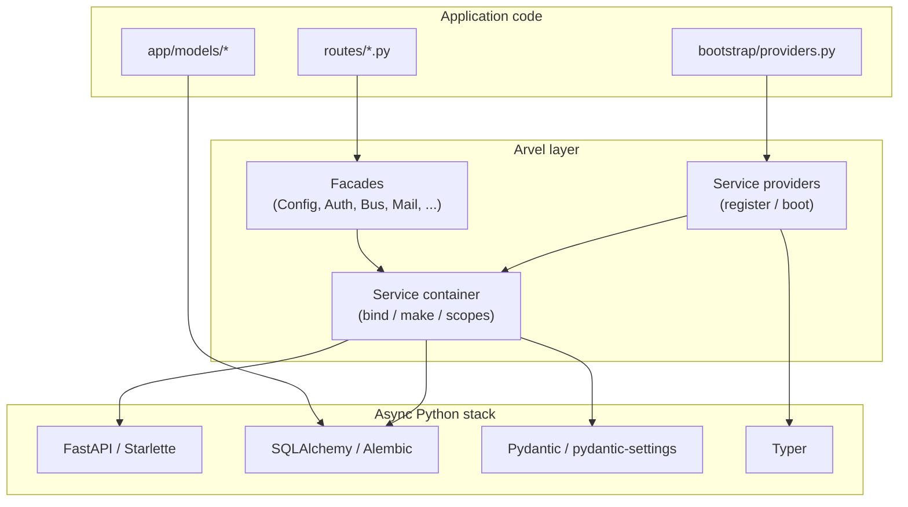

# Arvel — Framework Internals

This documentation set explains **how Arvel works under the hood** and **how to contribute to it**. It is written for framework engineers and contributors, not for application developers.

> **Audience**: You are reading the framework's own source and want a map of its subsystems, control flow, and extension points. Working knowledge of Python `async`/`await`, FastAPI, Starlette, Pydantic, and SQLAlchemy is assumed.
>
> If you want to *build an app* with Arvel, read the user guide instead. This set is the contributor-facing companion.

> **Source of truth**: Everything here is derived from the package source under `packages/*/src/`, the tests, `pyproject.toml`, and the project skeleton under `packages/arvel/src/arvel/_skeleton/`. Documented against the in-repo state where core reports version `0.3.0`. Anything inferred rather than verified is marked `ASSUMPTION:`; open questions for the team are marked `TODO/QUESTION:` and collected in [CUTOVER-NOTES.md](reference/CUTOVER-NOTES.md).

## What Arvel is

Arvel is a Laravel-style developer experience layered over the standard async Python stack. It does **not** ship a new router, ORM, or DI framework. It composes existing libraries:

| Concern | Underlying library | Arvel layer |
|---|---|---|
| HTTP / ASGI | FastAPI + Starlette | `Route` facade, `Router`, middleware, form requests, resources |
| Validation / models | Pydantic + pydantic-settings | `FormRequest`, `ArvelSettings`, typed config |
| Database | SQLAlchemy + Alembic | Arvent ORM: `Model`, relations, query builder, schema DSL |
| CLI | Typer | `arvel` console + `make:*` generators |
| Async jobs | TaskIQ (optional) | `Job`, `Bus`, queue drivers |
| Observability | structlog + OpenTelemetry | logging facade, observability middleware |

The glue is a **service container** plus a **service-provider** boot pipeline. Every subsystem is a provider that binds services into the container during a synchronous `register()` phase, then does I/O during an asynchronous `boot()` phase.

## The 10,000-foot view

Application code talks to **facades** (thin static accessors) and the `Route`/`Model` APIs. Those resolve concrete services from the **container**. The container and everything bound into it are wired by **service providers** during application bootstrap.

## How to read these docs

Start with **Architecture** — it is the spine. Everything else is a subsystem hanging off the container and the provider pipeline.

### Architecture (start here)

1. [Overview](architecture/overview.md) — the layered design and where the seams are.
2. [Bootstrap & lifecycle](architecture/bootstrap-lifecycle.md) — how `Application` boots: register vs boot, provider ordering, ASGI assembly.
3. [Service container](architecture/service-container.md) — bindings, resolution, autowiring, scopes, async.
4. [Service providers](architecture/service-providers.md) — the `register`/`boot`/`shutdown` contract and baseline chain.
5. [Configuration](architecture/configuration.md) — the two config systems: typed `ArvelSettings` and module-based `config()`.
6. [Facades](architecture/facades.md) — how the static accessors bind to container services.

### HTTP layer

- [Routing](http/routing.md) · [Middleware](http/middleware.md) · [Requests & validation](http/requests-validation.md) · [Resources](http/resources.md) · [Exceptions](http/exceptions.md)

### Arvent ORM

- [Model internals](orm/model-internals.md) · [Relationships](orm/relationships.md) · [Query builder](orm/query-builder.md) · [Schema & migrations](orm/schema-migrations.md) · [Casts](orm/casts.md)

### Subsystems

- [Auth](subsystems/auth.md) · [Queues](subsystems/queues.md) · [Events](subsystems/events.md) · [Broadcasting](subsystems/broadcasting.md) · [Mail](subsystems/mail.md) · [Notifications](subsystems/notifications.md) · [Cache](subsystems/cache.md) · [Session](subsystems/session.md) · [Storage](subsystems/storage.md) · [Scheduling](subsystems/scheduling.md) · [Encryption](subsystems/encryption.md) · [Localization](subsystems/localization.md) · [Observability](subsystems/observability.md)

### Console & packages

- [CLI architecture](console/cli-architecture.md)
- [Companion packages overview](packages/overview.md) and per-package internals

### Contributing

- [Repo & build](contributing/repo-and-build.md) · [Quality gates](contributing/quality-gates.md) · [Testing](contributing/testing.md) · [Extending Arvel](contributing/extending.md) · [Conventions](contributing/conventions.md)

### Reference

- [Glossary](reference/glossary.md) · [Source map](reference/source-map.md) · [Diagram index](reference/diagram-index.md) · [Cutover notes](reference/CUTOVER-NOTES.md)
