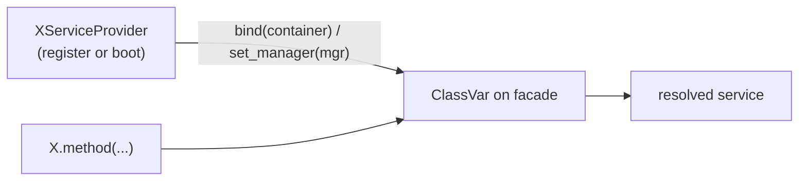

# Facades

A facade is a thin, process-wide static accessor for a service that lives in the container. `Cache.get(...)`, `Bus.dispatch(...)`, `Config.of(...)` all hide a container resolution behind a class method.

**Source**: `packages/arvel/src/arvel/facades/` plus the providers that bind them.

## There is no dynamic proxy

Unlike Laravel's facade base class with a magic accessor, Arvel facades are **plain classes with explicit `@classmethod` delegates**. There is no shared `Facade` base and no `__getattr__` indirection. Each facade:

1. holds the bound service in a `ClassVar`,
2. exposes a `bind()` / `set_manager()` that a provider calls,
3. delegates each public method explicitly.

```python
class Cache:
    manager: ClassVar[CacheManager | None] = None

    @classmethod
    def bind(cls, container: Container) -> None:
        from arvel.cache import CacheManager
        cls.manager = container.make(CacheManager)

    @classmethod
    def mgr(cls) -> CacheManager:
        if cls.manager is None:
            raise FacadeNotBoundError("Cache")
        return cls.manager
```



This means a facade is a single static binding per process. Tradeoff: simple and import-friendly, but not per-request swappable. For per-request services, resolve from the request scope or via `dep()` instead.

## Binding strategies

Facades wire up in one of four ways, depending on what the underlying service needs.

| Strategy | Example | Bound where |
|---|---|---|
| **Container-resolved** | `Cache.bind(container)` → `container.make(CacheManager)` | provider `register()` |
| **Manager-injected** | `Event.bind(dispatcher)`, `Mail.bind(mailer)` | provider `boot()` (needs a live instance) |
| **Env-resolved** | `Crypt` builds an `Encrypter` from `APP_KEY` | lazily on first use |
| **Stateless** | `Hash` uses a module-level argon2 hasher | never bound |

The split between `register()` and `boot()` matters: container-only facades bind in `register()`; facades that need an already-constructed manager bind in `boot()` (after every provider has registered).

## Facade catalog

| Facade | Module | Bind call | Underlying service |
|---|---|---|---|
| `Config` | `config/repository.py` | `Config.bind(container)` | `Container` → `ArvelSettings` singletons |
| `Cache` | `facades/cache.py` | `Cache.bind(container)` | `CacheManager` |
| `Storage` | `facades/storage.py` | `Storage.bind(container)` | `StorageManager` |
| `Session` | `facades/session.py` | `Session.bind(container)` | `SessionManager` |
| `Bus` | `facades/bus.py` | `Bus.bind(container)` | `QueueManager` |
| `Auth` | `facades/auth.py` | `Auth.set_manager(mgr)` | `AuthManager` |
| `Broadcast` | `facades/broadcast.py` | `Broadcast.set_manager(mgr)` | `BroadcastManager` |
| `Event` | `facades/event.py` | `Event.bind(dispatcher)` | `EventDispatcher` |
| `Mail` | `facades/mail.py` | `Mail.bind(mailer)` | `Mailer` |
| `Notification` | `facades/notification.py` | `Notification.bind(mgr)` | `NotificationManager` |
| `Crypt` | `facades/crypt.py` | env (`APP_KEY`) | `Encrypter` |
| `Hash` | `facades/hash.py` | none | argon2 `PasswordHasher` |
| `Context` | `context/facade.py` | contextvar | request-context repository |
| `Log` | `logging/facade.py` | module-level | `OtelLogger("arvel")` |

### Public vs internal exports

`facades/__init__.py` re-exports only a subset:

```python
__all__ = ["Cache", "Config", "Context", "Crypt", "Log", "Session", "Storage"]
```

`Auth`, `Bus`, `Event`, `Hash`, `Mail`, `Notification`, and `Broadcast` exist in the directory but aren't re-exported from the package root — import them from their module (`from arvel.facades.bus import Bus`).

## How a facade finds the app

It doesn't — there's no global `Application` accessor in `facades/`. Each facade is a class-level singleton set once by its provider:

```mermaid
sequenceDiagram
    participant Boot as Application.boot()
    participant Prov as QueueServiceProvider
    participant C as Container
    participant F as Bus facade

    Boot->>Prov: boot()
    Prov->>C: make(QueueManager)
    C-->>Prov: manager
    Prov->>F: Bus.bind(container)
    Note over F: cls.manager set; ready process-wide
```

`Crypt` and `Hash` bypass the container entirely — `Crypt` reads `APP_KEY` from the environment and caches an `Encrypter`; `Hash` is stateless.

## Unbound errors

Calling a facade before its provider bound it raises:

| Facade | Error |
|---|---|
| `Cache`, `Bus`, `Storage`, `Session`, … | `FacadeNotBoundError` |
| `Auth` | `RuntimeError` |
| `Broadcast` | `RuntimeError` |
| `Crypt` (no `APP_KEY`) | `MissingAppKeyError` |

> `TODO/QUESTION:` The unbound-facade error type isn't uniform (`FacadeNotBoundError` vs `RuntimeError`). Worth standardizing?

## When to use a facade vs `dep()`

- **Facade** — ergonomic static access to a process-wide singleton (cache, bus, mail). Great in jobs, listeners, and services.
- **`dep()`** — inject a container binding into a route as a FastAPI `Depends`, including request-scoped services. See [routing](../http/routing.md).

## See also

- [Service container](service-container.md) — what facades resolve from.
- [Configuration](configuration.md) — `Config.of` internals.
