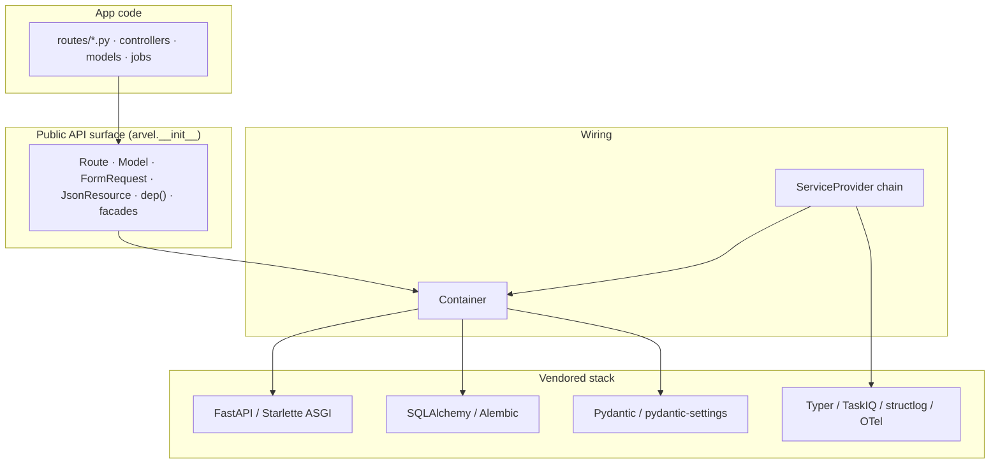
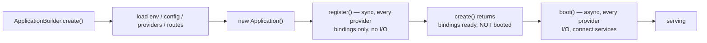
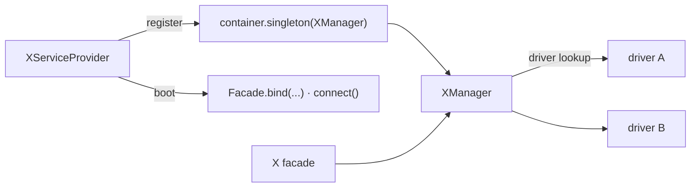

# Architecture overview

Arvel is a thin coherent layer over FastAPI, Starlette, Pydantic, and SQLAlchemy. The whole framework reduces to two ideas:

1. A **service container** that holds and resolves every service.
2. A **service-provider pipeline** that fills the container during a two-phase bootstrap (sync `register`, async `boot`).

Everything else — routing, the ORM, queues, mail, broadcasting — is a subsystem registered by a provider and resolved through the container.

## Layers

The public API is deliberately narrow. `packages/arvel/src/arvel/__init__.py` re-exports the supported symbols and documents the rule: anything not in `__all__` is internal and may change without notice.

## The container is the hub

There is exactly one `Container` per `Application`. The application binds itself into its own container on construction, so any service can resolve the `Application` or `Container` by type. The ASGI app exposes the container at `app.state.arvel_container` for request-time resolution.

Two resolution surfaces sit on top of the container:

- **Facades** — process-wide static accessors (`Config`, `Cache`, `Bus`, …) that hold a reference to a resolved service. See [facades](facades.md).
- **`dep()`** — adapts any container binding into a FastAPI `Depends`, so plain `async def` routes can receive container services as parameters.

## Two-phase bootstrap

The single most important control-flow fact in the framework:

- **`register()`** is synchronous and may only bind into the container. No I/O, no reaching into other providers.
- **`boot()`** is asynchronous, runs after *every* provider has registered, and is where connections open and facades that need a live manager get bound.
- `create()` returns a fully *registered* but *not yet booted* app. Booting happens via the ASGI lifespan (default) or an explicit `await app.boot()`.

Details and ordering live in [bootstrap & lifecycle](bootstrap-lifecycle.md).

## Subsystem shape

Every subsystem follows the same shape, which makes the codebase predictable:

A subsystem typically ships:

- a **provider** (`XServiceProvider`) that binds a manager,
- a **manager** (`XManager`) that selects a **driver** from typed config,
- one or more **drivers** behind a `Protocol`,
- an optional **facade** for ergonomic static access.

When you read a new subsystem, find the provider first — it tells you what gets bound and when.

## Where the seams are

Arvel keeps the vendored stack swappable behind its own names:

- The ASGI app type is exported as `arvel.ASGIApp` (currently `fastapi.FastAPI`). App code references `arvel.ASGIApp`, not FastAPI directly, so the HTTP framework stays an implementation detail.
- Drivers (cache, queue, storage, broadcast, mail) sit behind protocols, selected by config. Adding a driver never touches the manager's callers.
- The ORM wraps SQLAlchemy rather than replacing it — you can drop to SQLAlchemy Core/ORM where needed.

## Monorepo at a glance

Arvel is a `uv` workspace. The core lives in `packages/arvel`; optional capabilities ship as separate distributions.

| Package | Role |
|---|---|
| `arvel` | The framework core |
| `arvel-permission` | Roles & permissions |
| `arvel-image` | Image transforms + media library |
| `arvel-oauth` | OAuth2 / OIDC login |
| `arvel-search` | Full-text search |
| `arvel-audit` | Audit trail / activity log |
| `arvel-ecommerce-demo` | Full-stack reference app |

See [repo & build](../contributing/repo-and-build.md) for the workspace layout and dev workflow, and the [source map](../reference/source-map.md) for a subsystem-to-path index.
