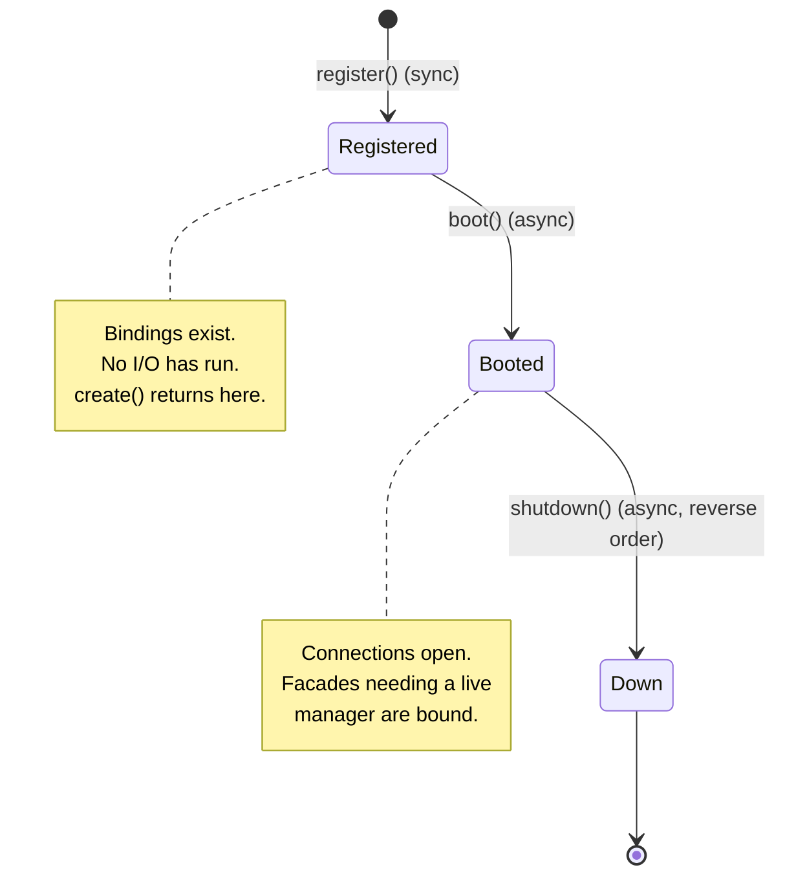

# Service providers

A service provider is the unit of bootstrap. Each subsystem ships one, and the [bootstrap pipeline](bootstrap-lifecycle.md) drives them through three lifecycle hooks. If you're adding a feature to Arvel, you're almost certainly writing or extending a provider.

**Source**: `packages/arvel/src/arvel/providers/service_provider.py` (base class), plus one provider per subsystem (e.g. `providers/config_provider.py`, `http`, `database`, `cache`, …).

## The contract

```python
class ServiceProvider:
    app: Application
    container: Container

    def __init__(self, app: Application) -> None:
        self.app = app
        self.container = app.container

    def register(self) -> None:
        """Sync. Container bindings only — no I/O, no other providers."""

    async def boot(self) -> None:
        """Async. May do I/O. Runs after every provider's register()."""

    async def shutdown(self) -> None:
        """Async. Tear down resources. Runs in reverse registration order."""
```

Every provider receives the `Application` and a shortcut to its `container`. The three hooks map directly onto the lifecycle phases.



### `register()` — bindings only

Synchronous. Bind services into the container and nothing else. Do **not** open connections, read files, or call into other providers — they may not have registered yet. A typical `register()`:

```python
def register(self) -> None:
    self.container.singleton(CacheManager)
    Cache.bind(self.container)   # facade that only needs the container
```

### `boot()` — I/O and cross-provider wiring

Asynchronous, runs after every provider's `register()`. By now the whole container is populated, so this is where you:

- open connections (DB engines, brokers),
- resolve managers and bind facades that need a live instance,
- auto-discover app files (e.g. the scheduler reads `app/console/kernel.py`).

```python
async def boot(self) -> None:
    dispatcher = self.container.make(EventDispatcher)
    Event.bind(dispatcher)       # facade needs the resolved manager
```

### `shutdown()` — teardown

Asynchronous, runs in reverse registration order. Release what `boot()` acquired. A failing `shutdown()` raises `ShutdownError`.

## Helper methods on the base class

| Method | Purpose |
|---|---|
| `safe_config(cls, *, default)` | Resolve a config class, returning `default` on any failure. Use when a settings class is optional. |
| `commands()` | Return console `Command` classes/instances this provider ships. Collected by `ConsoleServiceProvider.boot()`. |
| `provides()` | Abstracts the provider promises to bind. Reserved for deferred-provider logic (not yet active). |
| `publishes(paths, *, tag=, is_migrations=)` | Register publishable files for `arvel vendor:publish`. |

### `safe_config`

```python
def safe_config(self, cls: type[_T], *, default: _T) -> _T:
    try:
        return self.container.make(cls)
    except Exception:
        return default
```

Lets a provider degrade gracefully when the app didn't register its settings class.

### `commands`

A provider can ship CLI commands. Return either `Command` subclasses (instantiated with no args) or pre-built instances (when you need to inject container dependencies):

```python
def commands(self) -> list[type[Command] | Command]:
    return [MakeWidgetCommand, ReindexCommand(self.container.make(SearchManager))]
```

`ConsoleServiceProvider` (the TAIL provider) walks every registered provider in `boot()` and merges these into the console app — which is why it must run last. See [CLI architecture](../console/cli-architecture.md).

### `publishes`

Mirrors Laravel's `$this->publishes([...], 'tag')`. Registers source→destination file mappings under a tag so users can copy stubs into their app with `arvel vendor:publish --tag=<tag>` or `--provider=<class>`:

```python
def boot(self) -> None:
    self.publishes(
        {Path(__file__).parent / "stubs/permission.py": "config/permission.py"},
        tag="permission-config",
    )
```

When `is_migrations=True`, each destination is treated as a directory and the basename gets a UTC timestamp at publish time, so the file lands chronologically in `database/migrations/`. On a bare `Application` (test scaffolding without a base path) `publishes()` is a silent no-op — it's metadata for the `vendor:publish` command, which only runs against a fully built app.

## Baseline providers

The framework always installs a HEAD set before user providers and a TAIL provider after them. The ordering and rationale are in [bootstrap & lifecycle](bootstrap-lifecycle.md#provider-ordering-head--user--tail). In short:


Each baseline provider lives under `packages/arvel/src/arvel/providers/` (or the subsystem package, e.g. `context/provider.py`, `observability/`). Read a subsystem's provider first — it's the table of contents for what that subsystem binds.

## Writing a provider (checklist)

1. Subclass `ServiceProvider`.
2. In `register()`: bind your manager (`self.container.singleton(MyManager)`) and any facade that only needs the container.
3. In `boot()`: open connections, bind facades that need a live manager, auto-discover app files.
4. In `shutdown()`: close what `boot()` opened.
5. If you ship CLI commands, return them from `commands()`.
6. If you ship publishable stubs, call `self.publishes(...)` in `boot()`.
7. Add the provider to the app's `bootstrap/providers.py` (or, for a baseline change, the HEAD/TAIL lists).

See [extending Arvel](../contributing/extending.md) for end-to-end playbooks.
