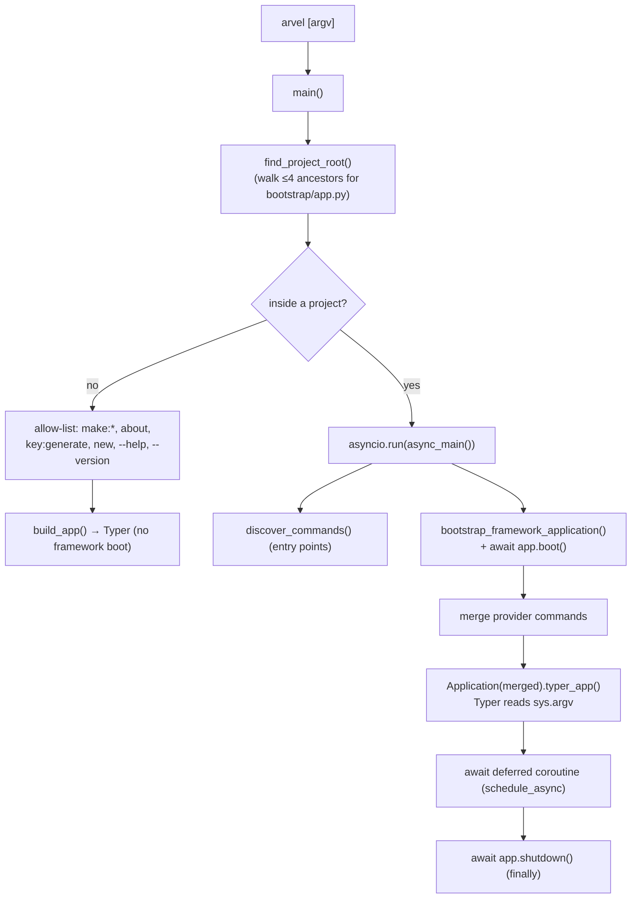

# CLI architecture

The `arvel` command is a Typer app. Inside a project it boots the full framework before dispatching; outside a project it runs a limited set of commands without booting. Commands come from two channels: packaging entry points and `ServiceProvider.commands()`.

**Source**: `packages/arvel/src/arvel/console/` — `entrypoint.py`, `__init__.py` (`Application`, `Command`, `Context`), `bootstrap.py`, `_loader.py`, `_async.py`, `commands/`, `providers/console_service_provider.py`. Entry points live in `packages/arvel/pyproject.toml`.

## Entry point

`[project.scripts]` maps `arvel` → `arvel.console.entrypoint:main`. `main()` is a sync gatekeeper; `async_main()` runs the project lifecycle. The Typer app itself is owned by `arvel.console.Application`, not by `entrypoint.py`.



## Two command channels

| Channel | Mechanism | Needs booted app? |
|---|---|---|
| **Entry points** | `[project.entry-points."arvel.commands"]` → `discover_commands()` via `importlib.metadata` | No — works for DI-free commands |
| **Provider commands** | `ServiceProvider.commands()` collected by `ConsoleServiceProvider.boot()` | Yes — provider must be registered + booted |

There's no standalone registry class. The registry is `Application._commands: dict[str, Command]` (last registration wins, with a warning). `ConsoleServiceProvider` is pinned **last** in the baseline TAIL so it sees every other provider's `commands()`. On a name collision when running inside a project, the provider (container) copy wins over the entry-point copy.

> **Note**: Queue commands (`queue:work`, `queue:failed`, …) are intentionally **not** in the entry points — they need `QueueManager`/`FailedJobStore` injected, so they're provider-only and only appear when `QueueServiceProvider` is booted.

## The Command base

```python
class Command:
    name: ClassVar[str]              # "make:model", "queue:work"
    help: ClassVar[str]
    needs_application: ClassVar[bool]  # True → entrypoint binds booted app to self.app
    app: FrameworkApplication | None

    def register(self, app: typer.Typer) -> None: ...   # default wraps handle(ctx)
    def handle(self, ctx: Context) -> int: ...           # 0 = success
    async def call(self, name, args=()) -> int: ...       # in-process dispatch
```

- `Context` is a plain-text I/O facade over `typer.echo` (`info`, `error`, `warn`, `line`, …). No Rich/color.
- Simple commands rely on the default `register()` (no CLI args). Commands needing flags override `register()` and use the `_Option`/`_Argument` bridge in `console/_t.py`.
- `make:*` generators extend `BaseMakeCommand` (`commands/_base_make.py`): positional `name`, `--force`, name validation, stub rendering to a target subdir.

### Async commands

Typer callbacks are sync, so async work uses one of three patterns:

| Pattern | Used by | Mechanism |
|---|---|---|
| Deferred coroutine (preferred) | `migrate`, `queue:work`, `schedule:work`, `db:seed`, `reverb:start` | `schedule_async(coro)` — entrypoint awaits it after Typer returns |
| Nested `asyncio.run()` | `cache:clear`, `cache:forget`, `schedule:run` | second loop inside the outer loop |
| Sync blocking | `serve` | `uvicorn.run()` directly |

> **Warning**: The nested-`asyncio.run()` commands run a second event loop inside the already-running outer loop from `async_main()`. This is inconsistent with the single-loop intent of the deferred pattern. `TODO/QUESTION:` Should `cache:*` and `schedule:run` move to `schedule_async`?

## Bootstrap for the CLI

Inside a project, `async_main()` always: imports the user's `bootstrap/app.py` → `create_application()` (providers' `register()` already ran), `await app.boot()` (async boot + service connect), merges provider commands, dispatches, then `await app.shutdown()` in a `finally`. Commands with `needs_application = True` get `self.app` and reach services through `self.app.container.make(...)`. See [bootstrap & lifecycle](../architecture/bootstrap-lifecycle.md).

> **Note**: There is **no** `ConsoleKernel`. `app/console/kernel.py` is scheduling-only — its `Kernel.schedule(schedule)` is discovered by `SchedulerServiceProvider.boot()`, not by CLI registration. To add a command, use `ServiceProvider.commands()` or a new entry point. `routes/console.py` is stored by `with_routing(console=...)` but never loaded yet.

## Built-in commands

A non-exhaustive catalog (see the source map for the full list and registration source):

| Group | Commands |
|---|---|
| Scaffolding | `new`, `make:controller`, `make:model`, `make:migration`, `make:job`, `make:event`, `make:listener`, `make:resource`, `make:request`, `make:policy`, `make:command`, … (24 `make:*`) |
| Migrations / DB | `migrate`, `migrate:rollback`, `migrate:status`, `migrate:fresh`, `migrate:reset`, `migrate:refresh`, `db:seed`, `db:show`, `db:table`, `model:show`, `model:prune` |
| Queue | `queue:work`, `queue:failed`, `queue:retry`, `queue:flush`, `queue:forget`, `queue:size`, `queue:restart`, `queue:clear`, `queue:prune-failed` |
| Scheduler | `schedule:work`, `schedule:list`, `schedule:run`, `schedule:interrupt`, `schedule:pause`, `schedule:continue` |
| Cache / config / optimize | `cache:clear`, `cache:forget`, `config:show`, `config:cache`, `config:clear`, `view:cache`, `view:clear`, `optimize`, `optimize:clear` |
| Ops / introspection | `serve`, `route:list`, `event:list`, `channel:list`, `shell` / `tinker`, `about`, `test`, `down` / `up`, `vendor:publish`, `key:generate`, `openapi:export`, `openapi:validate` |

Composite commands (`migrate:fresh`, `optimize`) chain other commands in-process via `Command.call()` → `Application.run(name)`.

> **Warning**: `Application.run(name, args)` ignores `args` today — programmatic/scheduled invocation can't pass flags. `key:rotate` and parts of `optimize` (`route:cache`, `event:cache`) are honest stubs. `TODO/QUESTION:` confirm intended timelines for these.

## See also

- [Service providers](../architecture/service-providers.md) — `commands()` contract.
- [Scheduling](../subsystems/scheduling.md) — `app/console/kernel.py` discovery.
- [Source map](../reference/source-map.md)
