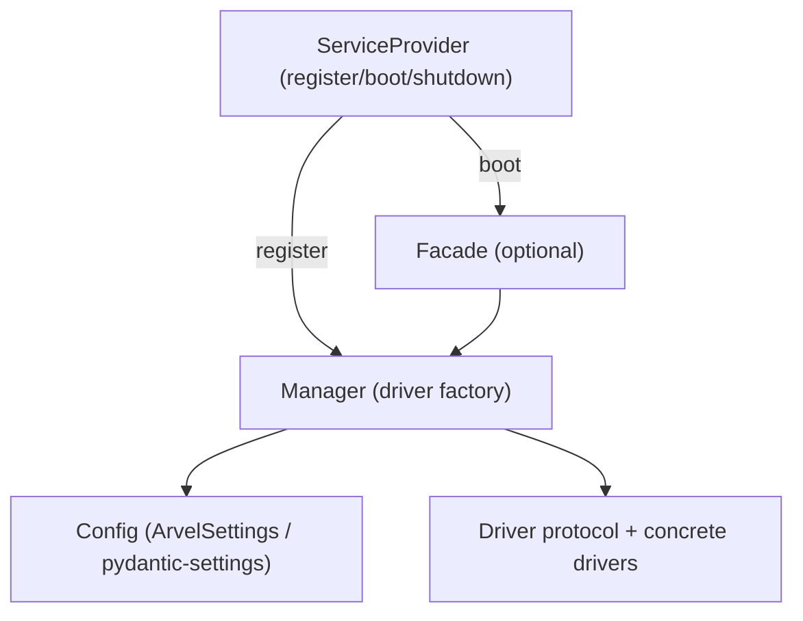

# Extending the framework

Most framework work fits one of a few shapes: a new subsystem, a new driver for an existing manager, a new facade, or a new CLI command. They all hang off the service container and a service provider.

**Source**: see [service providers](../architecture/service-providers.md), [service container](../architecture/service-container.md), [facades](../architecture/facades.md), and [CLI architecture](../console/cli-architecture.md).

## The subsystem shape

Existing subsystems are remarkably uniform. A new one should follow the same pattern:



1. **Config** — a `pydantic-settings` class for env-driven knobs (driver name, URLs, timeouts).
2. **Manager** — picks a driver from config and caches it (one instance per driver).
3. **Driver protocol** — a `Protocol` defining the operations; concrete drivers implement it. Keep optional third-party imports lazy.
4. **Provider** — `register()` binds the manager (sync, no I/O); `boot()` opens connections and binds the facade; `shutdown()` tears down.
5. **Facade** (optional) — a thin static accessor wired in the provider.

## Adding a service provider

```python
from arvel.providers.service_provider import ServiceProvider

class WidgetServiceProvider(ServiceProvider):
    def register(self) -> None:
        config = self.safe_config(WidgetConfig)
        self.app.container.singleton(WidgetManager, lambda c: WidgetManager(config))

    async def boot(self) -> None:
        Widget.bind(self.app.container.make(WidgetManager))

    async def shutdown(self) -> None:
        ...  # close connections, reverse order

    def commands(self) -> list[type[Command] | Command]:
        return [WidgetSyncCommand]
```

- `register()` is **sync** and may only register bindings — no awaiting, no connections.
- `boot()` is **async** and runs after every provider has registered, so cross-provider wiring is safe.
- Add the provider to the app's `bootstrap/providers.py`. Baseline framework providers are pinned in `Application` (HEAD/TAIL); user and package providers slot in between.

## Adding a driver to an existing manager

Managers expose a registration hook (e.g. `SearchManager.register_driver()`, `QueueManager`/`CacheManager` driver factories). Implement the driver protocol, keep heavy imports lazy (inside the factory), and register it. No new provider needed.

## Adding a facade

There's no dynamic `__getattr__` magic. A facade is a class with a `ClassVar` slot and explicit `@classmethod` delegates, plus a `bind()`/`set_manager()` classmethod the provider calls during `register()` or `boot()`. See [facades](../architecture/facades.md) for the exact pattern. Facades that need test doubles also expose a `fake()`.

## Adding a CLI command

Subclass `Command`, set `name`/`help`, implement `handle(ctx)` (or override `register()` for custom flags). Surface it either via `ServiceProvider.commands()` (when it needs DI) or an `arvel.commands` entry point in `pyproject.toml` (when it's DI-free). Set `needs_application = True` to receive a booted app. See [CLI architecture](../console/cli-architecture.md).

## Publishing migrations / stubs

If your subsystem owns a table, ship a migration stub and register it with `self.publishes({...}, tag="...")` (mark migrations so the installer routes them to `database/migrations`). Apps copy it via `vendor:publish --tag=...` or a dedicated `install` command.

## Checklist

- [ ] Config is `pydantic-settings`, env-driven, typed.
- [ ] Manager caches one driver per name; optional deps imported lazily.
- [ ] `register()` is sync and binding-only; `boot()` does I/O; `shutdown()` is reverse-order.
- [ ] Public symbols re-exported from the package `__init__.py` with a test importing the public path.
- [ ] `mypy --strict` + `pyright --strict` clean; new code tested to the coverage floor.
- [ ] No new unscoped suppressions.

## See also

- [Service providers](../architecture/service-providers.md) · [Service container](../architecture/service-container.md) · [Conventions](conventions.md)
