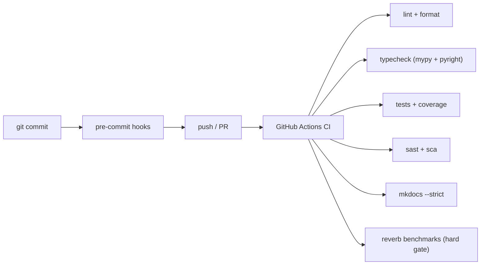

# Quality gates

Every gate must end with **zero errors and zero warnings**. Warnings are findings, not noise. Fix the underlying problem — don't loosen config or sprinkle suppressions.

**Source**: root `pyproject.toml` (`[tool.ruff]`, `[tool.mypy]`, `[tool.pyright]`, `[tool.coverage]`), `.github/workflows/ci.yml`, `.github/workflows/security.yml`, `.pre-commit-config.yaml`.

## The gates

## Lint & format — Ruff

`ruff` runs with `select = ["ALL"]` at line length 100, target `py314`. The ignore list is deliberate (docstring rules enabled per-module, formatter-conflicting rules off). Per-file ignores in `pyproject.toml` are scoped and **each carries a one-line rationale** — that's the bar for any new suppression.

> **Warning**: Don't add a blanket `# noqa`. If a rule genuinely can't apply, add a scoped `per-file-ignores` entry with a rationale comment, matching the existing style. The same goes for `# type: ignore` / `# nosec` — specific code, real reason.

## Types — mypy + pyright, both strict

- `mypy` runs `strict = true`, `warn_unreachable`, `warn_unused_ignores`, with the Pydantic and SQLAlchemy plugins.
- `pyright` runs `typeCheckingMode = "strict"` with all `report*` checks **promoted to error** (e.g. `reportUnknownMemberType`, `reportPrivateUsage`, `reportUnusedImport`).
- The `_skeleton/` tree is excluded from both — it's template code that runs under a generated project's `sys.path`, not the framework's.

Both must pass with zero findings. Optional runtime deps (redis, jwt, boto, …) are covered by `ignore_missing_imports` overrides so the source stays free of import-ignore noise.

## Tests & coverage

- `pytest` with `asyncio_mode = "auto"`, `--strict-markers --strict-config`, benchmarks excluded by default.
- Coverage `fail_under = 90` (branch coverage), plus **per-module floors** enforced by the workspace `conftest.py` after `pytest-cov` finishes (`[tool.coverage.arvel_per_module]`). Floors sit just under the measured number so refactors aren't blocked, and ratchet up as coverage climbs.

See [testing](testing.md) for the test layout and how to run subsets.

## Security

`make security` and the `security.yml` workflow run:

- **bandit** (SAST) — MEDIUM+ severity/confidence blocks; the `_skeleton` is excluded (it's user code).
- **pip-audit** (SCA) — any unfixed third-party CVE fails; documented exceptions live in `docs/security/dependency-exceptions.md` and are passed via `--ignore-vuln`.
- **gitleaks** — secret scanning, in CI and as a pre-commit hook.

High/critical findings block merge.

## Pre-commit

`.pre-commit-config.yaml` runs whitespace/EOL/large-file/merge-conflict/private-key checks, `ruff-check --fix` + `ruff-format`, local `mypy` and `pyright` (framework src + tests), `gitleaks`, and `no-commit-to-branch` (blocks direct commits to `main`/`master`). Install with `uv run pre-commit install`.

## CI jobs

`ci.yml` runs: lint, typecheck, tests+coverage, smoke benchmark (non-blocking), Testcontainers integration, **reverb benchmarks** (hard perf gate — never reintroduce `continue-on-error`), reverb tracemalloc (heap budget), bandit, pip-audit, `mkdocs build --strict`, the ecommerce demo (backend + Vue frontend), and a final `build` job gated on the rest.

## See also

- [Testing](testing.md) · [Conventions](conventions.md) · the workspace rules under `.cursor/rules/` (`enforce-quality-gates`, `strict-type-safety`).
