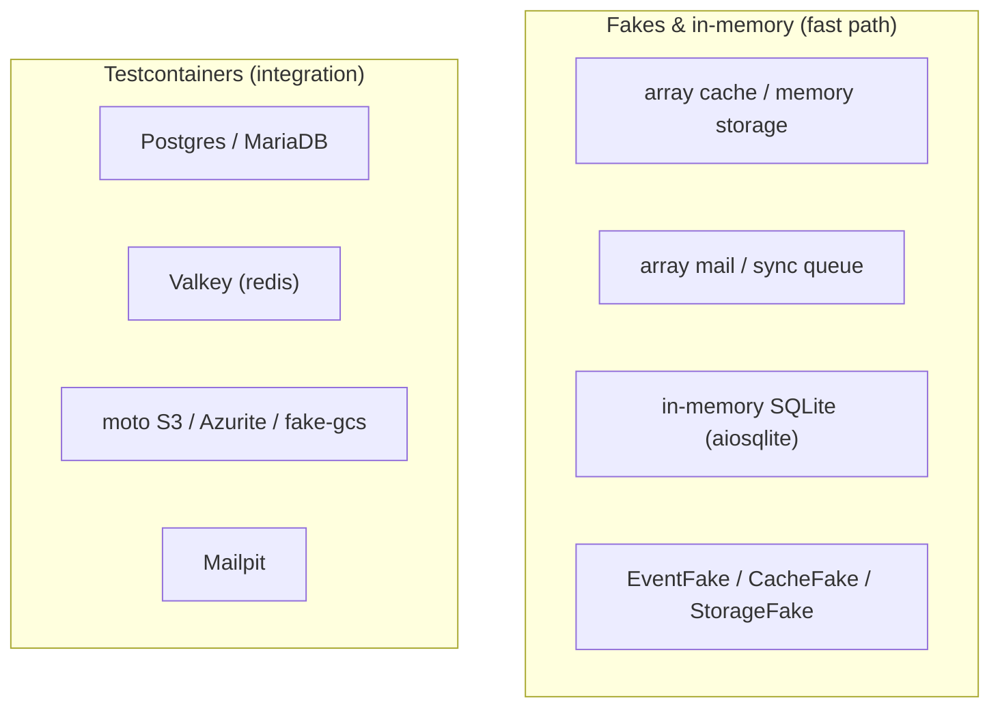

# Testing

Tests live next to each package under `tests/`. The core suite is `packages/arvel/tests`. There's a public `arvel.testing` toolkit for app authors, and the framework's own tests lean on fakes, in-memory drivers, and Testcontainers emulators for the real backends.

**Source**: `packages/arvel/tests/`, `packages/arvel/src/arvel/testing/`, root `pyproject.toml` (`[tool.pytest.ini_options]`).

## Layout & markers

`testpaths` covers `packages/arvel/tests` plus each library's `tests/`. Tests are grouped by subsystem (`cache/`, `session/`, `test_queue/`, `test_auth/`, `reverb/`, …), each with its own `conftest.py`.

Markers (`--strict-markers`):

| Marker | Meaning |
|---|---|
| `unit` | pure unit, no external deps |
| `integration` | integration-level |
| `security` | security-focused |
| `slow` | slow tests |
| `benchmark` | perf benchmarks — excluded by default (`-m 'not benchmark'`) |
| `requires_emulator` | needs a Docker-hosted backend |

## Running

```bash
make test               # fast: no Docker, no emulators
make test-integration   # full: boots emulators via Testcontainers
make coverage           # tests + coverage, fail-under 90
uv run pytest packages/arvel/tests/cache -m unit   # a subset
```

`make test` excludes `benchmark` and `requires_emulator`; `make test-integration` pre-pulls emulator images (S3/moto, Azurite, fake-gcs, Valkey, Mailpit, Postgres, MariaDB) and runs everything except benchmarks.

## How the suite avoids real infrastructure



Most drivers have a no-infra variant (array/memory/sync/null) used for unit tests. The `requires_emulator` tests spin up real backends through Testcontainers when Docker is available; they skip cleanly when it isn't.

## The `arvel.testing` toolkit

Public helpers for app authors (`arvel.testing.__init__`):

| Symbol | Purpose |
|---|---|
| `create_test_app` | build a booted app for tests |
| `ArvelTestCase` | base test case |
| `TestResponse` | HTTP response assertions |

Plus fakes under `arvel.testing.fakes` (`CacheFake`, `EventFake`, `StorageFake`, `LockFake`) and broadcasting/observability test doubles. Facades like `Cache`, `Event`, `Storage` expose `fake()` to swap in these doubles.

> **Note**: QA-Pre test files (written before implementation in the SDLC flow) may import not-yet-existing modules. Those are scoped out of the type checkers via overrides in `pyproject.toml` rather than left to fail — see the `ignore_errors` mypy blocks.

## See also

- [Quality gates](quality-gates.md) · [Extending the framework](extending.md)
