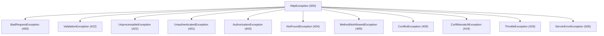
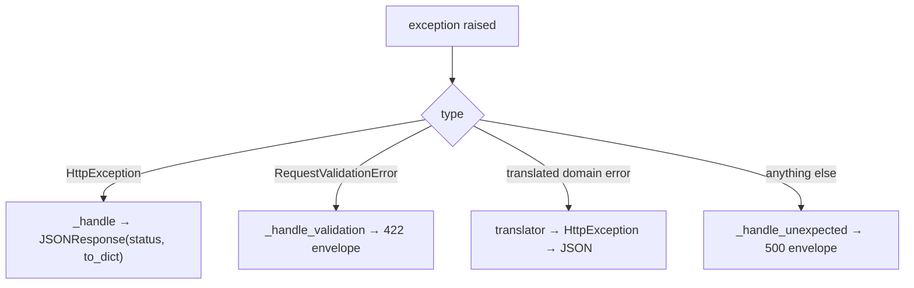

# Exception handling

All HTTP errors flow through one handler that renders a consistent JSON envelope. Domain exceptions (ORM, auth) are mapped into HTTP exceptions by translators registered at bootstrap.

**Source**: `packages/arvel/src/arvel/http/exceptions.py`, `http/problem_details.py`, `http/negotiation.py`, `providers/http_provider.py`.

## The `HttpException` hierarchy

The base carries a status code, a machine-readable `code`, a message, and optional field-level `details`:

```python
class HttpException(Exception):
    status_code: int = 500
    code: ClassVar[str] = "INTERNAL_ERROR"

    def to_dict(self) -> dict[str, Any]:
        body = {"error": {"code": self.code, "message": self.message}}
        if self.details:
            body["error"]["details"] = self.details
        return body
```



| Exception | Status | `code` |
|---|---|---|
| `BadRequestException` | 400 | `BAD_REQUEST` |
| `UnauthenticatedException` | 401 | `UNAUTHENTICATED` |
| `AuthorizationException` | 403 | `FORBIDDEN` |
| `NotFoundException` | 404 | `NOT_FOUND` |
| `MethodNotAllowedException` | 405 | `METHOD_NOT_ALLOWED` |
| `ConflictException` | 409 | `CONFLICT` |
| `CsrfMismatchException` | 419 | `CSRF_MISMATCH` |
| `ValidationException` / `UnprocessableException` | 422 | `VALIDATION_FAILED` / `UNPROCESSABLE` |
| `ThrottleException` | 429 | `TOO_MANY_REQUESTS` (+ `retry_after_seconds`) |
| `ServerErrorException` | 500 | `INTERNAL_ERROR` |

> **Note**: `CsrfMismatchException` is defined in `_middleware_core.py` (with `VerifyCsrf`), not `exceptions.py`, but it subclasses `HttpException`.

## The handler

`HttpExceptionHandler.register(app)` wires four FastAPI exception handlers:

```python
def register(self, app: FastAPI) -> None:
    app.add_exception_handler(HttpException, self._handle)
    app.add_exception_handler(RequestValidationError, self._handle_validation)
    self._register_translators(app)
    app.add_exception_handler(Exception, self._handle_unexpected)
```



`HttpServiceProvider` binds the handler as a singleton with the default translators; `Application.into_asgi()` calls `handler.register(fa)` before mounting routes.

## Translators map domain errors to HTTP

Translators turn subsystem exceptions into the right HTTP exception so handlers don't have to. The defaults (in `http_provider.py`) cover ORM and auth cases — e.g. a "model not found" becomes a `NotFoundException` (404), an auth failure becomes `UnauthenticatedException` (401). Register more by passing a `translators` mapping to `HttpExceptionHandler`.

## Always JSON

The default handler **always** returns JSON (`JSONResponse` + `exc.to_dict()`). There is no HTML branch.

`wants_json(request)` exists as a helper for *your* handler code, not for the exception layer:

```python
def wants_json(request) -> bool:
    # True if: path starts with /api, OR Accept mentions application/json,
    # OR X-Requested-With == XMLHttpRequest
    ...
```

If you need HTML error pages, branch on `wants_json` inside your handlers.

> **Note**: An optional `ProblemDetailsHandler` subclass emits RFC 7807 `application/problem+json`. It's still JSON, just a different envelope.

## Error envelope

Every rendered error has the same shape:

```json
{
  "error": {
    "code": "VALIDATION_FAILED",
    "message": "Validation failed.",
    "details": [{ "field": "email", "issue": "Email already exists." }]
  }
}
```

`details` is present only when the exception carries field-level issues (e.g. from `ValidationException`).

## See also

- [Requests & validation](requests-validation.md) — where `ValidationException` comes from.
- [Middleware](middleware.md) — `ThrottleException`, `CsrfMismatchException`, `UnauthenticatedException` sources.
