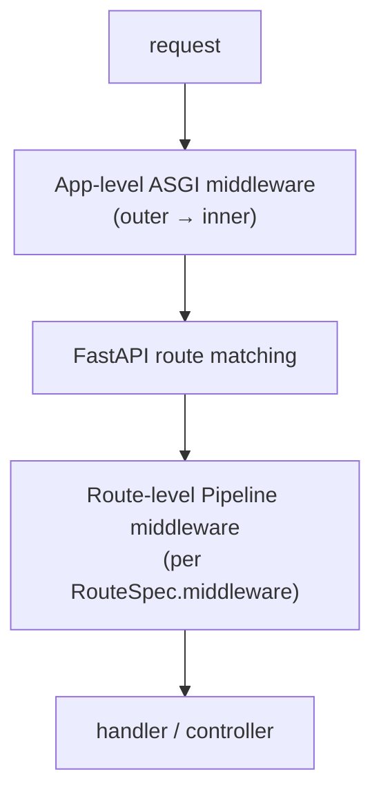
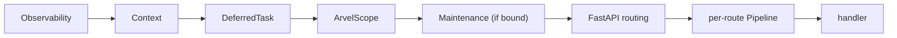

# Middleware

Arvel has **two tiers** of middleware. Knowing which tier a class belongs to tells you where it runs and how it composes.

**Source**: `packages/arvel/src/arvel/http/_middleware_core.py`, `http/middleware/`, `context/middleware.py`, and the stack assembly in `application/application.py`.

| Tier | Mechanism | Runs |
|---|---|---|
| **App-level (ASGI)** | `FastAPI.add_middleware(...)` | for every request, before route matching |
| **Route-level** | `Middleware` protocol + `arvel.support.Pipeline` | only on routes that declare it, after route matching |



## Route-level: the `Middleware` protocol

Route middleware implements a single async method:

```python
@runtime_checkable
class Middleware(Protocol):
    async def handle(self, request: Any, call_next: CallNext) -> Any: ...

CallNext = Callable[[Any], Awaitable[Any]]
```

`_wrap_with_middleware` (in `routing.py`) adapts each `Middleware` into an `arvel.support.Pipeline` step. The pipeline runs left-to-right — the **first** middleware in the tuple is the outermost on the request path:

```python
return await Pipeline().send(request).through(pipeline_steps).then(final)
```

Route middleware comes from three places, merged in order: enclosing `Route.group(middleware=[...])` frames, named groups resolved from strings, and the route's own `middleware=[...]`.

### Built-in route middleware

| Class | Module | Behavior |
|---|---|---|
| `Authenticate(guard_name="web")` | `_middleware_core.py` | Resolves `AuthManager.guard(name)`, sets `request.state.user`, raises `UnauthenticatedException` if none. |
| `Throttle(max_attempts, *, decay_seconds=60, key=None, store=None)` | `_middleware_core.py` | Rate limit; raises `ThrottleException` (429) past the limit. |
| `VerifyCsrf(except_paths=None)` | `_middleware_core.py` | Double-submit CSRF check; raises `CsrfMismatchException` (419). |
| `SignedMiddleware` | `middleware/signed.py` | Verifies `URL.has_valid_signature(request)`. |
| `DatabaseTransaction(session_maker=None)` | `middleware/database_transaction.py` | Wraps the request in a DB transaction (and provides the active session that `exists`/`unique` validation rules need). |

`Authenticate` resolves the guard at request time:

```python
async def handle(self, request, call_next):
    manager = container.make(AuthManager)
    guard = manager.guard(self._guard_name)
    user = await guard.user(request)
    if user is None:
        raise UnauthenticatedException("Not authenticated.")
    request.state.user = user
    _bind_user_to_context(user)
    return await call_next(request)
```

## App-level: ASGI middleware

These wrap the whole FastAPI app via `add_middleware`. Some are mounted automatically by `into_asgi()`; others are exported for apps to mount themselves.

| Class | Module | Auto-mounted? | Role |
|---|---|---|---|
| `ArvelScopeMiddleware` | `middleware/scope.py` | yes | Sets `request.state.arvel_scope` (the container `dep()` reads). |
| `ContextMiddleware` | `context/middleware.py` | yes (with observability) | Per-request context repository. |
| `DeferredTaskMiddleware` | `context/middleware.py` | yes (with observability) | Drains `defer()`'d tasks after the response. |
| `ObservabilityMiddleware` | `observability` | yes (when configured) | Request tracing/logging. |
| `MaintenanceModeMiddleware` | `maintenance` | yes (if bound) | 503s while in maintenance mode. |
| `Cors` | `_middleware_core.py` | no | CORS (subclasses Starlette `CORSMiddleware`). |
| `MethodSpoofMiddleware` | `middleware/method_spoof.py` | no | Rewrites POST + `_method=PUT/PATCH/DELETE` (must run before routing). |
| `SecurityHeadersMiddleware` | `middleware/security_headers.py` | no | HSTS, CSP, `X-Content-Type-Options`, `Referrer-Policy`. |

> **Warning**: `Cors`, `MethodSpoofMiddleware`, and `SecurityHeadersMiddleware` are **not** mounted by default — add them explicitly in your app's bootstrap if you need them.

## Stack ordering

`add_middleware` prepends, so the **last** `add_middleware` call is the **outermost** layer. `into_asgi()` exploits this to get the desired outer→inner order:

```python
# add_middleware prepends → last call = outermost
fa.add_middleware(ArvelScopeMiddleware, container=self.container)
# then, when observability is configured:
fa.add_middleware(DeferredTaskMiddleware)
fa.add_middleware(ContextMiddleware)
fa.add_middleware(ObservabilityMiddleware, service=config.service_name)
```

Resulting request path (outer → inner), when all layers are active:



> **Note**: `ContextMiddleware` and `DeferredTaskMiddleware` live under `arvel.context`, not `arvel.http`, even though they're part of the default HTTP stack.

## Choosing a tier

- Cross-cutting concern for the whole app, needs to run before routing, or is a third-party ASGI middleware → **app-level** (`add_middleware`).
- Per-route concern (auth, throttling, CSRF, transactions) that needs the matched route and `call_next` semantics → **route-level** (`Middleware` protocol).

See [extending Arvel](../contributing/extending.md) for writing a new middleware.
