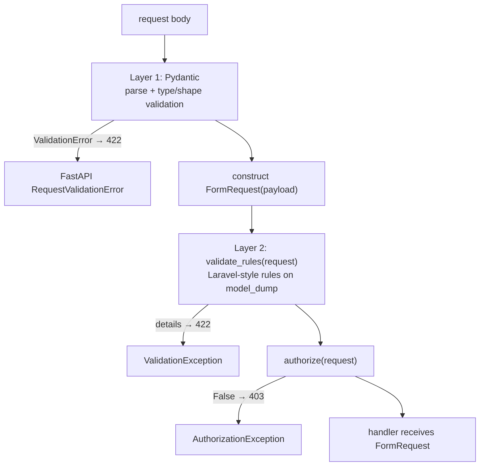

# Requests & validation

`FormRequest` combines Pydantic body parsing, Laravel-style rule validation, and authorization into one route parameter. Understanding it means understanding two validation layers stacked on top of each other.

**Source**: `packages/arvel/src/arvel/http/requests.py`, `validation/`.

## `FormRequest` is a wrapper, not a model

`FormRequest[T]` is a **generic wrapper** around a Pydantic payload model `T` — it is not itself a Pydantic model:

```python
class FormRequest(Generic[T]):
    _payload_type: ClassVar[type[BaseModel] | None] = None

    def __init__(self, payload: T) -> None:
        self._payload: T = payload

    def __init_subclass__(cls, **kwargs):
        ...  # walk __orig_bases__ to capture T

    def validated(self) -> T:
        return self._payload
```

Define one by parameterizing it with a payload model:

```python
class StoreUserPayload(BaseModel):
    name: str
    email: str

class StoreUserRequest(FormRequest[StoreUserPayload]):
    def rules(self) -> dict[str, str | list[str]]:
        return {"email": "unique:users,email"}

    async def authorize(self, request) -> bool:
        return request.state.user is not None
```

## Two validation layers



**Layer 1 (Pydantic)** does type and shape validation when FastAPI parses the body — before the `FormRequest` exists. So use the Pydantic model for "is this a string / int / well-formed email".

**Layer 2 (rules)** runs after, on `payload.model_dump(mode="python")`, for checks Pydantic can't do alone — chiefly database-backed ones (`unique`, `exists`).

## How routing wires it in

`_normalize_form_requests` (in `routing.py`) rewrites the handler signature at mount time:

1. Replace `form: StoreUserRequest` with a hidden body param typed as the payload model.
2. Inject a hidden `Request` param.
3. In the wrapper: construct `form_cls(payload)`, `await form.validate_rules(request)`, then `await form.authorize(request)` — denial raises `AuthorizationException`.

So by the time your handler runs, both layers have passed and `form.validated()` returns the typed payload.

## Rule validation

```python
async def validate_rules(self, request) -> None:
    data = self._payload.model_dump(mode="python")
    validator = Validator(data, request=request,
                          messages=self.messages(), attributes=self.attributes())
    self.with_validator(validator)
    details = await validator.validate(self.rules())
    if details:
        raise ValidationException("Validation failed.", details=details)
```

`Validator.validate`:

- expands expressions like `required|digits:16`,
- merges conditional `sometimes` rules,
- for each rule, parses it, looks up a handler in `RULE_HANDLERS`, and runs it (sync or async),
- returns a list of `{field, issue}` dicts; empty means pass.

## Supported rules

The rule registry is small and deliberate:

```python
RULE_HANDLERS = {
    "digits": rule_digits,
    "dimensions": rule_dimensions,
    "exists": rule_exists,
    "mimes": rule_mimes,
    "required": rule_required,
    "unique": rule_unique,
}
```

| Rule | Form | Notes |
|---|---|---|
| `required` | `required` | Fails on `None`, `""`, `[]`, `{}`. |
| `digits:N` | `digits:16` | Exact length, all digits. |
| `exists:table,column` | `exists:users,id` | SQLAlchemy `select`; needs an active session. |
| `unique:table,column[,except,except_col]` | `unique:users,email` | DB uniqueness, with optional ignore. |
| `mimes:ext,...` | `mimes:png,jpg` | Extension or content-type. |
| `dimensions:min_width=…,…` | `dimensions:min_width=100` | PNG/JPEG byte sniffing. |

An unknown rule yields `{"field": ..., "issue": "Unknown validation rule '...'."}`.

> **Warning**: There is **no** `string`, `numeric`, `min`, or `max` rule. Do type and range checks with Pydantic on the payload model. The rule layer is for things Pydantic can't see — primarily the database.

> **Warning**: `exists` and `unique` call `get_active_session()`, so the route needs an active SQLAlchemy session — typically by mounting `DatabaseTransaction` middleware.

### Conditional rules

`Rule.sometimes(field, rules, condition)` (and `Validator.sometimes`) add rules only when a condition holds. Register them via `with_validator()` in your `FormRequest`.

## Authorization

`authorize()` **defaults to deny** — subclasses must opt in:

```python
async def authorize(self, request) -> bool:
    return False   # base default
```

A `False` (or unoverridden) `authorize()` raises `AuthorizationException` (403) before the handler runs. Override it to allow.

## `validated()`

Returns the Pydantic-validated payload (`self._payload`). It does not re-run rules — by the time you call it, rule validation has already happened in the wrapper.

## See also

- [Routing](routing.md) — how the parameter is rewritten.
- [Exceptions](exceptions.md) — `ValidationException`, `AuthorizationException` rendering.
- [Auth subsystem](../subsystems/auth.md) — guards behind `request.state.user`.
