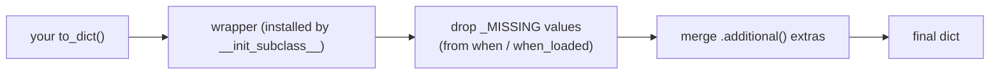
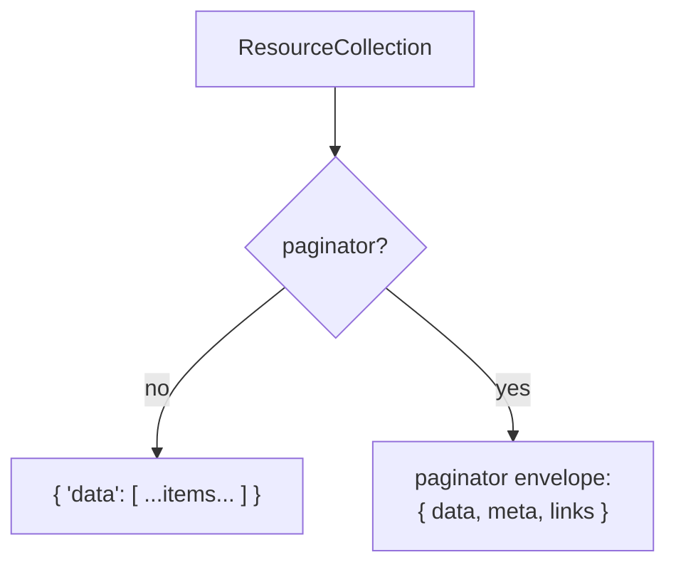

# API resources

Resources are the response-shaping layer: take a model (or a collection of models) and turn it into a JSON envelope. `JsonResource` shapes one item; `ResourceCollection` shapes many, with pagination support.

**Source**: `packages/arvel/src/arvel/http/resources.py`.

## `JsonResource[T]`

A resource wraps a single object and implements `to_dict(request)`:

```python
class JsonResource(Generic[T]):
    schema: ClassVar[type[BaseModel] | None] = None

    def __init__(self, resource: T) -> None:
        self.resource: T = resource
        self._additional: dict[str, Any] = {}

    @abstractmethod
    def to_dict(self, request: Any) -> dict[str, Any]: ...

    def response(self, request, *, status_code=200, headers=None) -> ResourceResponse:
        return ResourceResponse(content=self.to_dict(request),
                                status_code=status_code,
                                headers=dict(headers) if headers else None)
```

```python
class ItemResource(JsonResource[Item]):
    def to_dict(self, request) -> dict[str, object]:
        return {"id": self.resource.id, "name": self.resource.name}

# in a handler
return ItemResource(item).response(request)
```

`ResourceResponse` is a `JSONResponse` subclass, so it slots straight into FastAPI's response handling.

### Conditional fields

`__init_subclass__` wraps your concrete `to_dict` so the framework can post-process it:



| Helper | Use |
|---|---|
| `when(condition, value)` | Include a key only when `condition` is truthy; otherwise it's dropped. |
| `when_loaded(relation)` | Include a relation only if it's already eager-loaded (avoids a lazy query). |
| `additional(extra)` | Merge extra top-level keys into the output. |

The `_MISSING` sentinel returned by `when`/`when_loaded` is stripped by the wrapper, so absent fields simply don't appear.

## `ResourceCollection[T]`

Shapes a list of items through a resource class, optionally paginated:

```python
class ResourceCollection(Generic[T]):
    def __init__(self, resources, resource_cls, *, paginator=None): ...

    def to_dict(self, request) -> dict[str, Any]:
        if self._paginator is not None:
            base_url, query = _derive_url_context(request)
            return self._paginator.to_dict(
                items_serializer=lambda r: self._resource_cls(r).to_dict(request),
                base_url=base_url, query=query)
        data = [self._resource_cls(r).to_dict(request) for r in self._resources]
        return self.wrap(data)

    def wrap(self, data) -> dict[str, Any]:
        return {"data": data}
```

Create one with the `collection` classmethod on a resource:

```python
return ItemResource.collection(items).response(request)
```

## Wrapping



- **List path** → `{"data": [...]}` via `wrap`.
- **Paginator path** → the paginator's full envelope with `data`, `meta`, and `links`, and `_derive_url_context(request)` supplies the base URL and query for building page links.

## See also

- [Routing](routing.md) — handlers and controllers that return resources.
- [ORM query builder](../orm/query-builder.md) — paginators that feed `ResourceCollection`.
