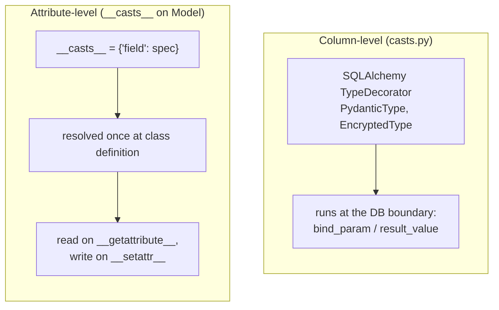
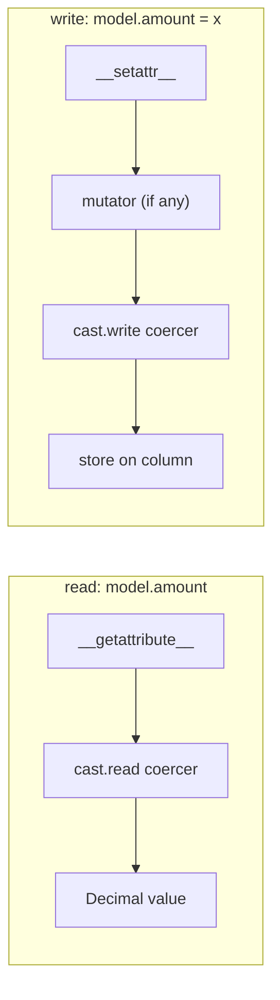
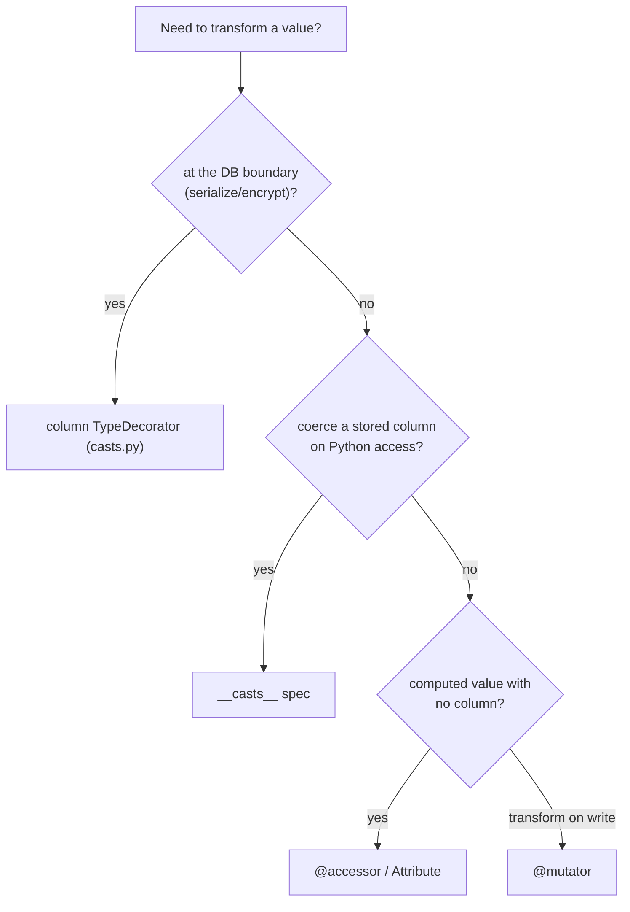

# Casts, accessors & mutators

Arvent has two distinct casting mechanisms that are easy to confuse: **column-level type decorators** (storage boundary) and **attribute-level `__casts__`** (Python-side coercion). Plus accessors and mutators for virtual attributes.

**Source**: `packages/arvel/src/arvel/database/casts.py`, `attributes.py`, and the cast pipeline in `model.py`.

## Two casting layers



| Layer | Where it runs | Use for |
|---|---|---|
| Column `TypeDecorator` | DB serialize/deserialize | persisting a Pydantic model as JSON, encrypting a column at rest |
| `__casts__` | Python attribute get/set | coercing a stored value to a richer Python type on access |

## Column-level type decorators

`casts.py` provides SQLAlchemy `TypeDecorator`s that transform values at the storage boundary:

```python
class PydanticType(TypeDecorator, Generic[PydanticModelT]):
    def process_bind_param(self, value, dialect): ...    # model → JSON for storage
    def process_result_value(self, value, dialect): ...  # JSON → model on load

class EncryptedType(TypeDecorator[str]):
    def process_bind_param(self, value, dialect): ...    # encrypt before write
    def process_result_value(self, value, dialect): ...  # decrypt after read
```

Use these as the column type via `column(PydanticType(MyModel))`. They're invisible to the rest of the app — the column just stores/returns the rich value.

## Attribute-level `__casts__`

Declare a `__casts__` map on the model. It's resolved once at class definition into read/write/serialize callables:

```python
class Order(Model):
    __casts__ = {
        "metadata": "json",
        "is_paid": "boolean",
        "secret": "encrypted:json",
        "amount": "decimal:2",
    }
```

```python
def __init_subclass__(cls, **kw):
    casts = getattr(cls, "__casts__", None)
    if casts:
        cls.__arvel_cast_resolvers__ = {
            name: _resolve_cast_spec(cls.__name__, name, spec)
            for name, spec in casts.items()
        }
```

Built-in spec strings dispatch through `_CAST_DISPATCH`: `boolean`, `datetime`, `json`, `encrypted:json`, `decimal:N`, an Enum class, or a `CastsAttributes` subclass.

### Read and write integration

The cast is applied transparently when you touch the attribute:

```python
def __getattribute__(self, name):
    value = super().__getattribute__(name)
    resolved = ... # __arvel_cast_resolvers__.get(name)
    if resolved and resolved.read:
        return resolved.read(self, name, value)
    return value

def __setattr__(self, name, value):
    mutator_fn = type(self).__arvel_mutators__.get(name)
    if mutator_fn:
        value = mutator_fn(self, value)
    resolved = ...
    if resolved and resolved.write:
        value = resolved.write(self, name, value)
    super().__setattr__(name, value)
```



Note the write order: a registered **mutator runs first**, then the cast's write coercer.

## Custom casts: `CastsAttributes`

For reusable cast logic, subclass `CastsAttributes` and reference it in `__casts__`:

```python
class CastsAttributes(ABC):
    @abstractmethod
    def get(self, model, key, value): ...    # read coercion
    @abstractmethod
    def set(self, model, key, value): ...    # write coercion
    def serialize(self, model, key, value):  # form used by to_dict()
        return value
```

`serialize` lets `to_dict()` emit a different shape than the in-memory `get` value (e.g. a JSON-safe form).

## Virtual attributes: `Attribute`, `@accessor`, `@mutator`

`attributes.py` provides a unified `Attribute` descriptor with symmetric get/set and optional per-instance caching:

```python
class Attribute:
    def __init__(self, *, get=None, set=None, cached=False): ...

    def __get__(self, instance, owner=None):
        # optional cache; calls the getter
        ...
    def __set__(self, instance, value):
        # setter returns {column: value}; each goes through normal setattr
        ...
```

A write through an `Attribute` returns a mapping of real column names to values, and each is assigned via normal `setattr` — so it still passes through mutators and `__casts__`.

The `@accessor` decorator builds a read-only computed property; `@mutator("column")` registers a write transform that's collected into `__arvel_mutators__` and applied first in `__setattr__` (as shown above).

## Choosing a mechanism



## See also

- [Model internals](model-internals.md) — where `__casts__` and mutators are wired in.
- [Encryption](../subsystems/encryption.md) — what `EncryptedType` / `encrypted:` rely on.
