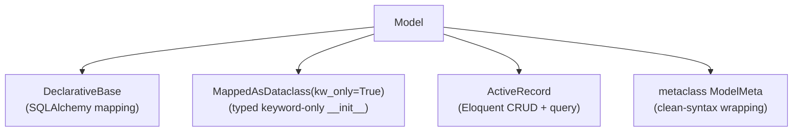
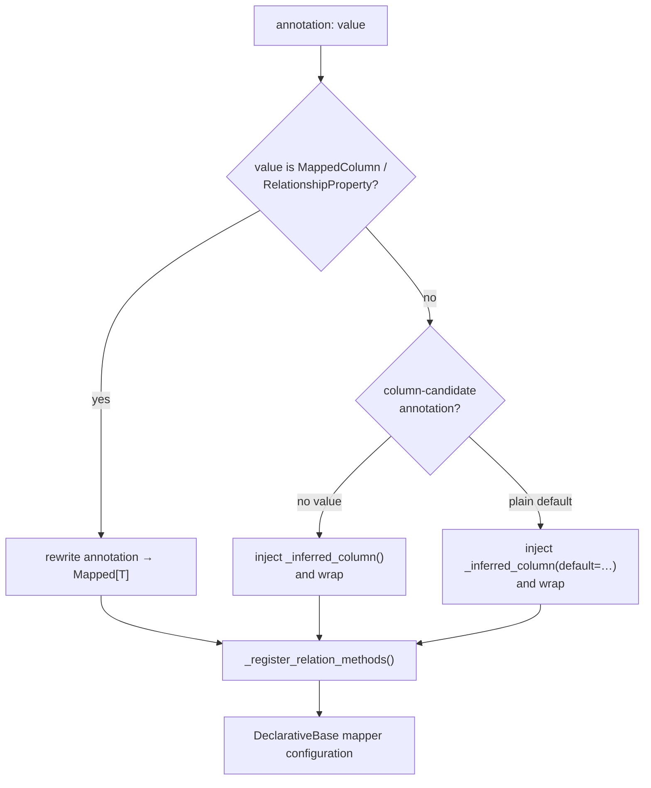

# Model internals

Arvent is an Eloquent-shaped ActiveRecord API on top of SQLAlchemy 2.x declarative. The clever part is the "clean syntax" — `id: int = id_()` instead of `id: Mapped[int] = mapped_column(...)`. This page explains how that works and what `Model` actually is.

**Source**: `packages/arvel/src/arvel/database/model.py`, `columns.py`, `attributes.py`.

## What `Model` is

```python
class Model(
    MappedAsDataclass, DeclarativeBase, ActiveRecord,
    metaclass=ModelMeta, init=True, kw_only=True,
):
    __abstract__ = True
```

Four ingredients:



- `DeclarativeBase` — the model is a real SQLAlchemy mapped class.
- `MappedAsDataclass` — every concrete subclass gets a typed, keyword-only `__init__` from its column annotations.
- `ActiveRecord` (extends `QueryMixin`) — the `find`/`create`/`where`/`save`/`delete` API.
- `ModelMeta` — wraps plain annotations into SQLAlchemy `Mapped[T]` at class-creation time.

## Clean syntax: how `id_()` becomes a column

You write the plain Python type; the metaclass supplies the `Mapped[...]` wrapper.

```python
class Item(Model, Timestamps):
    __tablename__ = "items"
    id: int = id_()
    name: str = string(255)
    price: Decimal = decimal(10, 2)
```

Each column helper in `columns.py` returns a `mapped_column(...)` typed as `Any`, so the annotation (`int`, `str`, `Decimal`) stays the single source of truth for the Python type:

```python
def id_(*, autoincrement=True, init=False) -> Any:
    return mapped_column(Integer, primary_key=True, autoincrement=autoincrement,
                         init=init, default=None)

def string(length=255, *, nullable=False, unique=False, index=False,
           init=True, default=_UNSET) -> Any:
    return mapped_column(String(length=length), ...)
```

`ModelMeta.__new__` runs at class creation and, for each annotation:



`ModelMeta` is declared with `@dataclass_transform(... field_specifiers=(id_, string, …))` so type checkers understand the helpers produce dataclass fields. Bare annotations (no helper) fall back to the `type_annotation_map`:

```python
type_annotation_map = {
    str: String(255),
    datetime: DateTime(timezone=True),
    Decimal: Numeric(10, 2),
}
```

### Column vocabulary

`columns.py` exports the full set. All return `Any` (the annotation carries the type):

| Group | Helpers |
|---|---|
| Keys | `id_`, `uuid_id`, `uuid` |
| Strings | `string`, `text`, `foreign_string` |
| Numbers | `integer`, `big_integer`, `decimal` |
| Bool / time | `boolean`, `datetime` |
| JSON | `json`, `jsonb` |
| Foreign keys | `foreign_id`, `foreign_uuid`, `foreign_string` |
| Enum / search | `enum`, `tsvector` |
| Generic / escape hatch | `column`, `nullable_column`, `field` |

`foreign_id("users.id", on_delete="CASCADE")` builds a real SQLAlchemy `ForeignKey`. `column(SomeType, ...)` is the escape hatch when no helper fits.

## ActiveRecord surface

`ActiveRecord` adds the terminal class operations and instance persistence; the fluent query entry points (`where`, `order_by`, `with_`, …) come from `QueryMixin`.

| Operation | Kind | Notes |
|---|---|---|
| `await Model.find(pk)` | class | `None` if missing |
| `await Model.find_or_fail(pk)` | class | raises if missing |
| `await Model.create(**attrs)` | class | insert + return instance |
| `await Model.all()` / `.get()` | class | `ModelCollection` |
| `await Model.update(values)` | class (`QueryMixin`) | bulk update, returns row count |
| `instance.fill(**attrs)` | instance | mass-assign honoring fillable/guarded + mutators |
| `await instance.save()` | instance | insert or update |
| `await instance.delete()` | instance | hard or soft (see below) |
| `await instance.fresh()` / `.refresh()` | instance | reload from DB |

There is no instance `update()` — it's `fill(**attrs)` then `save()`.

Unknown class-attribute access is forwarded to `cls.query()` by `ModelMeta`, which is how `Model.where(...)` reaches the query builder. See [query builder](query-builder.md).

## Timestamps

`Timestamps` is a mixin adding auto-populated `created_at` / `updated_at`:

```python
class Timestamps(MappedAsDataclass, metaclass=ModelMeta):
    created_at: datetime = datetime(nullable=False, init=False, default=None)
    updated_at: datetime = datetime(nullable=False, init=False, default=None)
```

`Model.__init_subclass__` attaches SQLAlchemy `before_insert` / `before_update` event listeners when those columns exist (overridable via `CREATED_AT` / `UPDATED_AT`, or disabled with `__timestamps__ = False`).

## Soft deletes

`SoftDeletes` adds a `deleted_at` column and registers a global scope that hides trashed rows:

```python
class SoftDeletes(MappedAsDataclass, metaclass=ModelMeta):
    deleted_at: datetime | None = datetime(nullable=True, init=False, default=None)
    __arvel_soft_delete_column__ = "deleted_at"

    def __init_subclass__(cls, **kw):
        ...
        cls.__arvel_global_scopes__["soft_delete"] = SoftDeleteScope(col).apply
```

`delete()` checks `__arvel_soft_delete_column__`: if set, it stamps `deleted_at = now()` and flushes instead of issuing a `DELETE`. The query builder's `with_trashed()` / `only_trashed()` bypass the scope. See [scopes in the query builder](query-builder.md#global-scopes).

## Virtual attributes, accessors, mutators

`attributes.py` provides a unified `Attribute` descriptor with symmetric get/set, plus `@accessor` and `@mutator` decorators and a `CastsAttributes` base for custom column casts.

- **Read**: `Model.__getattribute__` runs a resolved cast's `read` callable over the raw column value.
- **Write**: `Model.__setattr__` runs a registered mutator first, then the cast's `write` coercer.

The cast plumbing is detailed in [casts](casts.md).

## See also

- [Query builder](query-builder.md) · [Relationships](relationships.md) · [Casts](casts.md) · [Schema & migrations](schema-migrations.md)
