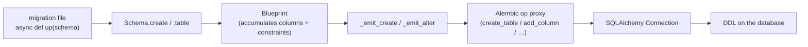
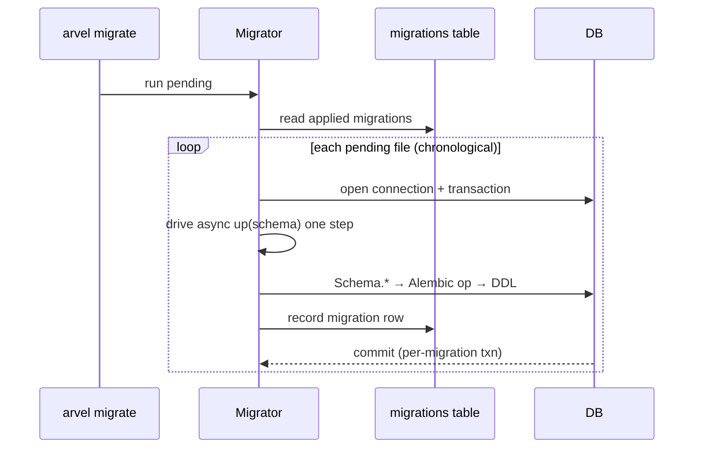

# Schema & migrations

Arvent ships a Laravel-style schema DSL that compiles to Alembic operations — it never emits raw SQL. Migration files are plain `async def up/down` functions, run by a custom `Migrator` against a `migrations` tracking table.

**Source**: `packages/arvel/src/arvel/database/schema.py`, `migrator.py`, `migrations.py`.

## The pipeline



The design rule (per ADR-044): the DSL **never** produces raw SQL. Each `Blueprint` collects `Column` and constraint objects, then hands them to Alembic via `op.create_table` / `op.add_column`.

## The `Schema` facade

`Schema` exposes class methods that take a table name and a builder callback:

```python
class Schema:
    @classmethod
    def create(cls, table_name, build: Callable[[Blueprint], None], *, executor=None):
        bp = Blueprint(table_name=table_name)
        build(bp)
        cls._emit_create(bp, executor or _default_executor())

    @classmethod
    def table(cls, table_name, build, *, executor=None): ...      # ALTER
    @classmethod
    def drop(cls, table_name, *, executor=None): ...
    @classmethod
    def drop_if_exists(cls, table_name, *, executor=None): ...
    @classmethod
    def rename(cls, from_name, to_name, *, executor=None): ...
```

`create` emits a `create_table`; `table` emits ALTERs (add/drop/modify columns, indexes). The `executor` parameter defaults to the real `alembic.op` module; tests pass a **recording executor** to assert what DDL *would* be emitted without a database.

## The `Blueprint`

`Blueprint` is the table builder passed into the callback. It accumulates pending columns, indexes (regular, expression, GIN), uniques, drops, renames, and modifications:

```python
@dataclass
class Blueprint:
    table_name: str
    columns: list[PendingColumn] = ...
    indexes: list[...] = ...
    expression_indexes: list[...] = ...
    gin_indexes: list[...] = ...
    uniques: list[...] = ...
    drops: list[str] = ...
    # ... renames, modifies, drop_indexes
```

Column helpers mirror the model column vocabulary: `id`, `integer`, `big_integer`, `string`, `text`, `boolean`, `datetime`, `decimal`, `json`, `jsonb`, `foreign_id`, `uuid`, `tsvector`, plus index/unique/timestamp helpers. Each appends a `PendingColumn`:

```python
def id(self, name="id", *, id_type=IdType.INT, primary_key=True, autoincrement=True, nullable=False):
    if id_type == IdType.UUID:
        autoincrement = False
    return self._add(PendingColumn(name=name, type_=id_type.value(), primary_key=primary_key, ...))
```

A typical migration body:

```python
from arvel.database import Schema


async def up(schema: Schema) -> None:
    schema.create("items", lambda t: (
        t.id(),
        t.string("name"),
        t.decimal("price", 10, 2),
        t.foreign_id("category_id").references("categories.id"),
        t.timestamps(),
    ))


async def down(schema: Schema) -> None:
    schema.drop("items")
```

### Cross-dialect types

PostgreSQL-specific types degrade gracefully so the same migration runs on SQLite in CI:

- `JsonB` — `JSONB` on PostgreSQL, falls back to `JSON` elsewhere.
- `_TsVector` — `TSVECTOR` on PostgreSQL, falls back to `TEXT` elsewhere.
- `IdType.UUID` — native `UUID` (or `VARCHAR(36)`), generated by the app via `uuid7()`, never by the DB.

## The `Migrator`

Migration files use an async-function contract that `arvel make:migration` generates:

```python
async def up(schema: Schema) -> None: ...
async def down(schema: Schema) -> None: ...
```

The `Migrator` orchestrates these against a Laravel-style `migrations` tracking table.



Key behaviors:

- **One transaction per migration**. A body failure leaves earlier migrations applied — Laravel semantics. The framework does not wrap the whole batch in a single transaction.
- **Async bodies, sync DDL**. The orchestration runs on the `AsyncEngine`, using `conn.run_sync()` to get a sync `Connection` for Alembic's `MigrationContext`. The user's `async def up()` is driven manually one step at a time. Migration bodies normally never `await` (`Schema.create` and friends are sync), so the coroutine runs to completion on the first `send(None)`. If a body actually suspends — a misuse — the migrator raises a clear error rather than deadlocking on a nonexistent event loop.

> **Note**: Because `Schema.*` helpers are synchronous, don't `await` inside a migration body. The `async def` signature exists for contract uniformity, not because the DDL is async.

## Errors

| Exception | When |
|---|---|
| `MigrationFileInvalidError` | A file doesn't expose the `up`/`down` contract |
| `MigrationFailedError` | A migration body raises during apply |

## See also

- [Model internals](model-internals.md) — the runtime column vocabulary (mirrors the Blueprint helpers).
- [CLI architecture](../console/cli-architecture.md) — `make:migration`, `migrate`, `migrate:rollback`.
