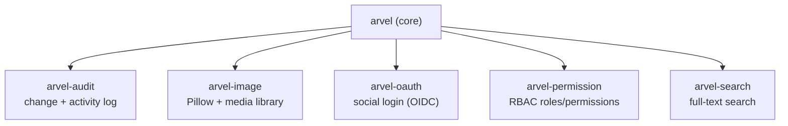

# Companion packages

The framework core lives in `packages/arvel`. Optional capabilities ship as separate workspace packages so apps only pull in what they use. They all follow the same shape: a `ServiceProvider`, optional models + published migration stubs, and a public import surface.

**Source**: `packages/arvel-audit`, `packages/arvel-image`, `packages/arvel-oauth`, `packages/arvel-permission`, `packages/arvel-search`, plus the reference app `kits/arvel-ecommerce-kit`. Workspace membership is declared in the root `pyproject.toml` (`[tool.uv.workspace] members = ["packages/*", "kits/*"]`).

## The five libraries



| Package | Provider | Facade | Install command | Migrations tag | Auto-mounts HTTP? |
|---|---|---|---|---|---|
| [audit](audit.md) | `AuditServiceProvider` | — | `audit:install` | `arvel-audit` | no |
| [image](image.md) | `ImageServiceProvider` | — | — | `arvel-image` | no |
| [oauth](oauth.md) | `OAuthServiceProvider` | — | `oauth:install` | `arvel-oauth` | no (manual routes) |
| [permission](permission.md) | `PermissionServiceProvider` | — | — | `arvel-permission` | no (manual middleware) |
| [search](search.md) | `SearchServiceProvider` | `Search` | — | — | no |

## How they wire in

There is **no provider auto-discovery**. To enable a package you add its provider to the app's `bootstrap/providers.py`:

```python
# bootstrap/providers.py
from arvel_permission import PermissionServiceProvider
from arvel_image import ImageServiceProvider

providers = [
    PermissionServiceProvider,
    ImageServiceProvider,
]
```

The core extras in `packages/arvel/pyproject.toml` (`permission`, `image`, `oauth`, `search`, `audit`, and `all`) pull the package as a dependency; registering the provider is still a separate, explicit step.

> **Note**: Each package publishes its migration stub via `ServiceProvider.publishes()`. Copy them into your app with the install command (audit, oauth) or `arvel vendor:publish --tag=<tag>` (everyone else), then run `arvel migrate`.

## Shared conventions

- **Import root** is the underscore name: `arvel_audit`, `arvel_image`, etc. The public surface is whatever the package `__init__.py` re-exports.
- **Models** subclass the core `Model` and ship a migration stub — they aren't auto-migrated.
- **Mixins** (`Auditable`, `HasMedia`, `HasRoles`, `Searchable`) graft behavior onto your models and hook core ORM lifecycle events.
- **Config** is mostly `pydantic-settings` over env vars (`AUDIT_*`, `OAUTH_*`, `SEARCH_*`). `arvel-permission` is the exception — its `PermissionConfig` is code-level, not env-driven.

## See also

- [Service providers](../architecture/service-providers.md) — `register`/`boot`/`commands`/`publishes`.
- [Ecommerce kit](../kits/ecommerce-kit.md) — a real app exercising several packages.
