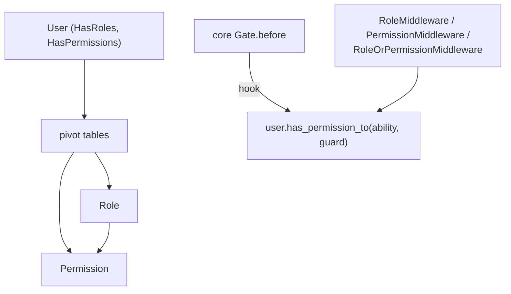

# arvel-permission

Role-based access control: `Role` and `Permission` models, `HasRoles` / `HasPermissions` mixins, route middleware, and a Gate `before` hook so permission checks flow through the core authorization layer.

**Source**: `packages/arvel-permission/src/arvel_permission/` — `provider.py`, `models.py`, `traits.py`, `service.py` (`PermissionRegistrar`), `gate_integration.py`, `middleware.py`, `events.py`, `config.py`, `migrations/create_permission_tables.py`.

## Shape

## Public surface

`Role`, `Permission`, `HasRoles`, `HasPermissions`, the three middleware (`RoleMiddleware`, `PermissionMiddleware`, `RoleOrPermissionMiddleware`), `PermissionRegistrar`, `PermissionConfig`, `register_permissions_with_gate`, the pivot `Table`s (`model_has_roles`, `model_has_permissions`, `role_has_permissions`), `PermissionServiceProvider`, plus the exception hierarchy (`RoleDoesNotExist`, `PermissionDoesNotExist`, `UnauthorizedException`, `GuardMismatchError`). The `events` module is public but not in `__all__`.

## Provider

`PermissionServiceProvider.register()` binds `PermissionConfig` (default, overridable via `provider.config = ...` before boot). `boot()` publishes `create_permission_tables.py` (tag `arvel-permission`), applies wildcard + model config, and — if a `Gate` is bound — registers the permission hook via `register_permissions_with_gate(gate, guard=default_guard_name)`. No commands, no facade.

## Integration points

- **Gate**: installs a `gate.before` hook calling `user.has_permission_to(ability, guard=...)`. Silently skipped if no `Gate` is bound.
- **HTTP middleware (manual)**: register the role/permission middleware on your router yourself — the provider doesn't mount them.
- **ORM**: the host `User` must declare `MorphToMany` relations to the pivots (see `traits.py`). Traits use `get_active_session()`.
- **Cache**: `PermissionRegistrar` can use an optional `CacheStore` (`cache_enabled`, `cache_store`, `cache_ttl`).
- **Events**: `events.py` is a separate, synchronous, in-process dispatcher (`events_enabled`) — **not** the core `Bus`/event system.

## Config

`PermissionConfig` is **code-level**, not env-driven. Key fields: `role_model`, `permission_model`, `default_guard_name` (`"web"`), table-name overrides, `wildcard_enabled`, `cache_enabled`, `events_enabled`, `cache_store`, `cache_ttl`, `cache_prefix`.

> **Warning**: Watch for these:
> - Middleware and the Gate hook only activate when the provider runs and a `Gate` is bound. The kit uses the models/traits directly **without** `PermissionServiceProvider`, so it gets no Gate bridge.
> - `PermissionConfig` is config-as-code; a Laravel-shaped `config/permission.py` dict (as in the kit) is **not** auto-wired to it.
> - `Role`/`Permission` get trait methods grafted at the end of `traits.py`, so import order matters.

## See also

- [Auth](../subsystems/auth.md) (Gate) · [Middleware](../http/middleware.md) · [Relationships](../orm/relationships.md) (`MorphToMany`)
