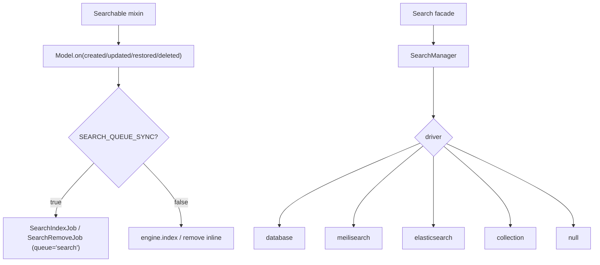

# arvel-search

Laravel Scout-style full-text search: a `Searchable` mixin, pluggable engines, a fluent `Model.search("term")`, and optional queue-backed index sync. The only companion package with a facade (`Search`).

**Source**: `packages/arvel-search/src/arvel_search/` — `provider.py`, `manager.py`, `facade.py`, `searchable.py`, `builder.py`, `engine.py`, `dtos.py`, `jobs.py`, `fake.py`, `engines/` (`database.py`, `meilisearch.py`, `elasticsearch.py`, `collection.py`, `null.py`).

## Shape

## Public surface

`Searchable`, `Search` (facade), `SearchManager`, `SearchBuilder`, `SearchPage`, `SearchQuery`, `SearchResult`, `Engine`, the concrete engines (`DatabaseEngine`, `MeilisearchEngine`, `ElasticsearchEngine`, `CollectionEngine`, `NullEngine`), `SearchFake`, `SearchConfig`, `SearchServiceProvider`, plus the `SearchError` hierarchy.

## Provider

`SearchServiceProvider.register()` binds `SearchConfig` and a `SearchManager(config)` instance. `boot()` imports the `jobs` module (a registration side effect for the queue jobs) and binds the `Search` facade to the manager. No commands.

## Integration points

- **ORM lifecycle**: `Searchable` registers `Model.on("created"|"updated"|"restored"|"deleted")` to keep the index in sync.
- **Facade**: `Search.engine()`, `Search.fake()`, `Search.active_engine_or_none()` — the last one no-ops gracefully when the facade isn't bound.
- **Queue**: when `SEARCH_QUEUE_SYNC=true`, sync goes through `SearchIndexJob` / `SearchRemoveJob` on the `search` queue via `Bus.dispatch`.
- **Custom engines**: `SearchManager.register_driver()`.

## Config

| Env var | Field | Default |
|---|---|---|
| `SEARCH_DRIVER` | `driver` | `database` |
| `SEARCH_INDEX_PREFIX` | `index_prefix` | `""` |
| `SEARCH_SYNC_ON_SAVE` | `sync_on_save` | `true` |
| `SEARCH_QUEUE_SYNC` | `queue_sync` | `false` |
| `SEARCH_MEILISEARCH_URL` / `_KEY` | Meilisearch | localhost / empty |
| `SEARCH_ELASTICSEARCH_URL` / `_KEY` | Elasticsearch | localhost / empty |

> **Note**: This package ships **no migrations** — `DatabaseEngine` queries the model's own table via SQLAlchemy. `Searchable` works without the provider, but sync becomes a no-op (`active_engine_or_none()` returns nothing). Queue sync needs `QueueServiceProvider` plus a worker on the `search` queue. There's a guard that warns if `__searchable__` includes password-like field names.

## See also

- [Queues](../subsystems/queues.md) · [Model internals](../orm/model-internals.md) · [Facades](../architecture/facades.md)
