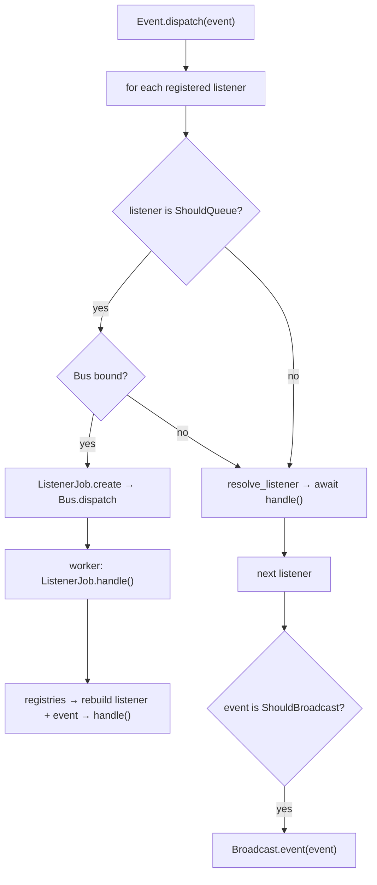

# Events

Events are immutable Pydantic payloads. The dispatcher runs registered listeners — inline by default, or onto the queue when a listener mixes in `ShouldQueue`. Events that mix in `ShouldBroadcast` also fan out to the broadcaster.

**Source**: `packages/arvel/src/arvel/events/` — `event.py`, `listener.py`, `dispatcher.py`, `should_queue.py`, `listener_job.py`, `providers/`.

## Building blocks

```python
class Event(BaseModel):
    model_config = ConfigDict(frozen=True)
    def __init_subclass__(cls, **kwargs):
        EventRegistry[key] = cls

class Listener(ABC, Generic[E]):
    def __init_subclass__(cls, **kwargs):
        ListenerRegistry[key] = cls
    @abstractmethod
    async def handle(self, event: E) -> None: ...

class ShouldQueue:  # marker mixin
    ...
```

Events and listeners auto-register in parallel registries — needed to deserialize a queued listener later.

## Dispatch

```python
async def dispatch(self, event):
    for listener_cls in self._registry.get(type(event), []):
        if issubclass(listener_cls, ShouldQueue):
            await self._dispatch_queued(listener_cls, event)
        else:
            await self._dispatch_inline(listener_cls, event)
    await self._maybe_broadcast(event)
```



Key behaviors:

- **Ordering** is registration order per event type.
- **Error isolation** — each inline listener runs in its own try/except; a failure is logged and the remaining listeners still run.
- **Queued fallback** — if a `ShouldQueue` listener fires but no `Bus` is bound, it runs inline instead.

## Queued listeners

A queued listener is bridged onto the queue by `ListenerJob`:

```python
class ListenerJob(Job):
    listener_class_key: str
    event_class_key: str
    event_json: str

    async def handle(self):
        listener_cls = ListenerRegistry[self.listener_class_key]
        event_cls = EventRegistry[self.event_class_key]
        event = event_cls.model_validate_json(self.event_json)
        await self._resolve_listener(listener_cls).handle(event)
```

So a queued listener needs both `EventServiceProvider` and `QueueServiceProvider`, plus a running worker (except the `sync` driver, which runs the job inline at push time). Declare one with multiple inheritance:

```python
class SendWelcome(Listener[Registered], ShouldQueue):
    async def handle(self, event: Registered) -> None: ...
```

## Broadcast hook

After listeners run, `_maybe_broadcast` checks whether the event mixes in `ShouldBroadcast` and, if a broadcaster is bound, calls `Broadcast.event(event)`. See [broadcasting](broadcasting.md).

## Provider

```python
class EventServiceProvider(ServiceProvider):
    def register(self):
        self.container.instance(EventDispatcher, EventDispatcher(container=self.container))
    async def boot(self):
        Event.bind(self.container.make(EventDispatcher))
```

The dispatcher gets the container so it can resolve listeners with DI. Provider order matters: `EventServiceProvider` before `QueueServiceProvider` (which binds `Bus`), before subsystems that attach listeners (e.g. auth).

## See also

- [Queues](queues.md) — `ListenerJob` runs on the queue.
- [Broadcasting](broadcasting.md) — `ShouldBroadcast`.
