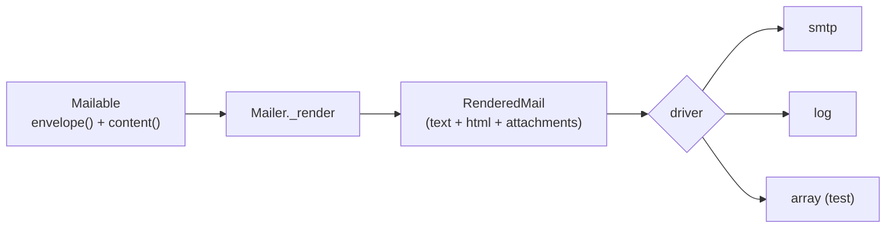

# Mail

A `Mailable` declares an envelope and content; the `Mailer` renders it to a `RenderedMail` and hands it to a driver (`smtp`, `log`, `array`).

**Source**: `packages/arvel/src/arvel/mail/` — `mailable.py`, `envelope.py`, `content.py`, `mailer.py`, `rendered_mail.py`, `drivers/`, `providers/`, `facades/mail.py`.

## Shape



## Mailable

```python
class Mailable(ABC):
    @abstractmethod
    def envelope(self) -> Envelope: ...     # from/to/subject/cc/bcc/reply_to/tags
    @abstractmethod
    def content(self) -> Content: ...       # body (inline or template)
    def attachments(self) -> list[Attachment]:
        return []
```

`Content` carries either inline strings or template view names, plus a `data` dict for the template. It enforces text/text_view and html/html_view mutual exclusion and requires at least one body source:

```python
@dataclass
class Content:
    text: str | None = None
    text_view: str | None = None
    html: str | None = None
    html_view: str | None = None
    data: dict[str, Any] = field(default_factory=dict)
```

## Rendering

```python
def _render(self, mailable, override_to=None) -> RenderedMail:
    env = mailable.envelope()
    content = mailable.content()
    # html_view → render_template(view, data); elif html → verbatim
    # text_view → render_template; elif text → verbatim
    # HTML-only → auto-derive plain text via html_to_text()
    return RenderedMail(envelope=env, body_text=..., body_html=..., attachments=...)
```

Templates render through `arvel.support.view.render_template`. If only HTML is supplied, the mailer derives a plain-text alternative automatically.

## Drivers

There's no formal driver protocol — drivers are duck-typed `async def send(self, mail: RenderedMail) -> None`:

| Driver | Behavior |
|---|---|
| `SmtpMailDriver` | `aiosmtplib`; builds `MIMEMultipart("mixed")` with an `alternative` text/html part + attachments; raises `MailException` on failure |
| `LogMailDriver` | logs at INFO; never raises |
| `ArrayMailDriver` | appends to `self.sent` (tests) |

## Sending

```python
await Mail.to(address).send(mailable)
# → Mailer.send_to(address, mailable) → _render → driver.send(rendered)
```

`Mail.fake()` swaps the active driver to `ArrayMailDriver` for assertions.

## Provider

`MailServiceProvider.register()` binds the `Mailer`; `boot()` binds the `Mail` facade. Driver selection prefers `config/mail.py` (via `config.lookup`), falling back to `MailConfig` env vars (`MAIL_DEFAULT` default `log`, `MAIL_SMTP_*`). Not a baseline provider — add it in `bootstrap/providers.py`.

## See also

- [Notifications](notifications.md) — the mail notification channel calls the `Mailer`.
- [Configuration](../architecture/configuration.md)
