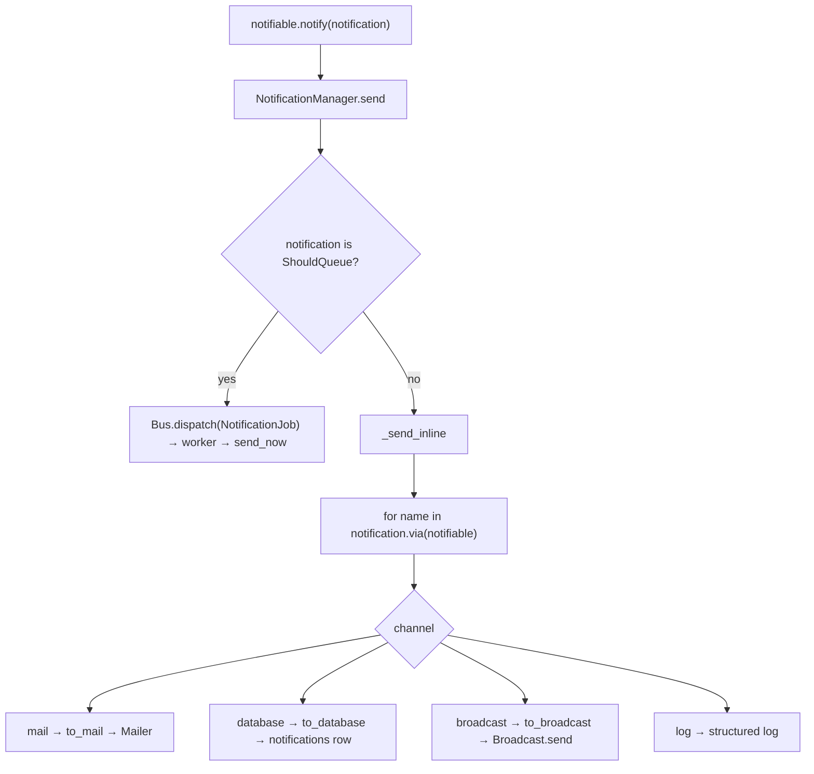

# Notifications

A `Notification` declares which channels to use via `via()`, and supplies a payload per channel (`to_mail`, `to_database`, `to_broadcast`). The `NotificationManager` fans it out.

**Source**: `packages/arvel/src/arvel/notifications/` — `manager.py`, `notification.py`, `notifiable.py`, `channels/`, `models/database_notification.py`, `notification_job.py`, `providers/`.

## Shape



## Notification base

```python
class Notification(ABC):
    @abstractmethod
    def via(self, notifiable) -> list[str]: ...     # channel names
    def to_mail(self, notifiable) -> Mailable | None: return None
    def to_database(self, notifiable) -> dict[str, Any]: return {}
    def to_broadcast(self, notifiable) -> dict[str, Any]: return {}
```

`via()` returns channel name strings looked up in the manager's channel map. Channel selection is entirely `via()`-driven — `NotificationConfig.default_channel` exists but the manager ignores it.

## Manager and channels

```python
class NotificationManager:
    def _bootstrap_channels(self):
        self._channels["log"] = LogChannel()
        self._channels["broadcast"] = BroadcastChannel()
        # "mail" if a Mailer is bound; "database" if an async_sessionmaker is bound

    async def _send_inline(self, notifiable, notification):
        for name in notification.via(notifiable):
            if name not in self._channels:
                raise UnknownChannelError(name)
            try:
                await self._channels[name].send(notifiable, notification)
            except Exception:
                logger.exception(...)   # other channels still run
```

| Channel | Action |
|---|---|
| `MailChannel` | `to_mail` → `Mailer.to(notifiable.email).send(mailable)` |
| `DatabaseChannel` | `to_database` → insert a `DatabaseNotification` row (JSON `data`) |
| `BroadcastChannel` | `to_broadcast` (`{channels, data}`) → `Broadcast.send` |
| `LogChannel` | structured log; never raises |

Per-channel errors are logged so one failing channel doesn't block the rest; an unknown channel name raises.

## Notifiable mixin

```python
class Notifiable:
    notification_manager: NotificationManager | None = None
    async def notify(self, notification): ...      # queues if ShouldQueue, else send
    async def notify_now(self, notification): ...   # always inline
```

Requires a duck-typed `self.id`. The manager comes from `notification_manager` or the `Notification` facade.

## Database notifications

```python
class DatabaseNotification(Model, Timestamps):
    __tablename__ = "notifications"
    id: str = field(length=36, primary_key=True)
    type: str
    notifiable_type: str
    notifiable_id: str
    data: str = text()
    read_at: datetime | None = None
```

Indexed on `(notifiable_type, notifiable_id, read_at)`. The provider publishes this table's migration.

## Queued notifications

`ShouldQueue` notifications dispatch a `NotificationJob` (storing notifiable id/class and notification class). The worker refetches the notifiable via its `find(id)` and calls `send_now`. So database/broadcast/mail delivery happens on the worker.

## Provider

`NotificationServiceProvider.register()` binds `NotificationManager`; `boot()` binds the `Notification` facade and publishes the notifications migration. Not a baseline provider.

## See also

- [Mail](mail.md) · [Broadcasting](broadcasting.md) · [Queues](queues.md)
