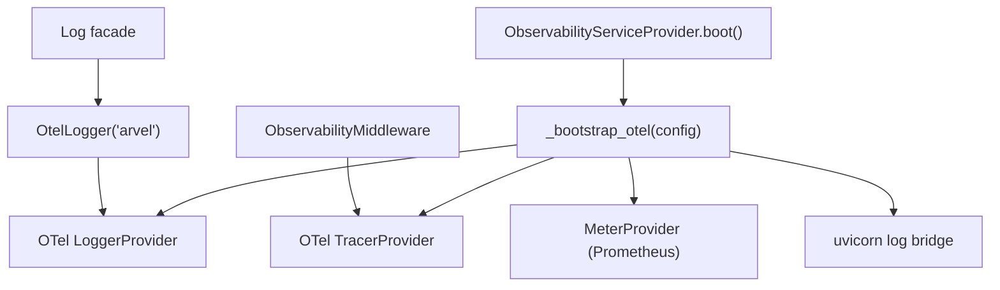

# Observability & logging

Logging and tracing go through OpenTelemetry, not structlog directly. The `Log` facade emits records to a global OTel `LoggerProvider`; `ObservabilityServiceProvider` boots the SDK; `ObservabilityMiddleware` instruments requests.

**Source**: `packages/arvel/src/arvel/observability/` (`provider.py`, `middleware.py`), `packages/arvel/src/arvel/logging/` (`otel_logger.py`, `facade.py`), `providers/log_provider.py`.

## How the pieces fit



> **Note**: Framework internals must not call `structlog.get_logger()` directly — logs flow through the OTel SDK. (Architecture tests enforce this.)

## Bootstrapping the SDK

`ObservabilityServiceProvider.register()` builds an `ObservabilityConfig` from env (`OTEL_*`, `LOG_*`, `OBSERVABILITY_*`). `boot()` runs `_bootstrap_otel(config)` unless `OTEL_SDK_DISABLED`:

| Signal | Provider | Exporters |
|---|---|---|
| Traces | `TracerProvider` | OTLP gRPC if `OTEL_EXPORTER_OTLP_ENDPOINT`; else console spans when `LOG_FORMAT=console` |
| Logs | `LoggerProvider` | OTLP gRPC, or console log exporter + formatter for `LOG_FORMAT` |
| Metrics | `MeterProvider` | `PrometheusMetricReader` when `OBSERVABILITY_METRICS_ENABLED` |
| DB | SQLAlchemy instrumentation | when `DB_QUERY_LOG_ENABLED` |
| Bridge | uvicorn → OTel | `install_uvicorn_bridge()` |

This is a **baseline** provider (it runs early in HEAD). `LogServiceProvider` is an explicit no-op placeholder — the real logging setup happens here.

## Request middleware

`ObservabilityMiddleware` is mounted by the application (after `ContextMiddleware`/`DeferredTaskMiddleware`) when `OBSERVABILITY_REQUEST_MIDDLEWARE_ENABLED` (default true). Per request it sets a `RequestContext` (request id, route, service), opens an `arvel.http.request` span, echoes `X-Request-ID`, and logs 5xx via `Log.error`. See [middleware](../http/middleware.md).

## The Log facade

```python
class _LogFacade:
    def debug(self, message, **context): ...
    def info(self, message, **context): ...
    def warning(self, message, **context): ...
    def error(self, message, *, exc=None, **context): ...
    def with_context(self, **fields) -> OtelLogger: ...
    def channel(self, name) -> OtelLogger: ...

Log: _LogFacade = _LogFacade()
```

`Log` is a module-level singleton over `OtelLogger("arvel")` — not container-bound, so it's safe to import anywhere. `OtelLogger` emits `OtelLogRecord`s to the global `LoggerProvider`, injecting request context, app `Context` vars, and trace ids, redacting `LOG_REDACT_FIELDS`, and gating on `LOG_LEVEL`. `with_context(**fields)` returns a bound logger; `channel(name)` namespaces one.

## See also

- [Middleware](../http/middleware.md) — `ObservabilityMiddleware` ordering.
- [Bootstrap & lifecycle](../architecture/bootstrap-lifecycle.md) — `ObservabilityServiceProvider` in the HEAD chain.
- [Facades](../architecture/facades.md) — `Log` and `Context`.
