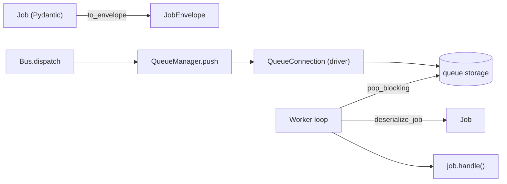
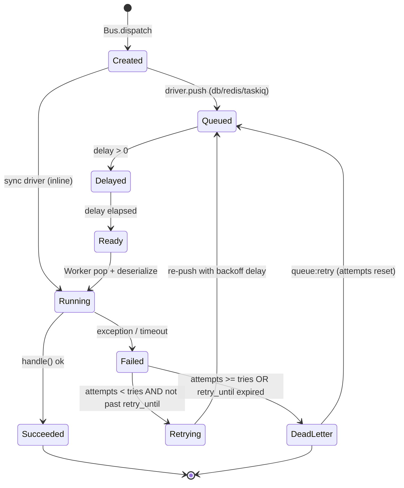

# Queues

Jobs are Pydantic models. The `Bus` serializes a job to an envelope and hands it to a driver; a `Worker` later pops envelopes, runs them, and handles retries, backoff, and the dead-letter queue.

**Source**: `packages/arvel/src/arvel/queue/` — `job.py`, `envelope.py`, `manager.py`, `bus.py`, `worker.py`, `registry.py`, `config.py`, `drivers/`, `providers/`.

## Pieces



## The `Job` base

```python
class Job(BaseModel):
    model_config = ConfigDict(arbitrary_types_allowed=True)
    queue: str = "default"
    tries: int = 3
    timeout: int = 60
    delay: int | timedelta = 0
    priority: int = Field(default=0, ge=0, le=9)
    backoff: int | list[int] = 0
    retry_until: datetime | None = None

    def __init_subclass__(cls, **kwargs):
        JobRegistry[key] = cls          # every subclass auto-registers

    @abstractmethod
    async def handle(self) -> None: ...
    def to_envelope(self) -> JobEnvelope: ...
```

Each subclass registers itself in `JobRegistry` keyed by `module.Class` (an allowlist — the worker only deserializes known job classes). `to_envelope()` promotes `queue`/`delay`/`priority` to envelope fields and serializes the rest as payload.

## Driver selection

`QueueManager` builds a connection from `QueueConfig.connection` (env `QUEUE_CONNECTION`, default `sync`):

```python
class QueueDriver(StrEnum):
    SYNC = "sync"; DATABASE = "database"; REDIS = "redis"; TASKIQ = "taskiq"
```

| Driver | Storage | Mechanics |
|---|---|---|
| `sync` | none | `push` runs `handle()` inline (dev/test default) |
| `database` | `jobs` table | `available_at`-gated; pop uses `FOR UPDATE SKIP LOCKED` |
| `redis` | two ZSETs per queue | atomic Lua `promote_and_pop`: promote due scheduled → ready, `ZPOPMIN` by `-priority` |
| `taskiq` | external broker | `broker.kick(BrokerMessage)`; meant for `taskiq worker` |

The Redis driver keeps a `:scheduled` ZSET (score = `available_at`) and a `:ready` ZSET (score = `-priority`, so higher priority pops first). A single Lua script promotes and pops atomically.

> **Warning**: With `sync`, `queue:work` is a no-op — jobs already ran inline at dispatch. Retries and the dead-letter queue only apply with a real backend (`database`/`redis`/`taskiq`).

## Dispatch

```python
class Bus:
    async def dispatch(self, job, *, connection=None, delay=None, priority=None) -> None:
        if delay is not None: job.delay = delay
        if priority is not None: job.priority = priority
        await self._manager.push(job, queue=None)
```

The `Bus` facade binds in `QueueServiceProvider.boot()`. Note the facade's `dispatch` doesn't expose `delay`/`priority` overrides — the implementation `Bus` does.

## Worker loop and job lifecycle

```python
async def _process_one(self, envelope):
    job = deserialize_job(envelope)
    try:
        await asyncio.wait_for(job.handle(), timeout) if timeout else await job.handle()
    except Exception:
        envelope.attempts += 1
        if envelope.attempts < job.tries and not retry_until_expired:
            envelope.delay = job.backoff_for(envelope.attempts)
            await conn.push(envelope, queue=self._queue)     # retry
        else:
            await store.create(envelope=envelope, queue=..., error=error_text)  # DLQ
```



- **Retry**: re-push with `delay = backoff_for(attempt)` (supports a fixed int or a per-attempt list).
- **Dead letter**: `FailedJobStore.create` stores the full envelope and a truncated error.
- **Recovery**: `queue:retry` resets `attempts` to 0 and re-dispatches.

## Deserialization safety

```python
def deserialize_job(envelope) -> Job:
    cls = JobRegistry.get(envelope.job_class)
    if cls is None:
        raise KeyError(...)
    return cls.model_validate(envelope.payload)
```

The worker only runs job classes present in `JobRegistry`, so job modules must be imported before the worker starts. An unknown class on the database driver is recorded to the dead-letter store rather than executed.

## Provider

`QueueServiceProvider.register()` binds `QueueConfig`, `QueueManager`, `Bus`, and a `FailedJobStore` (app session maker → engine → in-memory SQLite fallback). `boot()` binds the `Bus` facade and publishes the queue migration. CLI: `queue:work`, `queue:failed`, `queue:retry`, `queue:flush`, `queue:forget`, `queue:size`.

## See also

- [Events](events.md) — queued listeners ride on `ListenerJob`.
- [Notifications](notifications.md) — `NotificationJob`.
- [CLI architecture](../console/cli-architecture.md) — `queue:work`.
