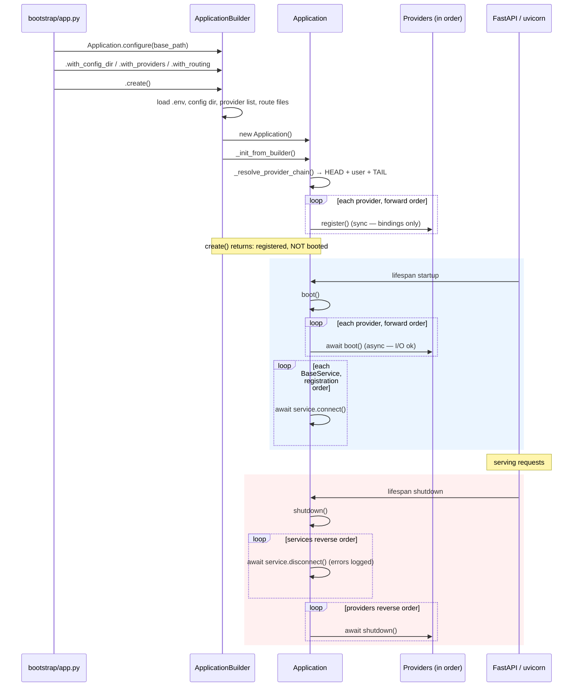
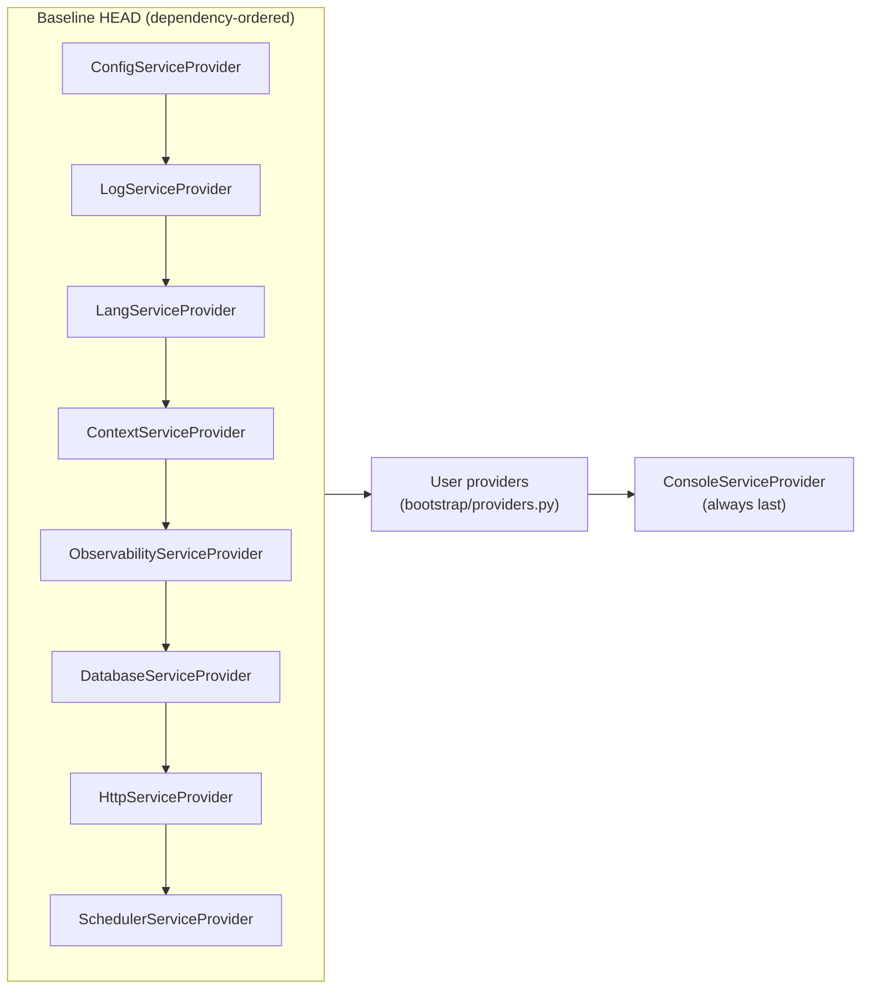
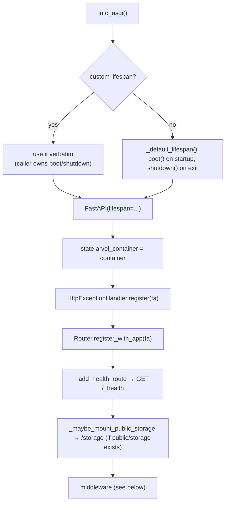

# ARCH-002 — Bootstrap & lifecycle

This page traces what happens from `Application.configure(...)` to a serving ASGI app, and back down through shutdown. If you only read one internals page, read this one — the register/boot split governs the whole framework.

**Source**: `packages/arvel/src/arvel/application/application.py`, `application/_loader.py`, `application/errors.py`.

## The `Application` object

`Application` is the framework kernel. It owns the root container and the provider lifecycle. On construction it binds itself and a `PublishRegistry` into its own container, so anything can resolve the `Application` or `Container` by type:

```python
def __init__(self) -> None:
    self.container = Container()
    self.container.instance(Application, self)
    self.container.instance(PublishRegistry, PublishRegistry())
    self._provider_classes: list[type[ServiceProvider]] = []
    self._provider_instances: list[ServiceProvider] = []
    self._services: list[BaseService] = []
    self._booted = False
```

Key state: the ordered provider classes, their instances, lifecycle-managed `BaseService`s, and a `_booted` flag that makes `boot()`/`shutdown()` idempotent.

## Two phases, one rule



**The rule**: `register()` is synchronous and binds into the container only — no I/O, no touching other providers. `boot()` is asynchronous, runs after *every* provider has registered, and is where you open connections and bind facades that need a live manager.

## Building the app: `ApplicationBuilder`

`Application.configure(base_path)` returns an `ApplicationBuilder`. The fluent methods stage configuration; `create()` executes the bootstrap.

| Builder method | Effect |
|---|---|
| `with_environment(name)` | Sets the environment string (`local`, `testing`, …). |
| `with_config_files([Cls, …])` | Registers typed `ArvelSettings` classes (calls `register(cls)`). |
| `with_config_dir(path)` | Discovers and loads module-based `config/*.py` (see [configuration](ARCH-006-configuration.md)). |
| `with_providers(list \| path)` | A list extends the user provider chain; a `Path`/`str` defers loading from `bootstrap/providers.py`. |
| `with_routing(web=, api=, console=)` | Route file paths; at least one is required. |
| `create()` | Runs the full bootstrap and returns a **registered, not booted** `Application`. |

`create()` runs these steps in order:

1. `_load_dotenv()` — loads `.env` from the base path with `override=False` (real env wins).
2. `_load_config_dir()` — resets the lookup registry, optionally loads from `bootstrap/cache/config.json`, otherwise imports each `config/*.py` module.
3. `_load_providers_from_path()` — when providers came from a path, validates the module exposes `providers: list[type[ServiceProvider]]`.
4. `_load_routing_files()` — resets the `Router` singleton and imports the `web`/`api` route modules so `@Route.*` decorators register.
5. `Application()` — fresh container, self-binding.
6. `_init_from_builder()` — resolves the provider chain and runs every `register()`.

User modules are imported under an isolated `_arvel_user_app.*` namespace by `_loader.py`, which also detects `sys.path` mutations.

## Provider ordering: HEAD → user → TAIL

`_resolve_provider_chain()` composes the final ordered list as **baseline HEAD**, then **deduplicated user providers**, then **baseline TAIL**.



The HEAD order is dependency-driven, and the docstring in `_baseline_head_providers()` spells out why:

| Provider | Why it runs where it does |
|---|---|
| `ConfigServiceProvider` | Binds `Config` and every registered `ArvelSettings`; everything downstream may read config. |
| `LogServiceProvider` | Binds the `Log` facade so later `register`/`boot` paths can log. |
| `LangServiceProvider` | Binds the translator so error messages can be localized. |
| `ContextServiceProvider` | Reserves the request-context layer so its middleware mounts ahead of the DB/HTTP stack. |
| `ObservabilityServiceProvider` | Boots the OTel SDK and bridges uvicorn logging. |
| `DatabaseServiceProvider` | Binds `AsyncEngine` / `async_sessionmaker` / `AsyncSession`. |
| `HttpServiceProvider` | Binds `Router`, the exception handler, rate-limit store, maintenance manager. |
| `SchedulerServiceProvider` | Binds `Schedule` + `SchedulerKernel`; `boot()` auto-discovers `app/console/kernel.py`. |

`ConsoleServiceProvider` is pinned to the TAIL because its `boot()` walks every registered provider and merges each provider's `commands()` into the console app — so it must run after user providers that may expose commands.

**Dedup rules**: if a user lists a HEAD provider, it's skipped (already in the chain). If a user lists the TAIL provider, it's forced to the end rather than running mid-chain.

**Needs-based filtering**: when the app is built with `with_required_subsystems(...)` (the CLI does this), `_init_from_builder` runs the resolved chain through `filter_provider_chain()` and keeps only the providers a command actually needs, merged with the always-on foundation set. A cold `arvel migrate` boots five providers, not the whole project. See [console/CLI runtime](SAD-005-console-runtime-architecture.md) for the subsystem graph.

> **Note**: HEAD providers are imported lazily inside `_baseline_head_providers()` so that pulling in `arvel` for, say, the `arvel new` command doesn't drag SQLAlchemy and FastAPI into import time.

## Register phase (sync)

`_init_from_builder()` instantiates each provider with the app and calls `register()` in forward order. Any exception is wrapped:

```python
self._provider_classes = self._resolve_provider_chain(providers)
instances = [cls(self) for cls in self._provider_classes]
self._provider_instances = instances
for inst in instances:
    try:
        inst.register()
    except Exception as exc:
        raise BootError(type(inst), exc) from exc
```

When `create()` returns, all bindings exist but no `boot()` has run.

## Boot phase (async)

`await app.boot()` is idempotent via `_booted`. It boots providers forward, then connects services:

```python
async def boot(self, *, probe_connections: bool = True) -> None:
    if self._booted:
        return
    for inst in self._provider_instances:
        await inst.boot()             # BootError on failure
    for service in self._services:
        await service.connect()       # ServiceConnectError on failure
    self._booted = True
```

`probe_connections` is threaded down to services that want to verify their connection at boot (e.g. ping the DB). Set it false to skip the probes — handy in tests and CLI paths that don't need a live round-trip.

`BaseService`s registered via `register_service()` get `connect()` at boot (registration order) and `disconnect()` at shutdown (reverse). Registering a service after boot does **not** connect it — register before booting.

## Shutdown phase (async)

`await app.shutdown()` tears down in reverse. The two loops handle failure differently: service disconnects are log-only (a flaky teardown can't mask anything), while provider shutdowns are *all* attempted, then the first failure re-raises as `ShutdownError` — so one broken provider can't skip the rest:

```python
async def shutdown(self) -> None:
    if not self._booted:
        return
    for service in reversed(self._services):
        try:
            await service.disconnect()
        except Exception:
            ...  # logged, never raised

    first_failure = None
    for inst in reversed(self._provider_instances):
        try:
            await inst.shutdown()
        except Exception as exc:
            ...  # logged
            first_failure = first_failure or (type(inst), exc)
    self._booted = False
    if first_failure:
        raise ShutdownError(*first_failure)
```

## ASGI assembly: `into_asgi()`

`into_asgi(*, lifespan=None, **fastapi_kwargs)` builds the FastAPI app. It only wires the app — it doesn't boot. Boot/shutdown ride the ASGI lifespan, so the method works the same from a sync entrypoint or inside a uvicorn `--factory` callback.



### Middleware order

The global ASGI stack is **declared**, not hardcoded. `into_asgi()` calls `_mount_middleware`, which walks the app's `bootstrap/middleware.py` list (or `_default_middleware_stack()` when none is declared) and boots each entry. Each entry is a `GlobalMiddleware` (`arvel.contracts.middleware`) that mounts itself via `app.add_middleware(...)` from its `boot(app, container)` classmethod — or skips when its config doesn't apply.

The list is **outer→inner**. `fa.add_middleware` *prepends*, so `_mount_middleware` boots the resolved chain in **reverse** to make list order hold:

```python
declared = self._middleware_classes or _default_middleware_stack()
chain = _resolve_middleware_chain(declared)  # dedupe; ArvelScope pinned innermost
for mw_cls in reversed(chain):
    mw_cls.boot(fa, self.container)           # self-gates, then add_middleware
```

The default stack, outermost request → innermost:

```
TrustProxies → Maintenance → ThrottleLogin → CsrfDoubleSubmit → Observability → Context → DeferredTask → ArvelScope → routes
```

- `_resolve_middleware_chain` always appends `ArvelScopeMiddleware` last (innermost), regardless of where — or whether — the app lists it. The per-request DI scope must wrap the handler, so an edited `bootstrap/middleware.py` can't strand it.
- Each entry self-gates in `boot()`: the observability trio (`DeferredTaskMiddleware`, `ContextMiddleware`, `ObservabilityMiddleware`) skips when `ObservabilityConfig.request_middleware_enabled` is false; `TrustProxies` mounts only when `HttpConfig.trusted_proxies` is non-empty; `Maintenance` only when a `MaintenanceModeManager` is bound; the auth middleware only when auth is registered and the relevant feature is enabled.

The default lifespan wires boot/shutdown to ASGI startup/shutdown:

```python
@asynccontextmanager
async def lifespan(_asgi_app: FastAPI) -> AsyncGenerator[None]:
    if not self._booted:
        await self.boot()
    try:
        yield
    finally:
        await self.shutdown()
```

> **Warning**: Routing works even without the default lifespan, but if you pass your own `lifespan` you own boot/shutdown. Skip booting and providers' `boot()` never runs — connections stay closed and `boot`-bound facades stay unbound.

## Running it: `serve()`

The module-level `serve(app, host=, port=)` runs uvicorn against `into_asgi()`. uvicorn drives the lifespan, so the default boot/shutdown fires on startup and graceful exit. It honors an optional `GRACEFUL_SHUTDOWN_TIMEOUT` env var:

```python
def serve(app: Application, *, host="127.0.0.1", port=8000) -> None:
    uvicorn.run(app.into_asgi(), host=host, port=port,
                timeout_graceful_shutdown=timeout)
```

## Errors

| Exception | Raised when | Carries |
|---|---|---|
| `BootError` | A provider's `register()` or `boot()` raises | `provider`, `original` |
| `ServiceConnectError` (subclass of `BootError`) | A `BaseService.connect()` fails during boot | the service |
| `ShutdownError` | A provider's `shutdown()` raises | the provider |
| `EnvironmentNotSetError` | `environment()` / `base_path()` called before the builder set them | — |

## `register()` for tests

`Application.register()` (distinct from a provider's `register`) is a minimal bootstrap for tests: empty base path, `environment="testing"`, no user providers, and a `Gate` singleton bound. Use it when you need a container without the full provider chain.

## See also

- [Service providers](ARCH-004-service-providers.md) — the per-provider contract.
- [Service container](ARCH-003-service-container.md) — what `register()` actually binds into.
- [Configuration](ARCH-006-configuration.md) — what the loader stages before providers run.
