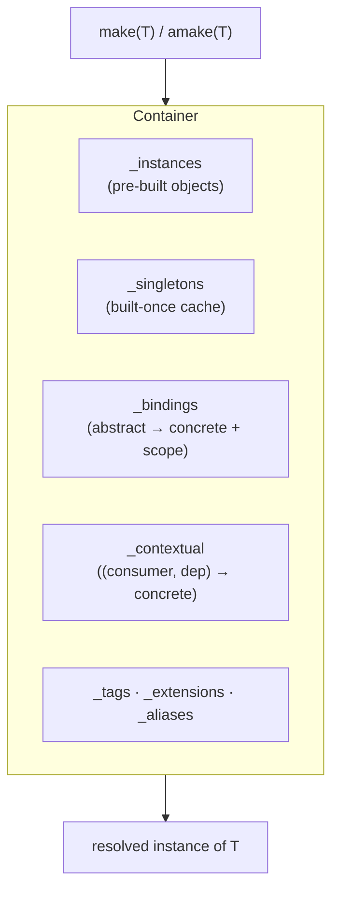
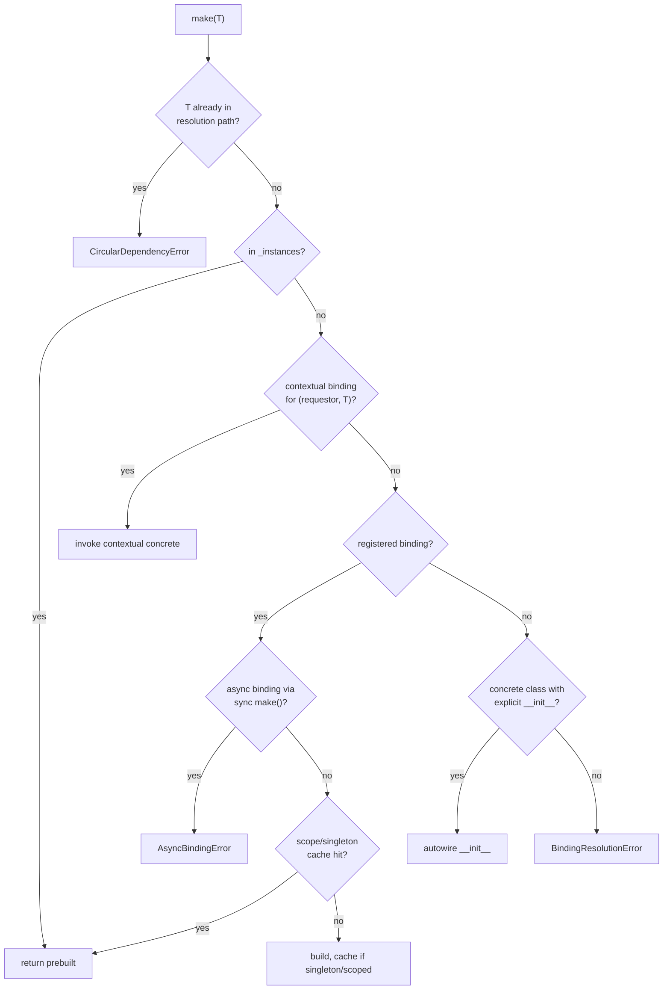

# ARCH-003 — Service container

The container is the dependency-injection core. It resolves types to instances, autowires constructors from type hints, manages lifetimes (singleton / scoped / transient), and supports async factories. Everything else in the framework is bound into it.

**Source**: `packages/arvel/src/arvel/container/` — `container.py` (the `Container`), `scopes.py` (`Scope`), `inspect.py` (autowiring helpers), `errors.py`.

## Mental model



The container is keyed by **type**, not by string name. `bind(SomeProtocol, SomeImpl)` registers a mapping; `make(SomeProtocol)` resolves it. If a concrete class isn't bound, the container can still build it by autowiring its `__init__`.

## Lifetimes

```python
class Scope(StrEnum):
    SINGLETON = "singleton"
    SCOPED = "scoped"
    TRANSIENT = "transient"
```

| Scope | Cached where | Built |
|---|---|---|
| `TRANSIENT` (default) | nowhere | every `make()` |
| `SINGLETON` | root `_singletons` | once per process |
| `SCOPED` | the scope child's `_scope_cache` | once per `scope()` / `ascope()` |

Registration API:

```python
container.bind(Abstract, Concrete)                 # transient by default
container.bind(Abstract, factory, scope=Scope.SINGLETON)
container.singleton(Abstract, Concrete)            # = bind(..., SINGLETON)
container.scoped(Abstract, Concrete)               # = bind(..., SCOPED)
container.instance(Abstract, prebuilt_obj)         # highest priority, no factory
```

`concrete` defaults to `abstract`, so `container.singleton(CacheManager)` binds the class to itself as a singleton. There is no `rebind()` — calling `bind()` again overwrites the prior binding.

## Resolution order

`make(T)` calls the internal `_resolve`, which checks sources in priority order:



1. **Circular check** — the type is already mid-construction in this call path.
2. **`_instances`** — a pre-built object wins over any factory.
3. **Contextual** — a `(requestor, dependency)` override (see below).
4. **Registered binding** — honor its scope and cache.
5. **Autowire fallback** — an unbound *concrete* class with a real `__init__` gets built by resolving its constructor dependencies.

A bare abstract type with no binding, or a class whose `__init__` is `object.__init__`, raises `BindingResolutionError`.

## Autowiring

`_instantiate` reads the target's typed `__init__` parameters and resolves each by type:

```python
hints = init_hints(abstract)          # {param_name: type}, cached per class
for name, dep_type in hints.items():
    if name in overrides:
        kwargs[name] = overrides[name]
    else:
        kwargs[name] = self._resolve(dep_type, path=(*path, abstract), requestor=...)
return abstract(**kwargs)
```

`init_hints(cls)` (in `inspect.py`) caches per class, skips `self`/`*args`/`**kwargs`, keeps only parameters whose hint is an actual `type`, and — on a `NameError` from a closure-scoped annotation — walks the call stack to recover the referenced types. Pass `**overrides` to `make()` to supply specific arguments and skip resolution for those.

## Async bindings

A factory is flagged async at registration time (`is_async_callable`). Two resolution surfaces:

- `make(T)` — synchronous. Resolving an async binding raises `AsyncBindingError` telling you to use `amake`.
- `await amake(T)` — awaits async factories, builds sync factories and autowired classes normally.

```python
container.bind(Connection, open_connection_async)   # async factory
container.make(Connection)        # -> AsyncBindingError
await container.amake(Connection) # -> awaits open_connection_async()
```

## Scopes

`scope()` / `ascope()` yield a child container that shares the root's singleton and instance caches but keeps its own scoped cache, which is cleared on exit:

```python
with container.scope() as scoped:
    a = scoped.make(RequestState)   # SCOPED: built once
    b = scoped.make(RequestState)   # same instance as a
# scoped cache discarded here
```

The HTTP layer uses an async scope per request (`ArvelScopeMiddleware`) so `SCOPED` bindings live for one request. Child containers fall through to the parent for bindings they don't define.

## Method injection

`call` / `acall` resolve an object and inject a method's typed parameters from the container:

```python
result = container.call(ReportService, "generate")          # sync
result = await container.acall(ReportService, "generate")    # async, awaits coroutine methods
```

If the class itself can't be resolved as a binding, it falls back to calling `cls()` directly, then injects the method arguments.

## Contextual bindings, tags, extensions

```python
# Give a specific consumer a specific implementation of a dependency
container.when(PdfReport).needs(Storage).give(S3Storage)

# Tag a group of bindings, resolve them together
container.tag([SlackChannel, EmailChannel], "notification.channels")
channels = container.tagged("notification.channels")   # [resolved, resolved]

# Decorate a resolved instance (invalidates the singleton cache so it re-runs)
container.extend(CacheManager, lambda mgr, c: InstrumentedCache(mgr))
```

> **Note**: `alias(abstract, name)` records a string alias but the resolution path does not consult it — the container resolves by type, so aliases are currently write-only. `TODO/QUESTION:` Is the string-alias API intended to gain a read path, or should it be removed?

## Errors

| Exception | When | Where |
|---|---|---|
| `BindingResolutionError` | Unbound abstract, or a dependency can't be built, or constructor `TypeError` | `_resolve` / `_instantiate` |
| `CircularDependencyError` (subclass) | A type depends on itself transitively | `_resolve` circular check |
| `AsyncBindingError` | Async factory resolved through sync `make()` / `_invoke` | `_resolve` / `_invoke` |

## Where it's used

- The `Application` owns the root container and binds itself into it.
- Every service provider's `register()` binds into this container.
- Facades hold references to services resolved from it (see [facades](ARCH-005-facades.md)).
- `dep()` adapts a container binding to a FastAPI `Depends`.

## See also

- [Service providers](ARCH-004-service-providers.md) — who binds what, and when.
- [Bootstrap & lifecycle](ARCH-002-bootstrap-lifecycle.md) — when resolution becomes safe (`boot` vs `register`).
