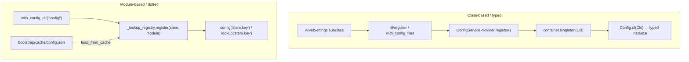
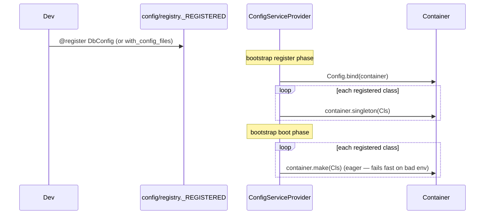

# ARCH-006 — Configuration

Arvel has **two** configuration systems. They used to be independent; now the
module-based one feeds the class-based one (see [The cascade](#the-cascade) below).

**Source**: `packages/arvel/src/arvel/config/` — `settings.py`, `registry.py`, `repository.py`, `no_prefix.py`, `_lookup_registry.py`, `_config_file_source.py`, `errors.py`.

| System | API | Backed by | Use for |
|---|---|---|---|
| **Class-based (typed)** | `ArvelSettings`, `@register`, `Config.of(Cls)` | container singletons | strongly-typed config sections |
| **Module-based (Laravel-style)** | `config("app.timezone")`, `lookup("db.DEFAULT")` | `_REGISTRY` dict of loaded `config/*.py` | dotted-key lookups into config modules |

<a name="the-cascade"></a>
## The cascade: config files override env

A typed settings class that sets `__config_path__` resolves its values in this order — highest wins, merged **per field**:

```
explicit kwargs  >  config/*.py value  >  env var  >  .env file  >  secrets dir  >  field default
```

This is exactly the source tuple returned by `settings_customise_sources` (`init_settings, ConfigFileSettingsSource, env_settings, dotenv_settings, file_secret_settings`), with field defaults as the final fallback. In practice the env var and `.env` collapse into "the environment", so the everyday mental model is:

- A `config/*.py` that defines a key → that value is used.
- A `config/*.py` that's absent (file or key) → env (real env var, then `.env`), then field default.
- A `config/*.py` that's present-but-partial → defined keys win; missing keys fall to env, then default.

Config files stay self-describing — they keep `env("KEY", default)` calls — so for any key a file defines, the value is already env-resolved at load time. The field default only matters when a file or key is absent.

`__config_path__` is a dotted path into the module registry. A `{default}` token selects a named entry — the file's `default` picks which `connections`/`stores`/`disks` entry maps onto the class (Laravel semantics). The active name is also surfaced on a `connection` field when the class has one.

| Class | `__config_path__` | Reads |
|---|---|---|
| `StorageConfig` | `filesystems` | `default` |
| `S3Config` / `LocalConfig` / … | `filesystems.disks.s3` / `.local` / … | that disk's keys |
| `DbConfig` | `database.connections.{default}` | the active connection's keys |
| `CacheConfig` | `cache.stores.{default}` | the active store's keys |
| `QueueConfig` | `queue` | `default` → `connection` |
| `SessionConfig` | `session` | flat keys |
| `BroadcastConfig` | `broadcasting` | `default`, `auth_endpoint` |
| `HttpConfig` | `http` | flat keys (e.g. `trusted_proxies`) |

Only the top-level `QueueConfig` opts in; the nested queue-connection classes (`DatabaseQueueConfig`, `RedisQueueConfig`, `TaskiqQueueConfig`) don't set `__config_path__`.

The mechanism is a pydantic-settings source (`ConfigFileSettingsSource`) inserted above the env source by `ArvelSettings.settings_customise_sources`. It returns only keys that match the model's fields; everything else falls through to env. A class without `__config_path__` is unaffected.



## Class-based config (`ArvelSettings`)

`ArvelSettings` extends pydantic-settings `BaseSettings` with Arvel defaults:

```python
class ArvelSettings(BaseSettings):
    model_config = SettingsConfigDict(
        env_nested_delimiter="_",
        env_file=(".env",),
        env_file_encoding="utf-8",
        extra="ignore",
        case_sensitive=False,
        secrets_dir=None,
    )
```

Define a config section as a subclass:

```python
@register
class DbConfig(ArvelSettings):
    url: str = "postgresql+asyncpg://localhost/app"
    password: SecretStr = SecretStr("")
    # env prefix auto-derived: reads DB_URL, DB_PASSWORD
```

### Env-prefix auto-derivation

When a subclass doesn't set a non-empty `env_prefix`, `__init_subclass__` derives one from the class name: strip a trailing `Settings`/`Config` suffix, convert CamelCase to `SNAKE_`, append `_`.

```python
_CAMEL_BOUNDARY = re.compile(r"(?<=[a-z0-9])(?=[A-Z])|(?<=[A-Z])(?=[A-Z][a-z])")
_SUFFIXES = ("Settings", "Config")

def _derive_prefix(class_name: str) -> str:
    name = class_name
    for suffix in _SUFFIXES:
        if name.endswith(suffix) and name != suffix:
            name = name[: -len(suffix)]
            break
    snake = _CAMEL_BOUNDARY.sub("_", name).upper()
    return f"{snake}_" if snake else ""
```

| Class | Derived prefix | Reads |
|---|---|---|
| `AppSettings` | `APP_` | `APP_*` |
| `MyThingConfig` | `MY_THING_` | `MY_THING_*` |
| `DbConfig` (sets `DB_` explicitly) | `DB_` | `DB_*` |

The built-in sections (`DbConfig`, `CacheConfig`, `SessionConfig`, `StorageConfig`, …) set an explicit `env_prefix`, so derivation is skipped for them.

### `NoPrefix`: opt a field out of the prefix

Wrap a field type in `Annotated[..., NoPrefix]` to read it from the bare uppercase env var instead of `{PREFIX}FIELD`:

```python
class AppSettings(ArvelSettings):
    name: str = "Arvel"                          # reads APP_NAME
    secret_key: Annotated[str, NoPrefix] = ""    # reads SECRET_KEY, not APP_SECRET_KEY
```

`__pydantic_init_subclass__` scans field metadata for the `NoPrefix` marker and rewrites the field's `validation_alias` to `AliasChoices(UPPER, field_name)`, then rebuilds the model.

### Registration and eager loading



`@register` appends a class to module-level `_REGISTERED`. `Application.with_config_files([...])` does the same per class. `ConfigServiceProvider.register()` binds `Config` to the container and registers a singleton per class; its `boot()` eagerly resolves each so invalid environment values fail at boot, not at first use.

### Reading typed config: `Config.of`

```python
class Config:
    _container: ClassVar[Container | None] = None

    @classmethod
    def bind(cls, container: Container) -> None:
        cls._container = container

    @classmethod
    def of(cls, settings_cls: type[T]) -> T:
        if cls._container is None or not cls._container.bound(settings_cls):
            raise ConfigNotRegisteredError(settings_cls)
        return cls._container.make(settings_cls)
```

`Config.of(DbConfig)` returns the singleton instance — fully typed, no string keys. `Config` is defined in `config/repository.py` but re-exported as a facade from `facades/__init__.py`.

## Module-based config (`config()` / `lookup()`)

This is the Laravel-style dotted accessor for `config/*.py` files loaded via `ApplicationBuilder.with_config_dir()`. Modules are stored in a process-wide registry keyed by file stem:

```python
_REGISTRY: dict[str, object] = {}   # reset at the start of each .create()

def register(stem: str, module: object) -> None:   # module-internal
    _REGISTRY[stem] = module
```

`lookup(key)` splits a dotted key, finds the module by its first segment, then walks attributes (falling back to dict subscript). It raises `ConfigKeyError` on any miss. `config(key, default=...)` wraps `lookup` and never raises — a missing key returns the default (or `None`):

```python
config("app.timezone")              # -> value, or None if missing
config("app.timezone", "UTC")       # -> value, or "UTC"
lookup("app.timezone")              # -> value, or raises ConfigKeyError
```

### Config caching

`with_config_dir` uses `{base_path}/bootstrap/cache/config.json`. On boot it resets the registry; if the cache exists and loads cleanly it skips importing `config/*.py`. The `config:cache` and `optimize` CLI commands write the cache via `dump_config_cache`; cached entries deserialize into `SimpleNamespace` objects.

Only the **module-based** registry is cached. Class-based `ArvelSettings` are resolved live (config file → env → default) on each `container.make()`.

`dump_config_cache` strips secret-named keys (`password`, `secret`, `token`, `credential`, `private`, bare `key`) before writing, so credentials never land in `bootstrap/cache/config.json`. Stripped keys fall back to env at load time — keep secrets in discrete keys, not embedded in connection strings, if you cache config.

> **Note**: `.gitignore` lists `.config_cache`, but no code under `config/` references it — the active cache file is `bootstrap/cache/config.json`. The `.config_cache` entry looks stale.

## Errors

| Exception | When |
|---|---|
| `ConfigNotRegisteredError` (subclass of `ConfigError`) | `Config.of(Cls)` for a class not bound to the container |
| `ConfigError` | A Pydantic `ValidationError` while loading an `ArvelSettings` (via `from_environment`), or any failure during `ConfigServiceProvider.boot()` eager load |
| `ConfigKeyError` | Empty key, unknown module stem, or unresolvable segment in `lookup()` |

> A separate `ConfigurationError` (a `ValueError` subclass in `config/exceptions.py`) is used for `ObservabilityConfig` field validation. It is unrelated to `Config.of()` / `config()`.

## See also

- [Facades](ARCH-005-facades.md) — `Config` is one.
- [Bootstrap & lifecycle](ARCH-002-bootstrap-lifecycle.md) — when config is loaded relative to providers.
