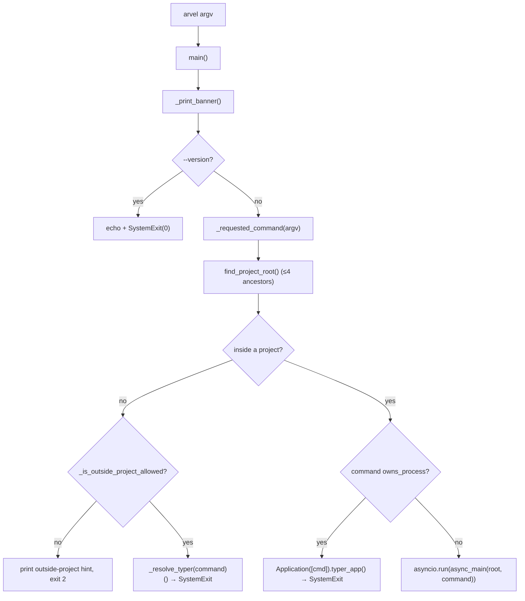
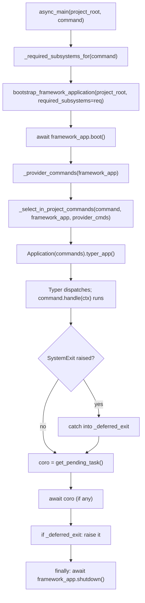
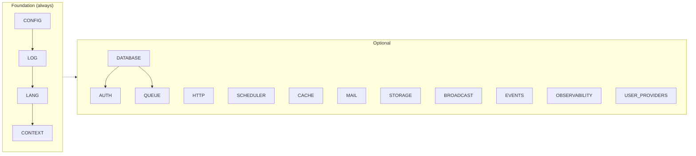
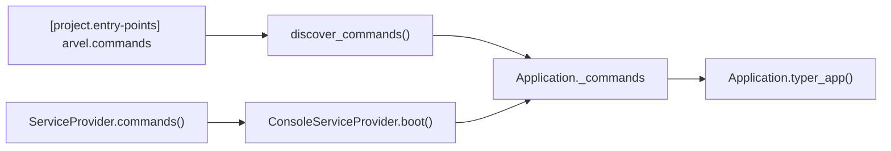

# SAD-005 — Console / CLI runtime architecture

**Work Item**: WI (CLI runtime) · **Status**: Approved · **Related**: ADR-017, ADR-013, ADR-009

**Scope**: How the `arvel` CLI is structured at runtime — entrypoint flow, the inside-vs-outside-project split, needs-based bootstrap, command discovery channels, the subsystem closure, the listing-app fast path, the async event-loop ownership story, and the scaffolding subsystem.

**Date**: 2026-06-07.

> **Relationship to ADR-017.** ADR-017 records the seven *decisions* that shaped the CLI ("Typer", "two command channels", "needs-based bootstrap", "outside-project allow-list", etc.). This SAD records the *runtime architecture* that implements those decisions — what code runs, in what order, on which event loop, and why the lazy-import paths exist. ADR-017 is the "why"; this document is the "how it actually executes".

---

## 1. Top-level lifecycle

The `arvel` command is a Typer app exposed by the `[project.scripts]` entry point in `packages/arvel/pyproject.toml`:

```
arvel = "arvel.console.entrypoint:main"
```

`main()` is a synchronous gatekeeper. It:

1. Re-execs into the project's virtualenv if needed (`maybe_reexec_into_project_venv(argv)`), so `arvel` run from outside the venv still picks up the project's installed packages.
2. Prints the banner (TTY-gated, opt-out via `--no-banner` / `ARVEL_NO_BANNER`).
3. Strips `--no-banner` from `argv` so Typer doesn't choke on it.
4. Handles `--version` / `-V` synchronously and exits.
5. Computes the *requested command name* (first non-flag positional) without parsing the rest of `argv`.
6. Walks up to four ancestors looking for `bootstrap/app.py` to decide *inside-project vs outside-project*.
7. Dispatches to one of three runtime branches:
   - **Outside project** — sync fast path; no event loop, no provider boot.
   - **Process-owning command** (`serve`, `shell`) — sync; the command itself owns `asyncio.run`.
   - **Inside project, normal command** — `asyncio.run(async_main(...))` owns the loop for the rest of the lifecycle.



## 2. The two project contexts

`find_project_root()` walks up from `cwd` looking for `bootstrap/app.py`. The CLI's behavior is *very* different in the two cases.

| Context | Test | Booted? | Allowed commands |
|---|---|---|---|
| **Inside a project** | `bootstrap/app.py` found | Yes — required subsystems only | All registered commands |
| **Outside a project** | No `bootstrap/app.py` in 4 ancestors | No — pure sync | `make:*`, `about`, `key:generate`, `new`, `--help`, `-h`, `--version`, `-V` |

Outside-project commands are the ones a developer might run before they have a project — scaffolding (`new`, `make:*`), one-shots (`key:generate`), and metadata (`about`, `--version`). Everything else needs `bootstrap/app.py` to know what subsystems to boot, what providers to register, and what configuration to load.

When an unsupported command runs outside a project the CLI prints a deterministic hint (and `arvel new my-app` instructions) before exiting `2`. This is the "you forgot to `cd` into the project" rescue path.

## 3. Inside-project lifecycle: `async_main`



Three structural points:

### 3.1 The CLI owns one `asyncio` event loop for the whole invocation

`main()` calls `asyncio.run(async_main(...))` once. Every subsequent async work — `framework_app.boot()`, command-deferred coroutines via `schedule_async`, `framework_app.shutdown()` — happens on that single loop. The framework engine and connection pools are bound to it.

The motivating constraint: SQLAlchemy's `AsyncEngine` is loop-bound. Boot and shutdown must run on the *same* loop, or shutdown deadlocks. Owning the loop in one place is the simplest correct answer.

### 3.2 `SystemExit` from Typer is caught, drained, then re-raised

Typer/Click in standalone mode raises `SystemExit(0)` on a successful command. If we let that propagate immediately, any coroutine the command deferred via `arvel.console._async.schedule_async()` (the scheduler loop, async migrations, async queue work) gets garbage-collected without ever being awaited.

The fix: catch `SystemExit` into `_deferred_exit`, await `get_pending_task()`, then re-raise. `framework_app.shutdown()` runs in the `finally` block regardless.

### 3.3 Process-owning commands bypass the loop

`serve` (delegates to `uvicorn`) and `shell` (runs an interactive REPL) both set `owns_process: ClassVar[bool] = True`. `main()` checks for that *before* `asyncio.run` — uvicorn calls `asyncio.run()` itself and you can't nest event loops, and the shell wants the terminal. Process-owning commands run their Typer dispatch synchronously and let the command's `handle` own its runtime (the command boots the framework itself if it needs to). `serve` additionally checks `find_project_root()` in `handle()` and exits `2` when run outside a project.

## 4. Needs-based bootstrap: `_required_subsystems_for`

A naive CLI boots every provider every time. Arvel doesn't. Each `Command` declares the *subsystems* it touches:

```python
class MigrateCommand(Command):
    name = "migrate"
    requires: ClassVar[frozenset[CliSubsystem]] = frozenset({CliSubsystem.DATABASE})
```

`_required_subsystems_for(command)` resolves the requested name to a class (without instantiating it) and computes `closure(cls.requires)` — the transitive set under the dependency graph in `arvel.console._subsystem`. The bootstrap then merges that with `FOUNDATION_SUBSYSTEMS` — an always-on **set** of `CONFIG`, `LOG`, `LANG`, `CONTEXT` (the arrows in the diagram below show grouping, not boot order; provider boot order is fixed by the HEAD chain in [bootstrap & lifecycle](ARCH-002-bootstrap-lifecycle.md#provider-ordering-head--user--tail)).



The dependency edges are explicit:

| Subsystem | Depends on |
|---|---|
| `AUTH` | `DATABASE` |
| `QUEUE` | `DATABASE` |

A `validate_no_cycles()` Tarjan-lite check runs at *import time* of `_subsystem.py` and raises `RuntimeError` if a cycle is ever introduced. This is a load-bearing invariant — a cycle would silently deadlock provider boot.

### Why this matters at runtime

A cold `arvel migrate` boots `CONFIG`, `LOG`, `LANG`, `CONTEXT`, `DATABASE` — five providers. A cold `arvel queue:work` adds `QUEUE`. Neither boots `HTTP`, `MAIL`, `BROADCAST`, etc. The starting time of the CLI on a development machine is dominated by the slowest provider booted; boot only what we need and the slowest one is `DATABASE`'s engine creation, not the sum of every provider in the project.

`make:*` and `new` declare empty `requires` *and* `requires_project_context = False` — they skip the framework boot entirely. `arvel make:controller User` doesn't open a DB connection, doesn't import SQLAlchemy, doesn't load configuration.

## 5. Two command channels, one registry



Two paths into the registry:

| Channel | Mechanism | Needs the framework? |
|---|---|---|
| **Entry points** | `[project.entry-points."arvel.commands"]` in package `pyproject.toml`, read via `importlib.metadata` | No — DI-free commands |
| **Provider commands** | `ServiceProvider.commands()` collected by `ConsoleServiceProvider.boot()` | Yes — provider must be in the closure |

Provider commands are the only way to express "I need `QueueManager` injected" — entry-point commands don't see the container. So `queue:work`, `queue:failed`, `db:seed` (when it loads seeders from container-bound modules), and the migration commands are provider-only.

Name collisions resolve in favor of the provider copy. `ConsoleServiceProvider` is pinned **last** in the baseline TAIL of the provider chain so it sees every other provider's `commands()` output before it builds the registry. `Application._commands` is a `dict[str, Command]` — last-write-wins, with a `_log.warning(...)` on overwrite so duplicate names don't pass silently.

## 6. The lazy import discipline

Importing every `Command` class at startup drags in the world (FastAPI, SQLAlchemy, Starlette, Jinja2, uvicorn ≈ 3.9s cold). The CLI works hard to avoid that.

### 6.1 The listing app for `arvel` and `arvel --help`

`build_listing_app()` registers *placeholder* Typer commands for every entry-point name, each annotated with the short help from a generated `COMMAND_HELP` manifest (`_command_meta.py`). The placeholders never *run* — they only render in `--help` listings. Real dispatch (`arvel <cmd>` or `arvel <cmd> --help`) routes through `load_command(name)` first, which imports just the requested class.

### 6.2 `_select_in_project_commands` loads only what runs

For a concrete `command` name the function builds a one-key dict containing just that command. Full discovery (`discover_commands()`) only runs for `arvel` / `arvel --help` / unknown names — paths where Typer needs the full set to render help or "no such command" errors.

### 6.3 `--version` doesn't even build a Typer app

`main()` checks for `--version` / `-V` before anything else. `arvel.__version__` is read from package metadata; the call returns in sub-second time. No discovery, no listing, no dispatch.

### Why these matter

Cold-start time matters for two things: shell tab-completion (where the CLI is invoked frequently and silently) and CI pipelines (where every `arvel migrate` adds wall time). The lazy-import discipline keeps `arvel <cmd>` consistently fast — the only mandatory imports are the ones the requested command itself needs.

## 7. Scaffolding subsystem (`_scaffold/`)

```
arvel/console/_scaffold/
├── new.py              # arvel new <name>
├── make/               # arvel make:<thing>
│   ├── controller.py
│   ├── model.py
│   ├── migration.py
│   ├── command.py
│   └── ...
├── stubs/              # *.tmpl files used as render templates
└── remote_kit.py       # arvel new --kit <name>: clones a kit repo
```

Three structural points:

1. **Stubs are templates, not Python**. `make:controller` reads `stubs/controller.py.tmpl`, substitutes `{{ name }}` and `{{ namespace }}`, writes the result. A user can override the stub by copying it into their project's `stubs/` directory — `vendor:publish --tag=stubs` writes them out. This is symmetrical with how Laravel's `php artisan stub:publish` works.
2. **No project context required**. `make:*` declares empty `requires` *and* `requires_project_context = False`. `new` is the same — it builds the project structure that `bootstrap/app.py` will eventually live in.
3. **Remote kits via `--kit`**. `new --kit <gh-org/repo>` clones a starter repo, runs its `arvel install` hook if present, and rewrites placeholders. The `arvel-ecommerce-kit` directory in this monorepo is the reference implementation.

## 8. Context and I/O

`Command.handle(ctx)` receives a `Context` with these methods:

| Method | Channel | Use |
|---|---|---|
| `info(msg)` | stdout | Successful step / progress |
| `line(msg)` | stdout | Plain text (no styling) |
| `comment(msg)` | stdout | Annotation (Artisan parity) |
| `alert(msg)` | stdout | High-visibility highlight |
| `warn(msg)` | stdout | Warning (caller decides exit code) |
| `error(msg)` | stderr | Pair with non-zero exit code |
| `newline(n=1)` | stdout | Blank lines |

The split is deliberate: `error()` goes to stderr so a misuse doesn't corrupt piped stdout. The banner also goes to stderr for the same reason — `arvel openapi:export | jq` works without manual `--no-banner`.

## 9. Failure modes and exit codes

| Condition | Exit | Source |
|---|---|---|
| Unknown command outside project | `2` | `_print_outside_project_message`, then `SystemExit(2)` |
| Successful command | `0` | Typer's standard return |
| Ctrl+C during a long-running command | `130` | `KeyboardInterrupt` → `SystemExit(130) from None` (no traceback) |
| Provider boot failure | `1` (or higher, command-specific) | Exception propagates; `framework_app.shutdown()` still runs in `finally` |
| Command raises | command-specific | Logged at `arvel.console`; `shutdown()` still runs |

The `KeyboardInterrupt` → `130` path is the conventional SIGINT exit code; `from None` suppresses the noisy traceback because the command (e.g. `schedule:work`) has already logged its graceful-shutdown line.

## 10. What this architecture buys

| Property | Mechanism |
|---|---|
| Fast CLI startup | Lazy load (§ 6) + needs-based bootstrap (§ 4) |
| Predictable behavior outside a project | Single allow-list checked in `main()` (§ 2) |
| Clean shutdown of async resources | One loop owned by the entrypoint (§ 3.1), `finally`-block shutdown (§ 3.2) |
| Process-owning commands | `owns_process` opt-out before `asyncio.run` (§ 3.3) |
| Pluggable commands without a registry class | Two channels, one merging step (§ 5) |
| Scaffolding without a real project | `requires_project_context = False` on `make:*` and `new` (§ 7) |
| Cycle-free provider boot | `validate_no_cycles()` at module import (§ 4) |

## 11. What this architecture does *not* solve

- **Shell completions**: not yet auto-generated. Typer ships a completion installer; we haven't wired it because the listing app rendering is enough for `--help`-driven discovery. Tracked as future work.
- **Plugin commands at runtime**: third-party extensions can register entry-point commands but can't add subsystems. Adding a new subsystem requires a code change to `CliSubsystem` plus a dependency-edge entry — by design (§ 4), since subsystems are framework-level concepts.
- **CLI-level configuration**: `bootstrap/app.py` configures the framework; the CLI itself takes only `--no-banner`, `--version`, `-V` and Typer's standard flags. Adding CLI-global flags (e.g. a `--quiet` that propagates into providers) would require reaching into the bootstrap surface, which is intentional friction.

## Cross-references

- ADR-017 — Console / CLI (the seven decisions implemented here).
- ADR-013 — Queue subsystem (provider commands wired through `ConsoleServiceProvider`).
- ADR-009 — Application + Service providers (the boot machinery the CLI drives).
- `docs/console/cli-architecture.md` — narrative-style developer doc; this SAD is the structural reference.
- Source: `packages/arvel/src/arvel/console/`.
