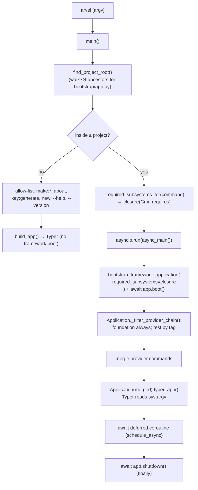

# CLI architecture

The `arvel` command is a Typer app. Inside a project it boots **only the subsystems the dispatched command needs** before dispatching; outside a project it runs a limited set of commands without booting at all. Commands come from two channels: packaging entry points and `ServiceProvider.commands()`.

**Source**: `packages/arvel/src/arvel/console/` — `entrypoint.py`, `__init__.py` (`Application`, `Command`, `Context`), `_subsystem.py`, `bootstrap.py`, `_loader.py`, `_async.py`, `commands/`, `providers/console_service_provider.py`. Entry points live in `packages/arvel/pyproject.toml`.

## Entry point

`[project.scripts]` maps `arvel` → `arvel.console.entrypoint:main`. `main()` is a sync gatekeeper; `async_main()` runs the project lifecycle. The Typer app itself is owned by `arvel.console.Application`, not by `entrypoint.py`.



## Subsystems and the boot plan

Every CLI command declares the framework slices it touches via `Command.requires: frozenset[CliSubsystem]`. The entrypoint computes the transitive closure under the dependency graph in `arvel/console/_subsystem.py` and asks the user's `bootstrap/app.py::create_application()` to build an `Application` that boots only those providers (plus the always-on foundation: `CONFIG`, `LOG`, `LANG`, `CONTEXT`).

| Subsystem | Provider | Notes |
|---|---|---|
| `CONFIG`, `LOG`, `LANG`, `CONTEXT` | foundation | Always loaded |
| `OBSERVABILITY` | `ObservabilityServiceProvider` | Opt-in |
| `DATABASE` | `DatabaseServiceProvider` | Required transitively by `QUEUE`, `AUTH` |
| `HTTP` | `HttpServiceProvider` | Routes, exception handler, OpenAPI |
| `SCHEDULER` | `SchedulerServiceProvider` | |
| `QUEUE` | `QueueServiceProvider` | depends on `DATABASE` |
| `CACHE` | `CacheServiceProvider` | |
| `MAIL` | `MailServiceProvider` | |
| `STORAGE` | `StorageServiceProvider` | |
| `BROADCAST` | `BroadcastServiceProvider` | |
| `AUTH` | `AuthServiceProvider` | depends on `DATABASE` |
| `EVENTS` | `EventServiceProvider` (+ notifications) | |
| `USER_PROVIDERS` | every provider in `bootstrap/providers.py` | Opt-in collectively |

Adding a new subsystem: extend `CliSubsystem`, tag the provider with `subsystem: ClassVar[CliSubsystem]`, add a dependency edge if needed, tag every command that uses it.

## Two command channels

| Channel | Mechanism | Needs booted app? |
|---|---|---|
| **Entry points** | `[project.entry-points."arvel.commands"]` → `discover_commands()` via `importlib.metadata` | No — works for DI-free commands |
| **Provider commands** | `ServiceProvider.commands()` collected by `ConsoleServiceProvider.boot()` | Yes — the provider must be loaded by the closure |

There's no standalone registry class. The registry is `Application._commands: dict[str, Command]` (last registration wins, with a warning). `ConsoleServiceProvider` is pinned **last** in the baseline TAIL so it sees every other provider's `commands()`. On a name collision when running inside a project, the provider (container) copy wins over the entry-point copy.

> **Note**: Queue commands (`queue:work`, `queue:failed`, …) are intentionally **not** in the entry points — they need `QueueManager`/`FailedJobStore` injected, so they're provider-only and only appear when `QueueServiceProvider` is in the closure.

## The Command base

```python
class Command:
    name: ClassVar[str]                                   # "make:model", "queue:work"
    help: ClassVar[str]
    requires: ClassVar[frozenset[CliSubsystem]] = frozenset()
    requires_project_context: ClassVar[bool] = False      # needs bootstrap/app.py but no provider boot
    owns_process: ClassVar[bool] = False                  # bypass asyncio.run wrapper
    app: FrameworkApplication | None

    @classmethod
    def needs_framework(cls) -> bool:                     # True iff requires or requires_project_context
        return bool(cls.requires) or cls.requires_project_context

    def register(self, app: typer.Typer) -> None: ...     # default wraps handle(ctx)
    def handle(self, ctx: Context) -> int: ...            # 0 = success
    async def call(self, name, args=()) -> int: ...       # in-process dispatch
```

- Commands with empty `requires` and `requires_project_context = False` get `self.app is None` — they run without a framework boot at all. `make:*` generators, `new`, `about`, `key:generate` fit here.
- Commands with non-empty `requires` get `self.app` bound to the booted `FrameworkApplication`. Use `self.app.container.make(...)` to resolve services.
- `requires_project_context = True` is for commands that need to know the project root but don't need any provider booted (e.g., `serve` re-imports the ASGI app under uvicorn).
- `Context` is a plain-text I/O facade over `typer.echo` (`info`, `error`, `warn`, `line`, …). No Rich/color.
- Simple commands rely on the default `register()` (no CLI args). Commands needing flags override `register()` and use the `_Option`/`_Argument` bridge in `console/_t.py`.
- `make:*` generators extend `BaseMakeCommand` (`commands/_base_make.py`): positional `name`, `--force`, name validation, stub rendering to a target subdir.

### Async commands

Typer callbacks are sync, so async work uses one of three patterns:

| Pattern | Used by | Mechanism |
|---|---|---|
| Deferred coroutine (preferred) | `migrate`, `queue:work`, `schedule:work`, `schedule:run`, `cache:clear`, `cache:forget`, `db:seed`, `reverb:start` | `schedule_async(coro)` — entrypoint awaits it after Typer returns |
| Owns process | `serve`, `shell`/`tinker` | runs its own loop outside the `asyncio.run` wrapper (`owns_process = True`) |

All async CLI commands run on the single outer loop via `schedule_async`; `cache:*` and `schedule:run` use the same deferred pattern as `migrate`. Commands that must own their own loop (uvicorn, the REPL) set `owns_process = True` so the entrypoint dispatches them outside its wrapper.

## Bootstrap for the CLI

Inside a project, `async_main()` always:

1. Asks `_required_subsystems_for(command)` for the transitive closure of `Command.requires`.
2. Imports the user's `bootstrap/app.py` → `create_application(required_subsystems=closure)`. The skeleton's factory forwards that set to `ApplicationBuilder.with_required_subsystems(...)`, which makes `Application._filter_provider_chain()` drop providers whose `subsystem` tag isn't in the closure (foundation providers are always kept; `USER_PROVIDERS` controls whether the user-listed providers in `bootstrap/providers.py` boot collectively).
3. `await app.boot()` runs the async boot pass for the *filtered* chain. The synchronous `register()` pass already happened during `.create()`.
4. Provider commands are merged into the Typer app, and the framework is bound to commands whose `needs_framework()` is true.
5. Typer dispatches. Async work uses `schedule_async(coro)` (see below); the deferred coroutine is awaited after Typer returns.
6. `await app.shutdown()` runs in `finally`, in reverse order of registration.

`USER_PROVIDERS` is the explicit opt-in for "I need everything the user's `bootstrap/providers.py` registers". Most plug-in install commands need it; pure framework commands like `migrate` typically don't.

See [bootstrap & lifecycle](../architecture/ARCH-002-bootstrap-lifecycle.md).

> **Note**: There is **no** `ConsoleKernel`. `app/console/kernel.py` is scheduling-only — its `Kernel.schedule(schedule)` is discovered by `SchedulerServiceProvider.boot()`, not by CLI registration. To add a command, use `ServiceProvider.commands()` or a new entry point. `routes/console.py` is stored by `with_routing(console=...)` but never loaded yet.

## Built-in commands

A non-exhaustive catalog (see the source map for the full list and registration source). The **Boots** column shows the closure each command requests; foundation (`CONFIG/LOG/LANG/CONTEXT`) is implicit on every framework-booting command.

| Group | Commands | Boots |
|---|---|---|
| Scaffolding | `new`, `make:controller`, `make:model`, `make:migration`, `make:job`, `make:event`, `make:listener`, `make:resource`, `make:request`, `make:policy`, `make:command`, … (24 `make:*`) | — (no framework) |
| Migrations / DB | `migrate`, `migrate:rollback`, `migrate:status`, `migrate:fresh`, `migrate:reset`, `migrate:refresh`, `db:seed`, `db:show`, `db:table`, `model:show`, `model:prune` | Database (+ user providers for `db:seed`, `model:prune`) |
| Queue (provider) | `queue:work`, `queue:failed`, `queue:retry`, `queue:flush`, `queue:forget`, `queue:size`, `queue:restart`, `queue:clear`, `queue:prune-failed` | Queue → Database, User providers |
| Scheduler | `schedule:work`, `schedule:list`, `schedule:run` | Scheduler, User providers |
| Cache / config / optimize | `cache:clear`, `cache:forget` (provider) | Cache, User providers |
| Config | `config:show`, `config:clear` | Config |
| Config | `config:cache` | Project context only |
| View | `view:cache`, `view:clear` (provider) | foundation |
| Optimize | `optimize`, `optimize:clear` | User providers |
| Ops / introspection | `serve` | Project context only (owns process) |
| Ops / introspection | `route:list`, `openapi:export`, `openapi:validate` | HTTP, User providers |
| Ops / introspection | `event:list` | Events, User providers |
| Ops / introspection | `channel:list` | Broadcast, User providers |
| Ops / introspection | `shell` / `tinker` | None — owns process and self-boots |
| Ops / introspection | `about`, `test`, `down` / `up`, `key:generate` | — (no framework) or project context |
| Vendor / install | `vendor:publish`, `auth:install`, `oauth:install`, `audit:install` | User providers |

Composite commands (`migrate:fresh`, `optimize`) chain other commands in-process via `Command.call()` → `Application.run(name)`.

In-process dispatch (`Application.run(name)`, `Command.call(name)`) is **name-only by design**: it runs the target's `handle(ctx)` directly. Flag-bearing commands own their args through Typer at the real entrypoint, not via this path — so there's no `args` passthrough (the model is `handle(ctx)`-only, and async commands use the deferred coroutine pattern). `key:rotate` is an honest deferred stub: it exits 2 with an actionable message and a production guard until column re-encryption ships. `optimize`'s `route:cache`/`event:cache` lines are intentional **n/a on Python** (routes and listeners are live callables, not serializable string actions), not unfinished work.

## See also

- [Service providers](../architecture/ARCH-004-service-providers.md) — `commands()` contract.
- [Scheduling](../subsystems/scheduling.md) — `app/console/kernel.py` discovery.
- [Source map](../reference/source-map.md)
