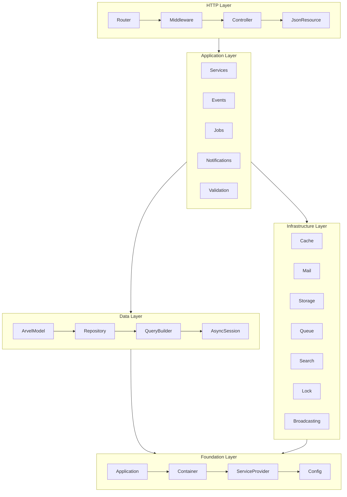
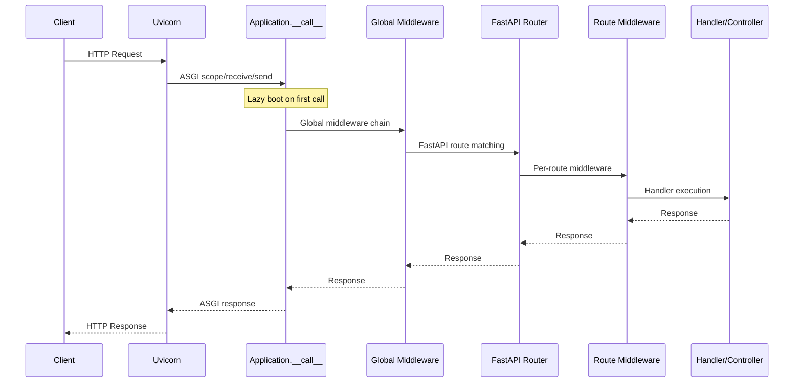
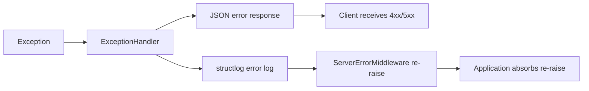
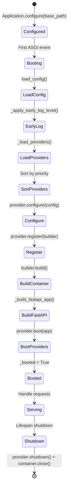
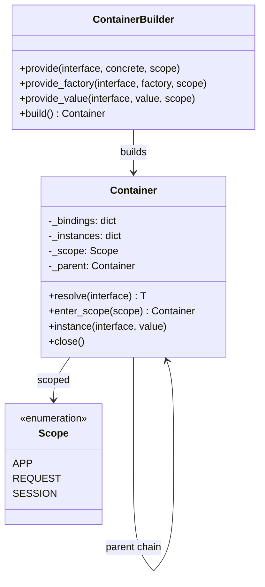
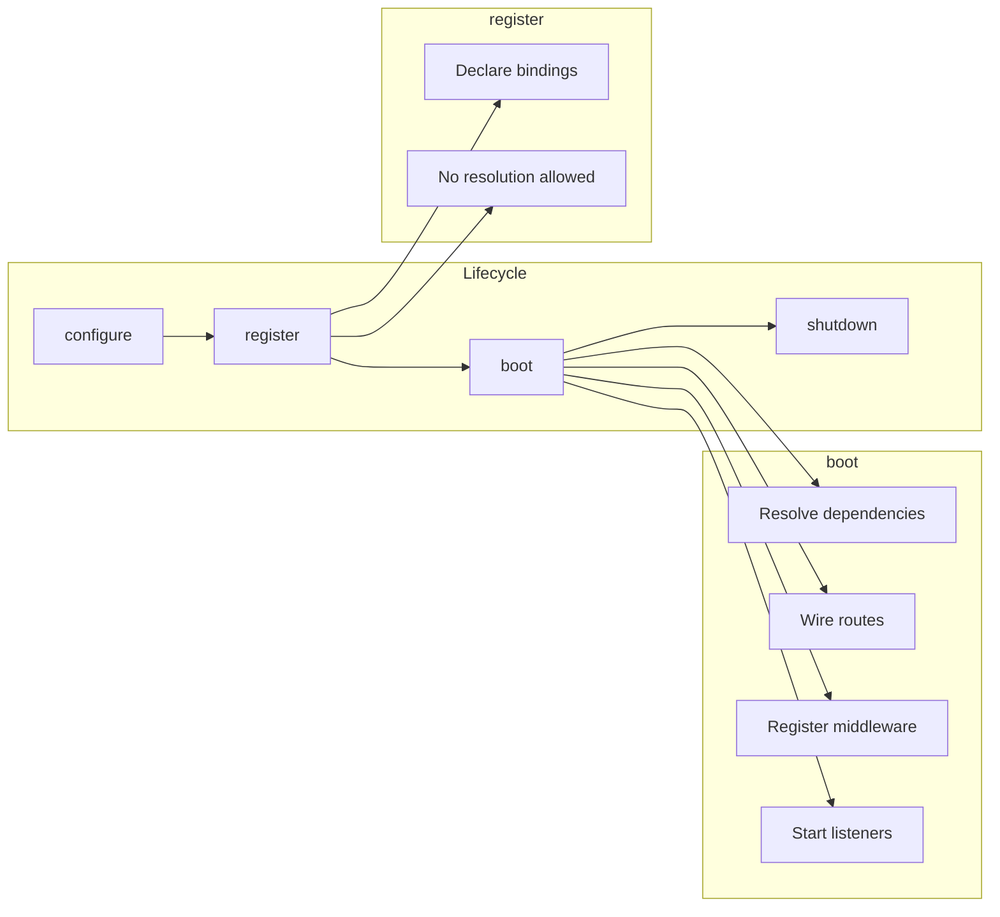
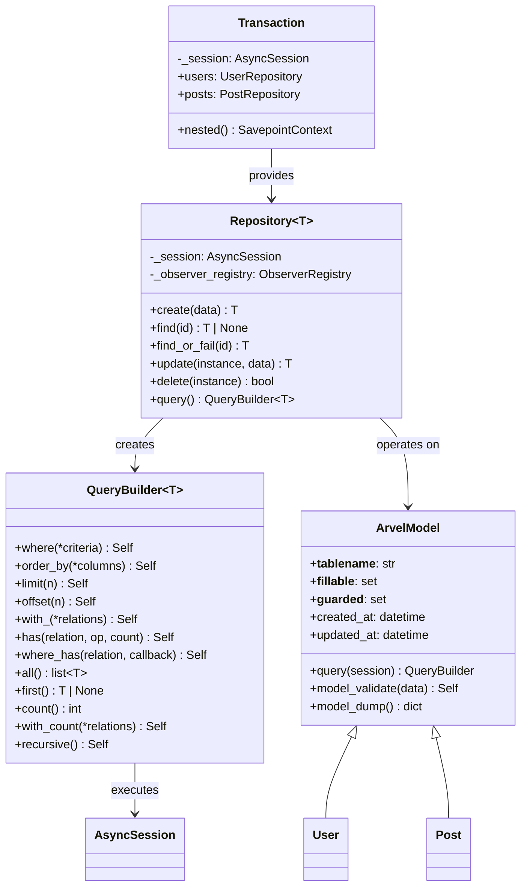
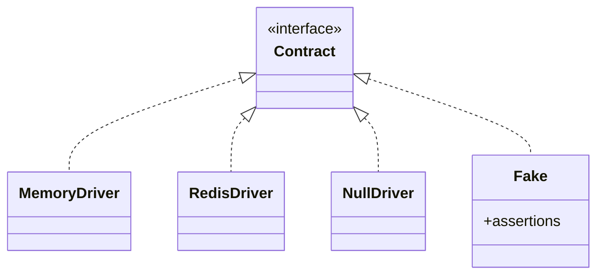

# Architecture Overview

This document describes Arvel's internal architecture — how the framework boots, processes requests, and manages dependencies. Read this to understand the "why" behind the design, not just the "how" of using it.

---

## High-Level Architecture

Arvel is organized into five distinct layers, each with clear responsibilities:



### Layer Responsibilities

| Layer | Owns | Depends On |
|-------|------|-----------|
| **Foundation** | Boot sequence, DI container, config, providers | Nothing (base layer) |
| **Infrastructure** | External service abstractions (cache, mail, storage, etc.) | Foundation |
| **Data** | ORM models, repositories, queries, migrations | Foundation |
| **Application** | Business logic, events, jobs, validation | Data + Infrastructure |
| **HTTP** | Routing, middleware, controllers, responses | Application |

---

## Request Lifecycle

Every HTTP request flows through this pipeline:



### Step by Step

1. **Uvicorn** receives the request and passes it as an ASGI event to `Application.__call__`
2. **Lazy boot** — if not yet booted, acquires `_boot_lock` and runs the full bootstrap sequence
3. **Global middleware** wraps the FastAPI app in an onion model (lowest priority = outermost):
   - `RequestIdMiddleware` (10) — generates/propagates `X-Request-ID`
   - `AccessLogMiddleware` (20) — structured access log
   - `ContextMiddleware` (30) — request-scoped context store
   - `RequestScopeMiddleware` — creates a child DI container per request
4. **FastAPI routing** — matches the request to a registered route
5. **Route middleware** — per-route middleware resolved from aliases
6. **Handler/Controller** — executes the endpoint, DI parameters resolved from the request container
7. **Response flows back** through the middleware stack in reverse order
8. **Error handling** — exceptions caught by `install_exception_handlers`, converted to structured JSON

### Error Flow



Arvel's `Application.__call__` absorbs the Starlette `ServerErrorMiddleware` re-raise after a response has been sent. This prevents duplicate tracebacks in Uvicorn while keeping the structured log entry from the exception handler.

---

## Boot Sequence



### Why Lazy Boot?

`Application.configure()` is **synchronous** and returns immediately. The async bootstrap runs on the first ASGI event. This design means:

- No async work at import time (uvicorn factory compatibility)
- No FastAPI leaking to user code
- Process managers (systemd, supervisord) get immediate process startup
- Tests can use `Application.create()` for eager async bootstrap

---

## DI Container Architecture



### Scope Resolution

When `resolve(T)` is called:

1. Check local `_instances` cache
2. Look up `_bindings` for `T`
3. If binding scope is higher than current scope, delegate to parent
4. Create instance (factory or constructor injection)
5. Cache in `_instances`

```
APP Container (singleton)
  ├── DatabaseEngine
  ├── AppSettings
  └── REQUEST Container (per-request)
       ├── AsyncSession
       ├── UserRepository
       └── SESSION Container (per-user)
            └── UserPreferences
```

### Constructor Injection

The container uses `get_type_hints(cls.__init__)` to discover dependencies:

```python
class OrderService:
    def __init__(
        self,
        repo: OrderRepository,       # Resolved from container
        mailer: MailContract,         # Resolved from container
        cache: CacheContract,         # Resolved from container
    ) -> None:
        self.repo = repo
        self.mailer = mailer
        self.cache = cache
```

Type hints are cached per class via `@lru_cache` on `_get_init_hints`. `Annotated[T, ...]` is unwrapped to resolve `T`.

---

## Provider System



### Provider Priority Bands

| Band | Priority | Purpose | Examples |
|------|----------|---------|---------|
| Core | 0–5 | Essential infrastructure | Observability, Context |
| Data | 10 | Database, sessions | DatabaseServiceProvider |
| Security | 12 | Auth, encryption | SecurityProvider |
| HTTP | 15 | Routing, middleware | HttpServiceProvider |
| Services | 20 | Application services | SearchProvider |
| User | 50 | Application code | AppProvider |

---

## Data Layer Architecture



### Query Execution Flow

```
User code                       QueryBuilder                 SQLAlchemy
─────────                       ────────────                 ──────────
query.where(User.active)  →  stmt.where(clause)
query.order_by(User.name)  → stmt.order_by(col)
query.limit(20)            →  stmt.limit(20)
query.all()                →  session.execute(stmt)    →  SQL generation
                           ←  result.scalars().all()   ←  Database result
                           →  ArvelCollection(rows)
```

### Observer Dispatch

```
Repository.create(data)
    │
    ├── dispatch("creating", instance) → abort if False
    │
    ├── session.add(instance)
    ├── session.flush()
    │
    └── dispatch("created", instance)
```

---

## Contract / Driver Pattern

Every infrastructure concern follows the same pattern:



| Contract | Drivers | Fake |
|----------|---------|------|
| `CacheContract` | memory, redis, null | `CacheFake` |
| `QueueContract` | sync, null, taskiq | `QueueFake` |
| `MailContract` | smtp, log, null | `MailFake` |
| `StorageContract` | local, s3, null | `StorageFake` |
| `LockContract` | memory, redis, null | `LockFake` |
| `BroadcastContract` | redis, memory, log, null | `BroadcastFake` |
| `SearchEngine` | meilisearch, elasticsearch, database, collection, null | — |
| `NotificationContract` | mail, database, slack | `NotificationFake` |
| `MediaContract` | — | `MediaFake` |

This design means:

- **Development**: Use memory/null drivers (no external services)
- **Testing**: Use fakes with assertion APIs
- **Production**: Use real drivers (Redis, S3, SMTP, etc.)
- **Swappable**: Change a driver by updating one env var

---

## Module Map

```
src/arvel/
├── foundation/     # Application kernel, DI container, providers, config, pipeline
├── http/           # Router, middleware, controllers, resources, exception handling
├── data/           # ORM models, repository, query builder, relationships, observers
├── auth/           # Guards, JWT, OAuth, policies, password reset, audit
├── validation/     # Form requests, rules, validator
├── events/         # Event dispatcher, listeners, discovery
├── broadcasting/   # Real-time broadcasting with channels
├── queue/          # Jobs, batching, chaining, middleware, workers
├── scheduler/      # Cron-based task scheduling
├── cache/          # Cache contract and drivers
├── lock/           # Distributed lock contract and drivers
├── mail/           # Mailable, drivers, attachments
├── notifications/  # Multi-channel notification dispatch
├── storage/        # File storage abstraction
├── search/         # Full-text search with engine drivers
├── media/          # Polymorphic file attachments
├── security/       # Encryption, hashing, CSRF, rate limiting
├── observability/  # Logging, tracing, health checks, Sentry
├── context/        # Request-scoped context, deferred tasks
├── i18n/           # Internationalization / translation
├── session/        # Session management
├── activity/       # Activity logging
├── audit/          # Audit trail
├── testing/        # TestClient, factories, fakes
├── support/        # Utilities, type guards
├── cli/            # Typer CLI, commands, code generators
├── app/            # Root configuration
├── contracts/      # Infrastructure contract re-exports
├── infra/          # Infrastructure wiring provider
└── logging/        # Log facade
```

Each module follows the same internal structure:

```
module/
├── __init__.py      # Public API re-exports
├── config.py        # ModuleSettings (pydantic-settings)
├── contracts.py     # Abstract interface
├── provider.py      # ServiceProvider for DI registration
├── drivers/         # Concrete implementations
│   ├── memory.py
│   ├── redis.py
│   └── null.py
├── fakes.py         # Test doubles with assertions
└── exceptions.py    # Module-specific errors
```

---

*This architecture document reflects Arvel v0.1.5. The framework is under active development — APIs may change before 1.0.*
