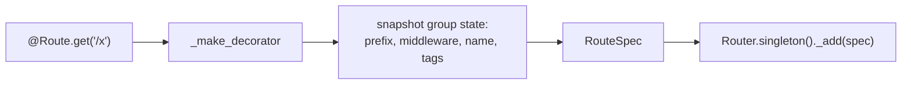
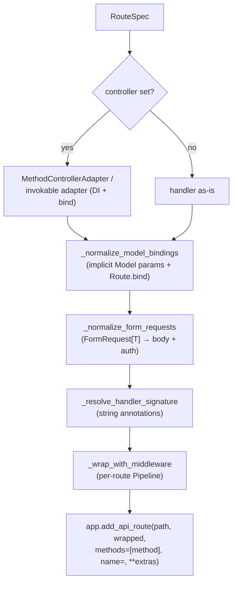
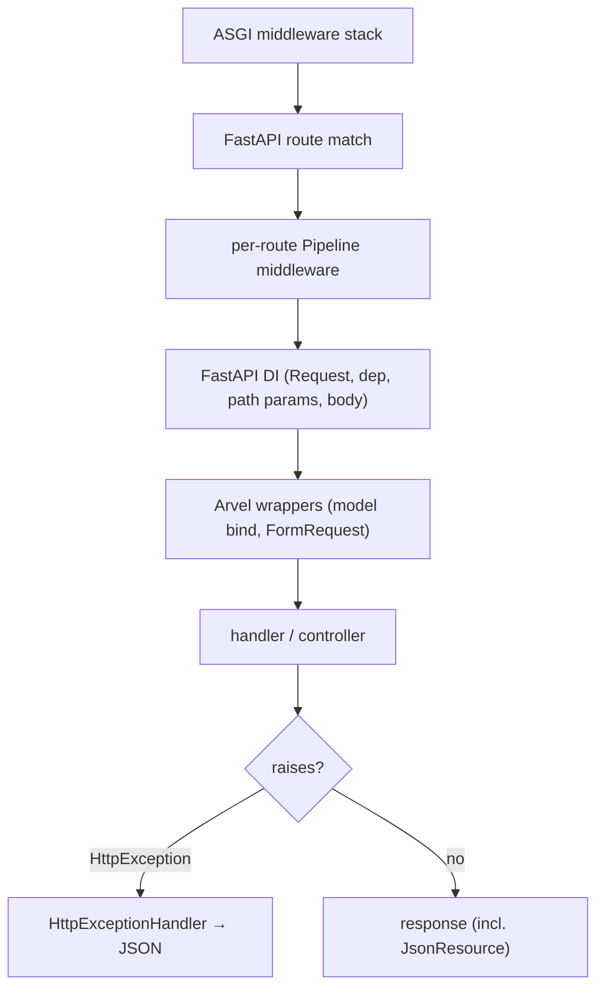

# Routing

Arvel does not ship a router. `@Route.get(...)` buffers a route declaration, and at ASGI assembly time the `Router` translates each buffered route into a FastAPI route, applying a fixed transform pipeline along the way.

**Source**: `packages/arvel/src/arvel/routing.py`, `dep.py`, `providers/http_provider.py`.

## Declaration is buffered, not immediate

`Route` is a module-level singleton (`_RouteFacade`). The verb decorators (`get`, `post`, `put`, `patch`, `delete`, `head`, `options`) all funnel through `_make_decorator`, which builds a `RouteSpec` and appends it to the `Router` singleton's buffer. Nothing touches FastAPI yet.



A `RouteSpec` is a slotted dataclass capturing everything needed to mount later:

```python
@dataclass(slots=True)
class RouteSpec:
    method: str
    path: str
    handler: Callable[..., Awaitable[Any]]
    name: str | None = None
    middleware: tuple[Middleware, ...] = ()
    controller: type | None = None
    action: str | None = None
    extras: dict[str, Any] = field(default_factory=dict)
    caller_locals: dict[str, Any] = field(default_factory=dict)
    bindings: dict[str, RouteBindingResolver] = field(default_factory=dict)
```

`caller_locals` is captured so string/closure-scoped annotations can be resolved at mount time (PEP 563). `extras` carries through to FastAPI's `add_api_route` — that's how `response_model`, `tags`, etc. reach OpenAPI.

## The `Router` singleton

```python
class Router:
    _instance: ClassVar[Router | None] = None

    @classmethod
    def singleton(cls) -> Router: ...
    @classmethod
    def reset_singleton(cls) -> None:
        cls._instance = None
```

One router per process. `HttpServiceProvider` binds it as `container.singleton(Router, lambda: Router.singleton())`, so the container and the decorators share the same instance. `reset_singleton()` clears the buffer — tests call it to avoid route leakage between cases, and the bootstrap loader calls it before importing route files.

## Mounting: `register_with_app`

`Application.into_asgi()` calls `router.register_with_app(fa)` after registering the exception handler. For each buffered spec, the router runs a transform pipeline, then mounts the result with `add_api_route`:



| Transform | What it does |
|---|---|
| Controller adapter | Wires a controller class + method (or `__call__`) with container DI. |
| `_normalize_model_bindings` | Turns implicit `Model` parameters and explicit `Route.bind()` into resolvers (route-model binding). |
| `_normalize_form_requests` | Rewrites a `FormRequest[T]` parameter into a Pydantic body param plus injected `Request`; runs rule validation + authorization in the wrapper. See [requests & validation](requests-validation.md). |
| `_resolve_handler_signature` | Resolves string/forward-ref annotations using `caller_locals`. |
| `_wrap_with_middleware` | Composes per-route middleware into an `arvel.support.Pipeline`. See [middleware](middleware.md). |

The container is read off `app.state.arvel_container` so adapters can resolve dependencies.

## Groups

`Route.group(...)` is a context manager that pushes a frame onto a `ContextVar` stack. Inside the block, every declared route inherits the merged prefix, middleware, name prefix, and tags:

```python
with Route.group(prefix="/api", middleware=["auth"], name_prefix="api.", tags=["billing"]):
    @Route.get("/invoices", name="invoices")   # → /api/invoices, name "api.invoices"
    async def invoices(): ...
```

Frames stack, so nested groups compose. `_current_middleware()` walks the frame stack outer→inner and resolves string references; `_current_tags()` dedupes tags across frames, preserving order.

## Named middleware groups

`Application.middleware_group(name, [...])` (forwarding to the router) registers a string alias. `resolve_middleware` expands aliases recursively with cycle detection, so `middleware=["api"]` can fan out to several middleware instances:

```python
app.middleware_group("api", [Throttle(60), Authenticate("api")])
# then: @Route.get("/x", middleware=["api"])
```

## OpenAPI tags

Group tags are prepended to a route's own `tags` in `extras` before mounting:

```python
group_tags = _current_tags()
full_extras = dict(extras)
if group_tags:
    route_tags = tuple(full_extras.get("tags") or ())
    full_extras["tags"] = [*group_tags, *route_tags]
```

So a route inside `Route.group(tags=["billing"])` declaring `tags=["invoices"]` ends up tagged `["billing", "invoices"]` in the generated OpenAPI schema.

## `RouteServiceProvider`

Apps that prefer programmatic registration subclass this and implement `map_routes`:

```python
class RouteServiceProvider(ServiceProvider, ABC):
    @abstractmethod
    def map_routes(self, router: Router) -> None: ...

    async def boot(self) -> None:
        self.map_routes(Router.singleton())
```

In practice, route files use `@Route.*` decorators at import time, and the bootstrap loader imports those modules — so registration is eager and `map_routes` often just imports route modules.

## Resource routes

`Route.resource(...)` / `Route.api_resource(...)` return a `ResourceRegistration` that registers the standard REST actions (seven for `resource`, five for `api_resource`) by calling `_make_decorator` with `controller=` and `action=` set for each.

## URL helpers

| Helper | Purpose |
|---|---|
| `url(path)` | Resolve a relative path against `APP_URL`; idempotent for absolute URLs. |
| `route(name, **params)` | Build a path for a named route; `absolute=True` prefixes `APP_URL`. |
| `URL.signed_route(name, expires_at=, **params)` | Build a signed URL; `URL.has_valid_signature(request)` verifies it. |

Absolute forms require `APP_URL`. Signed routes pair with `SignedMiddleware` on the protected route.

## `dep()` — container into FastAPI `Depends`

`dep(SomeType)` returns a resolver that reads the per-request scope off `request.state.arvel_scope` and calls `make`:

```python
def dep(abstract: type[T]) -> Callable[..., T]:
    def _resolve(request: Request) -> T:
        scoped = getattr(request.state, "arvel_scope", None)
        if scoped is None:
            raise RuntimeError("Arvel request scope is not installed. "
                               "Mount ArvelScopeMiddleware on your FastAPI app.")
        return scoped.make(abstract)
    _resolve.__annotations__["return"] = abstract
    return _resolve
```

Use it as `svc: ItemService = Depends(dep(ItemService))`. The scope is installed by `ArvelScopeMiddleware`.

> **Note**: `ArvelScopeMiddleware` currently sets `request.state.arvel_scope` to the **root** container, not a per-request child scope. `SCOPED` bindings therefore resolve against the root within a request. `TODO/QUESTION:` Is a per-request child scope planned here?

## End to end



## See also

- [Middleware](middleware.md) · [Requests & validation](requests-validation.md) · [Resources](resources.md) · [Exceptions](exceptions.md)
- [Bootstrap & lifecycle](../architecture/ARCH-002-bootstrap-lifecycle.md) — where `register_with_app` runs.
