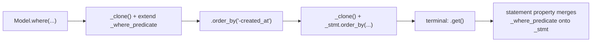
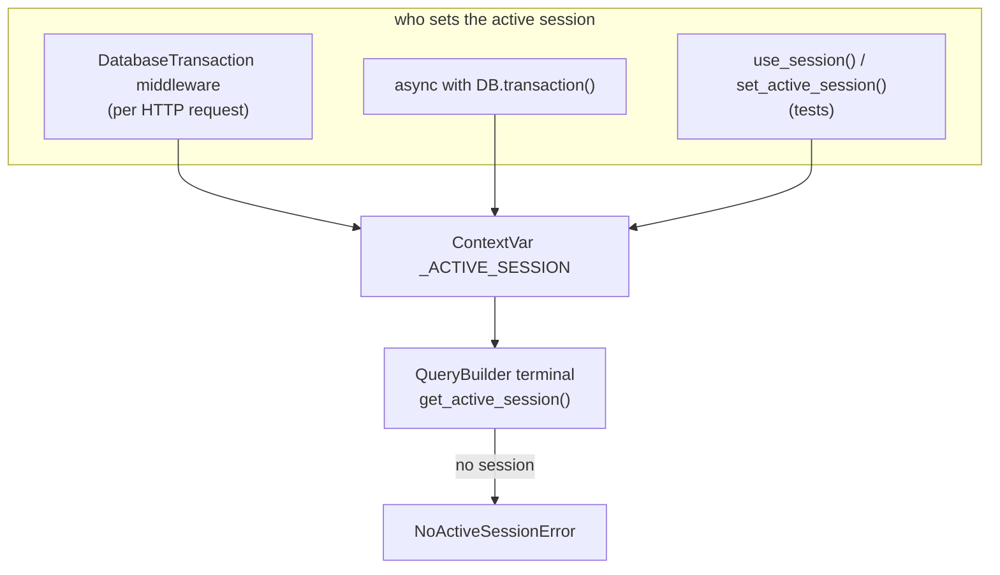
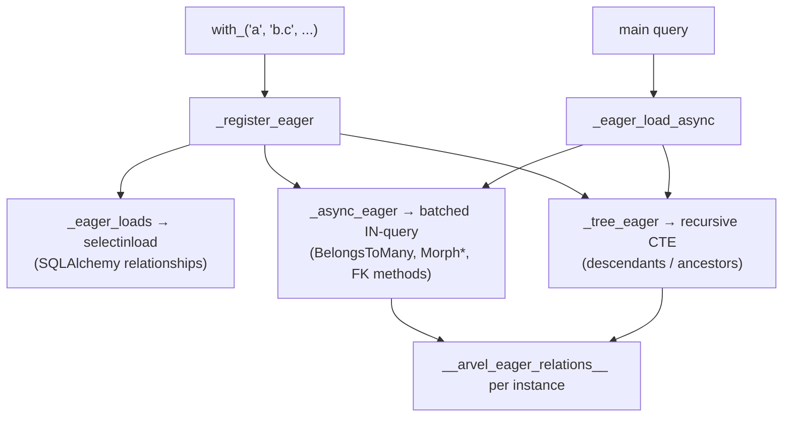

# Query builder

`QueryBuilder[T]` is a fluent, immutable wrapper that accumulates constraints and compiles them to a SQLAlchemy `Select` at terminal time. It runs against the session bound to the current async context.

**Source**: `packages/arvel/src/arvel/database/query.py`, `query_mixin.py`, `session.py`, `db.py`.

## Entry and state

`Model.query()` (from `QueryMixin`) constructs a builder for the model:

```python
@classmethod
def query(cls) -> QueryBuilder[Self]:
    return QueryBuilder(cls)
```

The builder holds a `Select`, an accumulated WHERE predicate, removed-scope tracking, and eager-load specs:

```python
class QueryBuilder(Generic[T]):
    def __init__(self, model, stmt=None):
        self._model = model
        self._stmt = stmt if stmt is not None else select(model)
        self._removed_global_scopes: set[str] = set()
        self._where_predicate: ColumnElement[bool] | None = None
```

## Immutable chaining

Every chain method clones the builder and accumulates. WHERE clauses go into `_where_predicate` (not directly onto `_stmt`) so `or_where` can OR the whole accumulated chain rather than the last clause:



The `statement` property merges the accumulated predicate onto the select:

```python
@property
def statement(self) -> Select:
    if self._where_predicate is None:
        return self._stmt
    return self._stmt.where(self._where_predicate)
```

## Compilation and global scopes

Terminal reads call `apply_global_scopes()` first. It runs each registered global scope (unless removed), merges the WHERE predicate, and attaches `selectinload` options for SQLAlchemy-relationship eager loads:

```python
def apply_global_scopes(self) -> Select:
    target = self
    if not self._remove_all_global_scopes:
        for name, scope_fn in getattr(self._model, "__arvel_global_scopes__", {}).items():
            if name not in self._removed_global_scopes:
                target = scope_fn(target)
    stmt = target._stmt
    if target._where_predicate is not None:
        stmt = stmt.where(target._where_predicate)
    for spec in self._eager_loads:
        stmt = stmt.options(_selectin_loader_for_path(self._model, spec.path, ...))
    return stmt
```

The soft-delete scope is the canonical example: it appends `WHERE deleted_at IS NULL`.

## Terminal methods

| Method | Result | Mechanics |
|---|---|---|
| `await first()` | `T \| None` | `apply_global_scopes().limit(1)`, then async eager load |
| `await get()` / `await all()` | `ModelCollection[T]` | full select + eager load |
| `await find(pk)` | `T \| None` | scoped `where(pk == …)` then `first()` |
| `await count(column=None)` | `int` | count subquery |
| `await exists()` | `bool` | `EXISTS` subquery |
| `await paginate(per_page=15, *, page=None)` | `Paginator[T]` | `count()` + limited select |
| `await chunk(size, callback)` | `None` | offset batches |

## Streaming large result sets

For result sets too large to hold in memory, three terminals walk the rows
incrementally. They differ in how they page the data and — crucially — in whether
they can eager-load relationships:

| Method | How it pages | Eager loads (`with_()`) |
|---|---|---|
| `async for row in chunk(size, cb)` / `chunk_by_id(size, cb)` | OFFSET / keyset batches | **Yes** — each batch runs the full eager pipeline |
| `async for row in lazy(size)` / `lazy_by_id(size)` / `cursor(size)` | keyset batches, one row at a time | **Yes** — per batch |
| `async for row in stream(batch_size=…)` | one server-side cursor (`yield_per`) | **No** — see below |

`stream()` opens a single server-side cursor and only ever holds one `batch_size`
window in memory, so it **cannot** eager-load relationships. Requesting any via
`with_()` raises `EagerLoadNotStreamableError` rather than silently dropping the
request (which would cause undetected N+1 queries or empty relations):

```python
# Raises EagerLoadNotStreamableError — naming the relations and pointing here.
async for product in Product.with_("media").stream():
    ...

# Do this instead — lazy()/chunk() eager-load per batch:
async for product in Product.with_("media").lazy(500):
    ...
```

This mirrors Laravel's contract ("`cursor` cannot eager-load; use `lazy`") but fails
fast instead of degrading. Use `stream()` only for relation-free passes; use
`lazy()`/`chunk()`/`chunk_by_id()` when you need relations loaded.

`RecursiveQueryBuilder.as_tree()` (from `Model.recursive(parent_key=…)`) materializes
the whole forest in memory, so — like its sibling `all()` — it **does** honor
`with_()` eager loads.

## Sessions: the active-session contextvar

The builder never holds a session. It resolves one from a `ContextVar` at execution time:

```python
_ACTIVE_SESSION: ContextVar[AsyncSession | None] = ContextVar("arvel_active_session", default=None)

def get_active_session() -> AsyncSession:
    session = _ACTIVE_SESSION.get()
    if session is None:
        raise NoActiveSessionError
    return session
```



Three ways a session gets bound:

1. **HTTP** — `DatabaseTransaction` middleware opens a session, sets it active, and wraps the request in `session.begin()`.
2. **Explicit** — `async with DB.transaction() as session:` sets the active session (nested calls use savepoints).
3. **Tests** — `use_session(session)` / `set_active_session(session)`.

`get_active_session` raises `NoActiveSessionError` if none is bound — a common cause of "why does my query fail outside a request" (answer: open a `DB.transaction()`).

## Engine and session binding

`DatabaseServiceProvider` binds the engine and session maker:

```python
def register(self):
    c.singleton(AsyncEngine, self._engine_factory)
    c.singleton(async_sessionmaker, self._session_maker_factory)  # expire_on_commit=False
    c.bind(AsyncSession, self._session_factory)

async def boot(self):
    DB.configure(maker)
    DB.configure_engine(engine)
    self.app.register_service(DatabaseService(self.app.container))  # health check
```

`DatabaseService` is a managed `BaseService`; its `health_check` runs `SELECT 1`. The provider disposes the engine on shutdown.

## Scopes

### Local scopes

Define a `scope_*` method (or use the `@scope` decorator) and call it as a chain method:

```python
class Post(Model):
    def scope_published(self, q):
        return q.where(Post.published == True)

await Post.published().get()           # auto-injects a builder
await Post.where(...).published().get()  # chains on an existing builder
```

The model's `__getattr__` resolves `published` to a `scope_published` caller; `QueryBuilder.__getattr__` forwards scope calls on an existing builder (partial application).

### Global scopes

A `GlobalScope` returns a new builder with the scope applied. `SoftDeleteScope` is built in; add your own with `Model.add_global_scope(name, scope)`. Bypass per query with `without_global_scope(name)`, or for soft deletes `with_trashed()` / `only_trashed()`.

## Eager loading and N+1

`with_(*relations)` registers relations into three buckets, resolved differently because Arvent mixes SQLAlchemy relationships with its own relation types:



The async buckets each run **one** batched query (`WHERE related IN (parent PKs)`), group by key, and stash results per parent in `__arvel_eager_relations__`. So accessing a relation on a row that was eager-loaded serves from cache — no N+1. Tree relations use a single recursive adjacency-list CTE for all parents. See [relationships](relationships.md).

## Collections and pagination

`ModelCollection[T]` (from `all()`/`get()`) is a relation-aware `Collection` — `load(*relations)` lazy-eager-loads onto an existing collection using the same engine.

`Paginator.to_dict()` produces a `{data, meta, links}` envelope:

```json
{
  "data": [ ... ],
  "meta": { "total": 120, "per_page": 15, "current_page": 2, "last_page": 8, "from": 16, "to": 30 },
  "links": { ... }
}
```

`SimplePaginator` and `CursorPaginator` (in `query.py`) offer the same shape with cheaper counting / cursor semantics. Page and cursor values come from a `PaginationRequest` contextvar set by HTTP middleware, so `paginate()` picks up the current page automatically. `ResourceCollection` consumes a paginator to build API responses — see [resources](../http/resources.md).

## See also

- [Model internals](model-internals.md) · [Relationships](relationships.md) · [Casts](casts.md)
