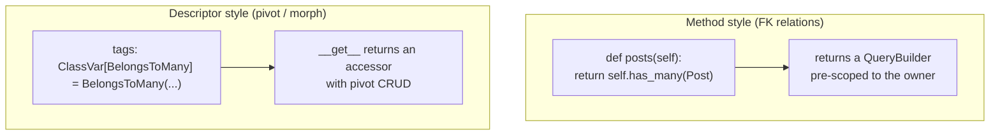
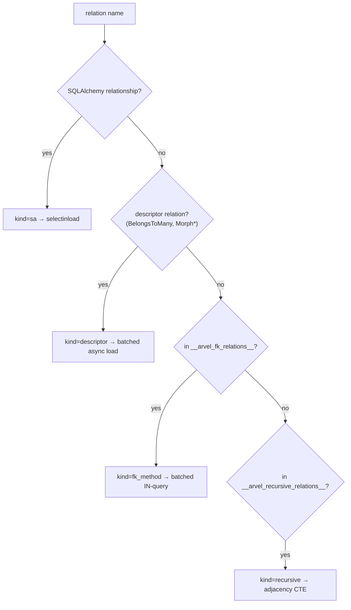
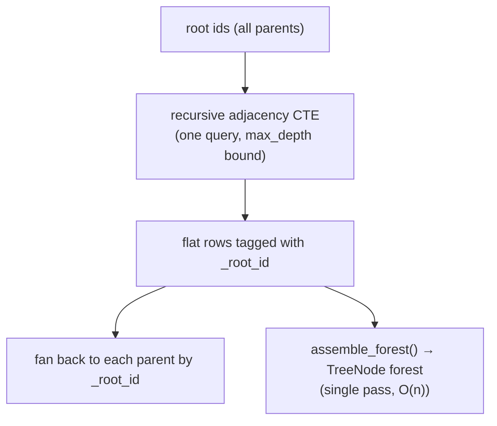
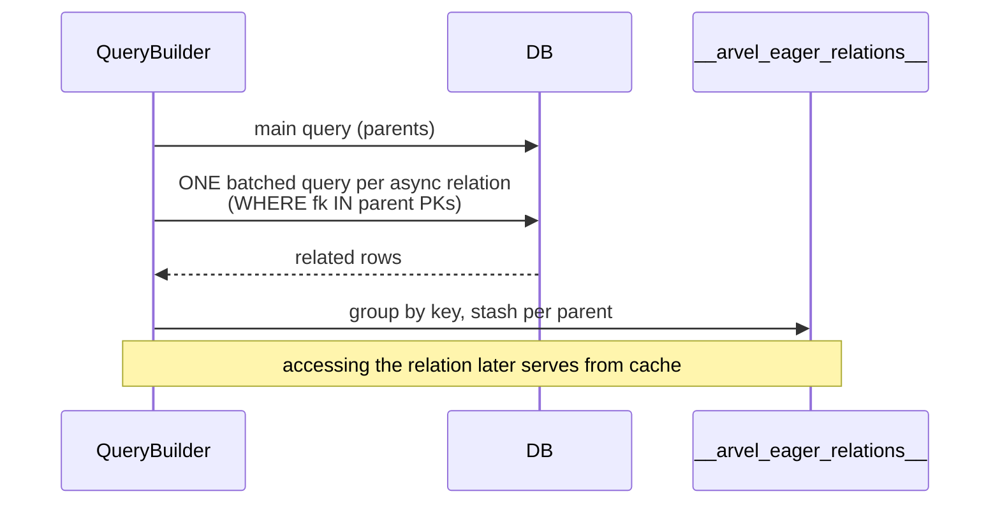

# Relationships

Arvent supports the full Laravel-Eloquent relation set. Internally there are two declaration styles and three eager-load strategies. This page is about the mechanics — how relations are discovered, how they build queries, and how eager loading avoids N+1. For the public API, see the user guide.

**Source**: `packages/arvel/src/arvel/database/orm/` (`relations.py`, `belongs_to_many.py`, `morph.py`, `morph_to_many.py`, `morph_map.py`, `_eager.py`), `tree.py`, and the discovery in `query.py`.

## Two declaration styles



- **Method style** — a zero-argument method returning `has_many` / `has_one` / `belongs_to` (or recursive `descendants`/`ancestors`). The result is a `QueryBuilder` already scoped to the owner.
- **Descriptor style** — a `ClassVar` set to `BelongsToMany`, `MorphMany`, `MorphTo`, etc. The descriptor's `__get__` returns an accessor object.

## Relation discovery

The query layer resolves a relation name through `_resolve_relation`, in priority order:



Method-style FK relations are registered at class creation by `ModelMeta._register_relation_methods`, which introspects zero-arg methods whose return type is a known relation and records them in `__arvel_fk_relations__` / `__arvel_recursive_relations__`.

## Method-style relations are query builders

`HasMany`, `HasOne`, and `BelongsTo` subclass `QueryBuilder` with the owner constraint pre-applied. So you can keep chaining:

```python
def has_many(self, related, *, foreign_key=None, local_key=None) -> HasMany:
    qb = HasMany(related_cls, owner=self, fk_col=fk, owner_pk=owner_pk, local_key=lk)
    return qb.where(col == owner_pk)
```

```python
recent = await user.posts().where(is_published=True).order_by("-created_at").get()
```

`has_many`/`has_one` add write helpers (`save`, `create`, `save_many`, `create_many`); `belongs_to` adds `associate` / `dissociate` / `with_default`.

## Descriptor-style: many-to-many

`BelongsToMany` is a descriptor over a pivot `Table`. Pivot rows are managed with explicit SQLAlchemy Core `insert`/`delete`/`update` — not a SQLAlchemy `relationship()`:

```python
class BelongsToMany(Generic[T]):
    def __init__(self, related_model, *, table, foreign_key, related_foreign_key): ...
    # __get__ → BelongsToManyAccessor with attach/detach/sync/toggle/where_pivot
```

The accessor's pivot operations (`attach`, `detach`, `sync`, `toggle`, `where_pivot`, `order_by_pivot`) issue Core statements against the pivot table, so extra pivot columns are first-class.

## Polymorphic relations

`MorphOne` / `MorphMany` filter on a `{name}_type` + `{name}_id` pair; `MorphTo` resolves the parent; `MorphToMany` uses a polymorphic pivot with a type column and a string-cast owner id.

### The morph map

By default the type column stores the model's class name. A morph map registers stable aliases so renaming a class doesn't orphan rows:

```python
morph_map({"post": Post, "video": Video})   # global alias registry
```

`get_morph_alias(cls)` returns the alias for a class; resolution fails for a type that isn't in the map once a map is in effect.

## Has-many-through

`HasManyThrough` subclasses `QueryBuilder` and sets up the join across an intermediate model:

```python
@classmethod
def has_many_through(cls, related, through, *, first_key=None, second_key=None, local_key="id"):
    ...
```

## Recursive (tree) relations

Self-referential trees use a recursive adjacency-list CTE rather than per-level queries:

```python
def build_adjacency_cte(model, *, id_key, parent_key, direction, roots, max_depth, base_where=None):
    """Recursive CTE seeded by *roots*, walking down (descendants) or up (ancestors)."""
```



`category.descendants().as_tree()` walks the CTE result through `assemble_forest` to build a nested `TreeNode` structure in one pass.

## Eager loading: the three buckets

`with_(*relations)` sorts relations by discovery kind into three resolution strategies, all of which kill N+1:

| Bucket | Relation kinds | Strategy |
|---|---|---|
| `_eager_loads` | SQLAlchemy relationships | `selectinload` options on the select |
| `_async_eager` | `BelongsToMany`, `Morph*`, FK methods | one batched `WHERE … IN (parent PKs)` query, grouped per parent |
| `_tree_eager` | recursive descendants/ancestors | one adjacency CTE for all parents |



The async buckets store results in a per-instance `__arvel_eager_relations__` map; terminal accessors (`HasMany.all()`, etc.) check that cache before querying. `load(*relations)` / `load_missing` do the same after the fact on already-fetched models (including on a whole `ModelCollection`).

## See also

- [Query builder](query-builder.md) — `with_`, `with_count`, `has`/`where_has`.
- [Model internals](model-internals.md) — `foreign_id`, relation method registration.
