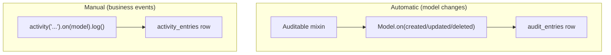

# arvel-audit

Automatic ORM change auditing plus a fluent activity log. Two tables: `audit_entries` (model changes) and `activity_entries` (business events).

**Source**: `packages/arvel-audit/src/arvel_audit/` — `provider.py`, `auditable.py`, `models.py`, `recorder.py`, `query.py`, `types.py`, `config.py`, `commands/install.py`, `migrations/`.

## What it adds

## Public surface

`Auditable`, `activity`, `ActivityRecorder`, `AuditLog`, `ActivityQuery`, `AuditEntry`, `ActivityEntry`, `AuditValues`, `AuditConfig`, `AuditServiceProvider`, `AuditInstallCommand`, `AUDIT_ACTIONS`, plus the `AuditError` hierarchy.

- `Auditable` — mix into a model; it records create/update/delete diffs into `audit_entries` within the same session/transaction as the change.
- `activity()` — fluent builder writing to `activity_entries`.
- `AuditLog` / `ActivityQuery` — read-side query helpers.

## Provider

`AuditServiceProvider.register()` binds `AuditConfig` as an instance. `boot()` publishes both migration stubs (tag `arvel-audit`, marked as migrations) and calls `wire_all_auditable()` to attach lifecycle observers. `commands()` returns `[AuditInstallCommand]` (`audit:install`). No facade.

## Integration points

- **ORM lifecycle**: `Auditable` registers `Model.on("updating"|"created"|"updated"|"deleting"|"deleted", ...)`.
- **Session**: writes through `get_active_session()` so audit rows commit with the change.
- **Context**: reads `Context.get("user_id")` for the `actor_id`.
- **Encryption**: `AuditValues` (a SQLAlchemy type) encrypts stored values via `Crypt` when `AUDIT_ENCRYPT_VALUES=true`.

## Config

| Env var | Field | Default |
|---|---|---|
| `AUDIT_ENABLED` | `enabled` | `true` |
| `AUDIT_ENCRYPT_VALUES` | `encrypt_values` | `false` |

> **Warning**: The container-bound `AuditConfig` singleton isn't consulted at runtime — `auditable.py` and `models.py` instantiate `AuditConfig()` fresh, and `encrypt_values` is read **once at import**. Changing the env after import won't change column behavior. `TODO/QUESTION:` should the mixin/models resolve `AuditConfig` from the container instead?

## See also

- [Encryption](../subsystems/encryption.md) · [Model internals](../orm/model-internals.md) · [Facades](../architecture/ARCH-005-facades.md) (`Context`)
