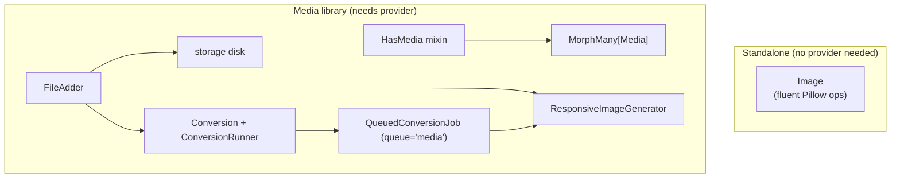

# arvel-image

Two layers in one package: a standalone Pillow-backed `Image` API, and a polymorphic media library (`HasMedia` + a `media` table) with conversions, responsive variants, and queued processing.

**Source**: `packages/arvel-image/src/arvel_image/` — `image.py`, `provider.py`, `media/` (`trait.py`, `model.py`, `collection.py`, `conversion.py`, `conversion_runner.py`, `file_adder.py`, `media_library.py`, `path_generator.py`, `responsive_image_generator.py`, `jobs.py`), `migrations/`.

## Two layers



## Standalone `Image` API

`Image` wraps Pillow in a fluent, lazy pipeline. No provider or database needed.

```python
from arvel_image import Image

result: bytes = (
    Image.load(source_bytes)
    .optimize()
    .strip_exif()                  # explicit GPS/EXIF zero-out for privacy-safe uploads
    .fit("cover", 800, 600)
    .quality(85)
    .format("webp")
    .to_bytes()
)
```

Key methods: `fit(mode, width, height)`, `resize(width=, height=)`, `crop(left=, top=, width=, height=)`, `quality(int)`, `format(str)`, `optimize()`, `strip_exif()`, `to_bytes()`, `save(path)`, plus async terminals `to_bytes_async()` / `save_async()` that offload the whole pipeline to a worker thread.

The chain is lazy — argument validation runs eagerly so mistakes fail fast, but decode/transform/encode only run on the terminal.

### Decompression-bomb guard

Importing `arvel_image` pins Pillow's `MAX_IMAGE_PIXELS` to ~178 MP, so a crafted image can't exhaust memory on decode. Anything past the ceiling warns; past 2x it, Pillow raises `DecompressionBombError`. Tighten or loosen it for your workload:

```python
from arvel_image import set_max_pixels

set_max_pixels(50_000_000)  # stricter
set_max_pixels(None)        # off — only if you fully trust the source
```

## Public surface

`Image`, `set_max_pixels`, `HasMedia`, `Media`, `MediaCollection`, `FileAdder`, `FileInfo`, `Conversion`, `ConversionRunner`, `PathGenerator`, `DefaultPathGenerator`, `MediaLibrary`, `QueuedConversionJob`, `ImageServiceProvider`, `calculate_responsive_widths`, `copy_responsive_images`, `generate_placeholder_svg`, `generate_responsive_images_for_media`, `get_conversion_runner`, `set_conversion_runner`, `get_path_generator`, `set_path_generator`, plus the `MediaError` hierarchy and `UnsupportedFormatError`.

- `Image` works without booting anything — pure Pillow wrapper.
- `HasMedia` adds a polymorphic `media` relation (a plain `MorphMany`); hosts declare one default collection via `__media_collection__` and an optional `register_media_collections()` for advanced setups.
- `media` is an ordinary relation, so the framework's eager loading covers it: `.with_("media")` on the query builder, or `load("media")` on an in-hand model/collection. Both resolve the host's type through `get_morph_alias`, so a view model that sets `__morph_class__` shares the canonical model's rows.
- `add_image(source, ...)` handles upload, storage, and conversions. `image_builder(...)` returns a `FileAdder` for advanced chains (`.queued()`, `.with_responsive_images()`, `.with_custom_properties()`, `.to_disk()`).

## Declaring a host

```python
from arvel.database import Model, Timestamps, id_, string
from arvel_image import HasMedia


class Product(HasMedia, Model, Timestamps):
    __tablename__ = "products"
    __media_collection__ = "images"   # the host's default bucket

    id: int = id_()
    name: str = string(200)
```

> **MRO matters.** Put `HasMedia` **before** `Model` so `HasMedia.to_dict()` chains into `Model.to_dict()` via `super()`.

For MIME/size limits, conversions, and fallback URLs, override `register_media_collections`:

```python
from arvel_image import HasMedia, MediaCollection, Conversion


class Product(HasMedia, Model, Timestamps):
    __media_collection__ = "images"

    def register_media_collections(self) -> None:
        (
            MediaCollection("images")
            .accept_mime_types(["image/jpeg", "image/png", "image/webp"])
            .max_file_size(5 * 1024 * 1024)
            .use_fallback_url("/img/placeholder.svg")
            .with_conversions(
                Conversion("thumbnail").fit("cover", 150, 150).format("webp").quality(85),
                Conversion("card").fit("cover", 400, 300).generate_responsive_images(),
                Conversion("full").fit("contain", 1200, 900).quality(90),
            )
            .register_on(self)
        )
```

## Writing

```python
await product.add_image(file_bytes, file_name="hero.jpg")     # bytes / bytearray / memoryview
await product.add_image(upload, file_name="hero.jpg")          # file-like with .read()
await product.add_image("/var/uploads/hero.jpg")               # local path
await product.add_image("https://cdn.example.com/img.png")     # HTTP(S), SSRF-guarded
await product.add_image("data:image/png;base64,iVBOR...")      # data URI
```

The SSRF guard rejects `file://`, `ftp://`, loopback, and private-IP URLs.

For advanced uploads, switch to the builder:

```python
media = await (
    product
    .image_builder(file_bytes, file_name="hero.jpg")
    .with_custom_properties({"alt": "Hero shot"})
    .to_disk("s3")
    .with_responsive_images()
    .queued()
    .save()                                # defaults to __media_collection__
)
```

`image_builder` only accepts in-memory sources (bytes, path, file-like). Use `add_image` for URLs and base64.

## Reading

After eager loading (`.with_("media")` on the query, or `.load("media")` on an instance/collection), every read serves from memory — zero per-host queries.

```python
product = await Product.with_("media").find(pid)

product.get_media()             # list[Media] for __media_collection__, ordered
product.first_media             # Media | None
product.last_media              # Media | None
product.image_url()             # str | None — original of first media
product.image_url("thumbnail")  # str | None — named conversion, falls back gracefully
product.image_url("thumbnail", fallback="/img/default.png")
```

## Multi-collection hosts

The single-collection case is the default; the explicit `_in(...)` helpers are the escape hatch:

```python
class User(HasMedia, Model, Timestamps):
    __media_collection__ = "avatar"

    def register_media_collections(self) -> None:
        MediaCollection("avatar", single_file=True).register_on(self)
        MediaCollection("cover", single_file=True).register_on(self)


await user.add_image(bytes_, file_name="me.jpg")                      # → avatar
await user.add_image(bytes_, file_name="bg.jpg", collection="cover")  # → cover

user.get_media()                  # avatar
user.media_in("cover")            # cover
user.media_in("*")                # every collection merged

await user.clear_images()                            # avatar only
await user.clear_media_in("cover")
await user.clear_media_in_except("cover", kept=keep_me)
```

## Conversions

Conversions are declared on the collection and run automatically after every `add_image`. `media.generated_conversions` is a `dict[str, bool]` updated after each run; `media.has_generated_conversion("thumbnail")` checks it safely.

Chain methods on `Conversion`: `fit`, `resize`, `crop`, `to_width`, `to_height`, `format`, `quality`, `generate_responsive_images`.

Conversions are re-applied with `process_one(media, host)` or by dispatching `QueuedConversionJob`. The optional `runner` and `gen` arguments default to module-level singletons.

```python
from arvel_image.media.media_library import process_one

await process_one(media, host)                          # uses module singletons
await process_one(media, host, runner=my_runner, gen=my_gen)
```

## Responsive images

Enable per upload, per conversion, or per collection.

```python
# per upload
await product.image_builder(bytes_, file_name="hero.jpg").with_responsive_images().save()

# per conversion
Conversion("card").fit("cover", 400, 300).generate_responsive_images()

# per collection (applies to originals)
MediaCollection("images").generate_responsive_images().register_on(self)
```

The width algorithm is file-size optimized: each step shrinks the width by `sqrt(0.7)` (~0.8367), stopping when the predicted file size drops below 10 KB or the width below 20 px.

Variants are stored under `{id}/responsive-images/` on the same disk as the original. The `responsive_images` column is a `dict[str, {"urls": [...], "base64svg": str}]` keyed by `"original"` for the original file's variants and by the conversion name (e.g. `"card"`) for conversion-level variants. A tiny blurred JPEG wrapped in an SVG is the placeholder.

```python
srcset_orig  = media.srcset()              # "original" group
srcset_card  = media.srcset("card")        # conversion-level group
placeholder  = media.placeholder_svg()     # data:image/svg+xml;base64,...
```

When `.queued()` is combined with `.with_responsive_images()`, variant generation is also deferred — the request returns immediately and `QueuedConversionJob` does the work.

## Manipulations

Store per-conversion op overrides on any `Media` row. Supported keys: `quality` (int), `format` (str), `width` + `height` (int pair), `fit` (mode string + width + height). Use `"*"` as the key to apply to every conversion.

```python
media.manipulations = {
    "*":         {"quality": 80},
    "thumbnail": {"format": "webp"},
}
await media.save()
await process_one(media, host)
```

`Conversion.with_manipulations(overrides)` returns a shallow copy with overrides appended — the original `Conversion` is never mutated.

## Serializing — automatic

`HasMedia.to_dict()` overrides the base `to_dict()` and appends a serialized `media` array when the relation is eager-loaded. No kit-side serializers needed.

```python
return product.to_dict()
# {
#   "id": 1,
#   "name": "Sneakers",
#   "media": [
#     {
#       "id": "42",
#       "uuid": "0193...",
#       "collection_name": "images",
#       "file_name": "hero.jpg",
#       "mime_type": "image/jpeg",
#       "size": 184320,
#       "url": "...",
#       "conversions": {"thumbnail": "...", "card": "...", "full": "..."},
#       "srcsets": {"card": "...100w, ...400w, ...800w"},
#       "placeholder_svg": "data:image/svg+xml;base64,...",
#       "custom_properties": {"alt": "Hero shot"},
#       "order": 1,
#       "created_at": "2026-06-04T00:21:00+00:00"
#     }
#   ]
# }
```

When `media` wasn't eager-loaded the key is absent — never a surprise N+1 in your serializer.

## Provider

`ImageServiceProvider.boot()` publishes `create_media_table.py` (tag `arvel-image`). No container bindings — `PathGenerator` and `ConversionRunner` use module-level accessors (`get_path_generator()`, `set_path_generator()`, `get_conversion_runner()`, `set_conversion_runner()`) that any app service provider can override.

## Integration points

- **ORM**: `HasMedia` → `MorphMany[Media]`.
- **Storage**: `Media` uses `disk` + `conversions_disk` from storage config; responsive variants share the original's disk.
- **Queue**: `QueuedConversionJob` runs on the `media` queue; `ConversionRunner` offloads Pillow work to a worker thread.
- **Accessors**: Override the default path generator or runner in your own provider via `set_path_generator()` / `set_conversion_runner()`.
- **Copy / move**: `media.copy(target)` / `media.move(target)` duplicate or transfer the original, every conversion derivative, and every responsive variant file. The `responsive_images` column is rewritten to point to the new paths. Files that fail to copy are silently skipped — the row copy completes regardless.
- **Regeneration guard**: `process_one()` only regenerates the `"original"` responsive group if it was previously present. Conversion-level groups are regenerated inside the conversion loop where the conversion output bytes are available.

## MIME detection and security

`FileAdder` sniffs the actual image content (via Pillow) to determine the real MIME type, ignoring the file extension. A file named `evil.png` that contains JPEG bytes is accepted as `image/jpeg` — and rejected if the collection only allows `image/png`. This prevents MIME spoofing.

Non-image uploads (PDF, video, etc.) fall back to Python's `mimetypes` module on the filename, then default to `application/octet-stream`.

## Config

No package-level settings class — disk, layout, and conversions are defined on your `HasMedia` subclasses and storage config. Optional extra `[heif]` adds `pillow-heif` for HEIF/HEIC.

The provider publishes `create_media_table.py` via `arvel vendor:publish --tag=arvel-image`.

## See also

- [File storage](../subsystems/storage.md) · [Queues](../subsystems/queues.md) · [Relationships](../orm/relationships.md) (Morph)
