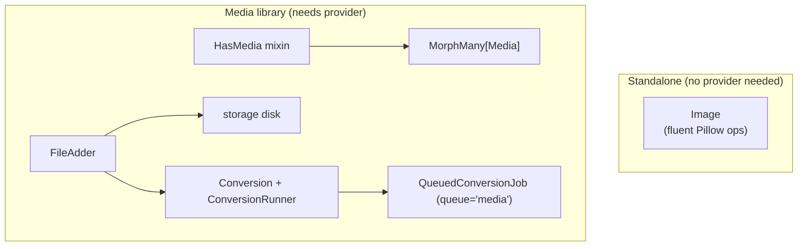

# arvel-image

Two layers in one package: a standalone Pillow-backed `Image` API, and a polymorphic media library (`HasMedia` + a `media` table) with conversions and pluggable path generation.

**Source**: `packages/arvel-image/src/arvel_image/` — `image.py`, `provider.py`, `media/` (`trait.py`, `model.py`, `collection.py`, `conversion.py`, `conversion_runner.py`, `file_adder.py`, `media_library.py`, `path_generator.py`, `jobs.py`), `migrations/`.

## Two layers

## Public surface

`Image`, `HasMedia` (`HasMediaMixin` alias), `Media`, `MediaCollection`, `FileAdder`, `FileInfo`, `Conversion`, `ConversionRunner`, `PathGenerator`, `DefaultPathGenerator`, `MediaLibrary`, `QueuedConversionJob`, `ImageServiceProvider`, plus the `MediaError` hierarchy and `UnsupportedFormatError`.

- `Image` works without booting anything — pure Pillow wrapper.
- `HasMedia` adds a polymorphic `media` relation (a plain `MorphMany`); hosts register collections via `register_media_collections()`.
- `media` is an ordinary relation, so the framework's eager loading covers it: `.with_("media")` on the query builder, or `load("media")` on an in-hand model/collection. Both resolve the host's type through `get_morph_alias`, so a view model that sets `__morph_class__` shares the canonical model's rows. `model_type` is written through `get_morph_alias` too — reads and writes use one resolver, honoring the morph map.
- `FileAdder` (`model.add_media(...)`) handles upload, storage, and conversions; `.queued()` offloads conversions to a worker.

## Provider

`ImageServiceProvider.register()` binds singletons for `PathGenerator → DefaultPathGenerator` and `ConversionRunner`. `boot()` publishes `create_media_table.py` (tag `arvel-image`). No commands, no facade.

## Integration points

- **ORM**: `HasMedia` → `MorphMany[Media]`.
- **Storage**: `Media` uses `disk` + `conversions_disk` from storage config.
- **Queue**: `QueuedConversionJob` runs on the `media` queue; `ConversionRunner` offloads Pillow work to a worker thread.
- **Container**: `PathGenerator` and `ConversionRunner` are overridable bindings; `resolve_path_generator()` reads the container binding when booted.

## Config

No package-level settings class — disk, layout, and conversions are defined on your `HasMedia` subclasses and storage config. Optional extra `[heif]` adds `pillow-heif` for HEIF/HEIC.

> **Warning**: The provider publishes only `create_media_table.py`. The upgrade migration `migrations/001_alter_media_model_id.py` is **not** in `publishes()` — existing databases must copy it manually. There's no install command; use `arvel vendor:publish --tag=arvel-image`.

## See also

- [File storage](../subsystems/storage.md) · [Queues](../subsystems/queues.md) · [Relationships](../orm/relationships.md) (Morph)
