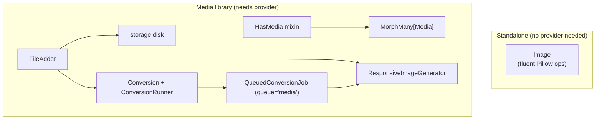

# arvel-image

Two layers in one package: a standalone Pillow-backed `Image` API, and a polymorphic media library (`HasMedia` + a `media` table) with conversions and pluggable path generation.

**Source**: `packages/arvel-image/src/arvel_image/` — `image.py`, `provider.py`, `media/` (`trait.py`, `model.py`, `collection.py`, `conversion.py`, `conversion_runner.py`, `file_adder.py`, `media_library.py`, `path_generator.py`, `responsive_image_generator.py`, `jobs.py`), `migrations/`.

## Two layers



## Standalone Image API

`Image` wraps Pillow in a fluent, re-encodable pipeline. No provider or database needed.

```python
from arvel_image import Image

result: bytes = (
    Image(source_bytes)
    .optimize()           # bake EXIF orientation, drop raw EXIF block on re-encode
    .strip_exif()         # explicit GPS/EXIF zero-out (privacy-safe uploads)
    .fit("cover", 800, 600)
    .quality(85)
    .format("webp")
    .encode()
)
```

Key methods: `fit(mode, width, height)`, `resize(width=, height=)`, `crop(x, y, w, h)`, `quality(int)`, `format(str)`, `optimize()`, `strip_exif()`, `to_bytes() -> bytes`, `save(path)`.

`strip_exif()` is belt-and-suspenders for privacy-sensitive uploads — it passes `exif=b""` to the encoder and clears EXIF/XMP from the working image before encoding. Pillow already drops the raw EXIF block on every re-encode; `strip_exif()` makes that guarantee explicit in your code.

## Public surface

`Image`, `HasMedia` (`HasMediaMixin` alias), `Media`, `MediaCollection`, `FileAdder`, `FileInfo`, `Conversion`, `ConversionRunner`, `PathGenerator`, `DefaultPathGenerator`, `MediaLibrary`, `QueuedConversionJob`, `ImageServiceProvider`, `calculate_responsive_widths`, `copy_responsive_images`, `generate_placeholder_svg`, `generate_responsive_images_for_media`, `get_conversion_runner`, `set_conversion_runner`, `get_path_generator`, `set_path_generator`, plus the `MediaError` hierarchy and `UnsupportedFormatError`.

- `Image` works without booting anything — pure Pillow wrapper.
- `HasMedia` adds a polymorphic `media` relation (a plain `MorphMany`); hosts register collections via `register_media_collections()`.
- `media` is an ordinary relation, so the framework's eager loading covers it: `.with_("media")` on the query builder, or `load("media")` on an in-hand model/collection. Both resolve the host's type through `get_morph_alias`, so a view model that sets `__morph_class__` shares the canonical model's rows. `model_type` is written through `get_morph_alias` too — reads and writes use one resolver, honoring the morph map.
- `FileAdder` (`model.add_media(...)`) handles upload, storage, and conversions; `.queued()` offloads conversions to a worker; `.with_responsive_images()` / `.without_responsive_images()` controls srcset generation per upload.

## Conversions

Define conversions on a `MediaCollection`. Each conversion is a Pillow pipeline that runs after every upload (inline or queued).

```python
from arvel_image import Conversion, MediaCollection

class Product(Model, HasMedia):
    def register_media_collections(self) -> None:
        (
            MediaCollection("images")
            .with_conversions(
                Conversion("thumb").fit("cover", 300, 300).quality(80),
                # generate_responsive_images() on the conversion creates a
                # "thumb" group in media.responsive_images, accessible via
                # media.get_srcset("thumb")
                Conversion("og").fit("contain", 1200, 630).format("jpeg")
                    .generate_responsive_images(),
            )
            .generate_responsive_images()   # srcset variants for the original too
            .register_on(self)
        )
```

`media.generated_conversions` is a `dict[str, bool]` updated after each run. `media.has_generated_conversion("thumb")` checks it safely.

Conversions are re-applied with `process_one(media, host, runner, gen)` or by dispatching `QueuedConversionJob`. Per-media overrides are stored in `media.manipulations` (see [Manipulations](#manipulations)).

## Responsive images

Call `.with_responsive_images()` on the file adder, or set it as the collection default with `MediaCollection.generate_responsive_images()`. The generator uses Spatie's `FileSizeOptimizedWidthCalculator` algorithm: each width step is `original * sqrt(0.7)` (approx 0.8367), stopping when the predicted file size drops below 10 KB or the width below 20 px.

```python
# Per-upload
media = await product.add_media(data, file_name="hero.jpg").with_responsive_images().to_media_collection("images")

# Collection default
class Product(Model, HasMedia):
    def register_media_collections(self) -> None:
        MediaCollection("images").generate_responsive_images().register_on(self)
```

Variants are stored under `{id}/responsive-images/` on the same disk as the original. The `responsive_images` column stores a `dict[str, {"urls": [...], "base64svg": str}]` keyed by `"medialibrary_original"` for the original. A tiny blurred JPEG wrapped in an SVG provides the placeholder.

```python
srcset = await media.get_srcset()                   # "https://... 500w, https://... 418w, ..."
placeholder = media.get_placeholder_svg()           # "data:image/svg+xml;base64,..."
```

Responsive variants are re-generated automatically by `process_one()` (and `QueuedConversionJob`) when the media already has `responsive_images` data. Named conversions also get their own srcset group — `get_srcset("thumb")` returns the variants for that conversion.

```python
srcset_orig  = await media.get_srcset()           # "medialibrary_original" group
srcset_thumb = await media.get_srcset("thumb")    # "thumb" conversion group
placeholder  = media.get_placeholder_svg()        # tiny blurred SVG data URI
```

When `.queued()` is combined with `.with_responsive_images()`, responsive image generation is also deferred to the worker — the upload request returns immediately and the `QueuedConversionJob` generates variants in the background.

## Manipulations

Store per-conversion op overrides on any `Media` row. Supported keys: `quality` (int), `format` (str), `width` + `height` (int pair), `fit` (mode string + width + height). Use `"*"` as the key to apply to all conversions.

```python
media.manipulations = {
    "*":     {"quality": 80},       # all conversions
    "thumb": {"format": "webp"},    # only thumb
}
await media.save()
await process_one(media, host, runner, gen)  # regenerate with overrides
```

`Conversion.with_manipulations(overrides)` returns a shallow copy with the overrides appended — the original `Conversion` is never mutated. Manipulations are applied in both inline and queued conversion runs.

## Provider

`ImageServiceProvider.boot()` publishes `create_media_table.py` (tag `arvel-image`). No container bindings — `PathGenerator` and `ConversionRunner` use module-level accessors (`get_path_generator()`, `set_path_generator()`, `get_conversion_runner()`, `set_conversion_runner()`) that any app service provider can override.

## Integration points

- **ORM**: `HasMedia` → `MorphMany[Media]`.
- **Storage**: `Media` uses `disk` + `conversions_disk` from storage config; responsive variants share the original's disk.
- **Queue**: `QueuedConversionJob` runs on the `media` queue; `ConversionRunner` offloads Pillow work to a worker thread.
- **Accessors**: Override the default path generator or runner in your own provider via `set_path_generator()` / `set_conversion_runner()`.
- **Copy**: `media.copy(target, collection)` copies the original file, all conversion derivatives, and all responsive variant files to the new media ID's path. The `responsive_images` column is rewritten to point to the new paths. Files that fail to copy are silently skipped — the row copy completes regardless.
- **Regeneration guard**: `process_one()` only regenerates the `"medialibrary_original"` responsive group if it was previously present. Conversion-level groups (e.g. `"thumb"`) are regenerated inside the conversion loop where the conversion output bytes are available.

## MIME detection and security

`FileAdder` sniffs the actual image content (via Pillow) to determine the real MIME type, ignoring the file extension. A file named `evil.png` that contains JPEG bytes is accepted as `image/jpeg` — and rejected if the collection only allows `image/png`. This prevents MIME spoofing.

Non-image uploads (PDF, video, etc.) fall back to Python's `mimetypes` module on the filename, then default to `application/octet-stream`.

## Config

No package-level settings class — disk, layout, and conversions are defined on your `HasMedia` subclasses and storage config. Optional extra `[heif]` adds `pillow-heif` for HEIF/HEIC.

> **Warning**: The provider publishes only `create_media_table.py`. The upgrade migration `migrations/001_alter_media_model_id.py` is **not** in `publishes()` — existing databases must copy it manually. There's no install command; use `arvel vendor:publish --tag=arvel-image`.

## See also

- [File storage](../subsystems/storage.md) · [Queues](../subsystems/queues.md) · [Relationships](../orm/relationships.md) (Morph)
