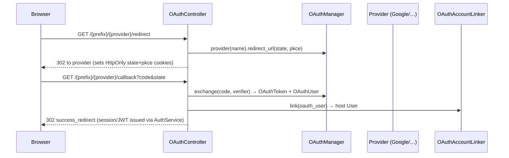

# arvel-oauth

OAuth2 / OIDC social login — Google, GitHub, Microsoft, Apple, and generic OIDC — with PKCE, encrypted token storage, and account linking to the host `User`.

**Source**: `packages/arvel-oauth/src/arvel_oauth/` — `provider.py`, `manager.py`, `linker.py`, `models.py`, `dtos.py`, `pkce.py`, `config.py`, `providers/` (`base.py`, `google.py`, `github.py`, `microsoft.py`, `apple.py`, `oidc.py`), `http/` (`routes.py`, `controller.py`), `commands/install.py`.

## Flow

## Public surface

`OAuthManager`, `OAuthProvider`, the concrete providers (`GoogleProvider`, `GitHubProvider`, `MicrosoftProvider`, `AppleProvider`, `OIDCProvider`), `OAuthAccount`, `OAuthAccountLinker`, `OAuthToken`, `OAuthUser`, `OAuthConfig`, `OAuthServiceProvider`, plus the `OAuthError` hierarchy. Wiring helpers `register_oauth_routes` and `OAuthController` live under `http/` (not re-exported from `__init__.py`).

## Provider

`OAuthServiceProvider.register()` binds `OAuthConfig` and an `OAuthManager(config)` instance. `boot()` publishes `create_oauth_accounts_table.py` (tag `arvel-oauth`). `commands()` returns `[OAuthInstallCommand]` (`oauth:install`). No facade.

## Integration points

- **HTTP (manual)**: call `register_oauth_routes(router, controller=...)` to mount `/{provider}/redirect` and `/callback`. Not auto-mounted.
- **Auth**: `OAuthController` issues a session/JWT via `AuthService` after linking; needs `AuthServiceProvider` and a users table.
- **DB**: links inside `DB.transaction()`.
- **State**: CSRF state + PKCE verifier ride in `HttpOnly` cookies (`oauth_state`, `oauth_pkce`), not the session.
- **HTTP client**: `httpx2` (injectable for tests); `pyjwt[crypto]` for Apple/OIDC.

## Config

`OAUTH_*` via `pydantic-settings`. Global: `OAUTH_USE_PKCE`, `OAUTH_SUCCESS_REDIRECT_URL`, `OAUTH_ERROR_REDIRECT_URL`, `OAUTH_ALLOW_HTTP_ISSUER`. Per provider: `OAUTH_GOOGLE_CLIENT_ID/_SECRET/_REDIRECT_URI`, `OAUTH_GITHUB_*`, `OAUTH_MICROSOFT_*` (+ `_TENANT`), `OAUTH_APPLE_*` (`_TEAM_ID`, `_KEY_ID`, `_PRIVATE_KEY`), `OAUTH_OIDC_ISSUER_URL/_CLIENT_ID/_SECRET/_REDIRECT_URI`. A provider counts as configured when its required credentials are non-empty (`OAuthManager.configured_providers()`).

> **Warning**: A few sharp edges:
> - Routes are **not** auto-mounted — you must wire `OAuthController` + `register_oauth_routes`.
> - `OAuthAccountLinker` hardcodes the core `arvel.auth.models.user.User`; custom user models need `user_model=`.
> - The OIDC provider is async — use `await manager.oidc()`, not `manager.provider("oidc")` (which raises).

## See also

- [Auth](../subsystems/auth.md) · [Encryption](../subsystems/encryption.md) (`EncryptedJson` token column) · [Routing](../http/routing.md)
