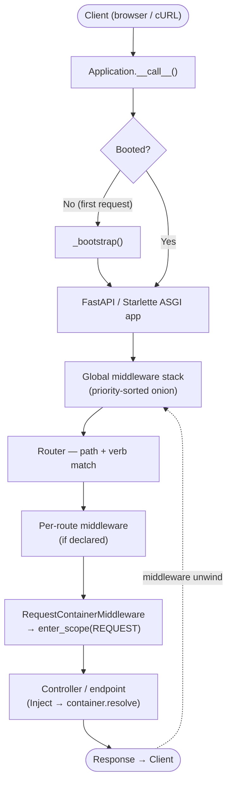
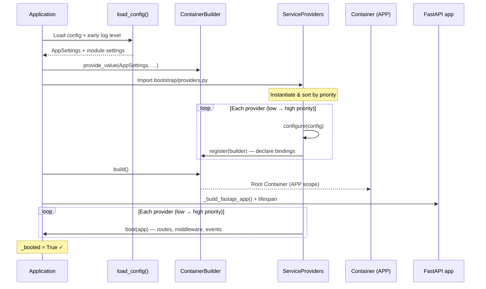

# Request Lifecycle

If you have ever traced a request through Laravel’s kernel, the shape here will feel familiar — only the transport is ASGI, and the heavy lifting still happens in a clear pipeline. Arvel sits on **Starlette** and **FastAPI**: your app object *is* the ASGI callable, and everything else hangs off that contract.

## The big picture

On the first HTTP connection, nothing magical runs at import time. `Application.configure()` gives you an object that implements the ASGI protocol; the real bootstrap (config, providers, container, FastAPI app) runs **lazily** on the first ASGI event. That keeps imports cheap and matches how production servers like Uvicorn expect factory-style apps to behave.

After boot, each request walks through global middleware (the HTTP kernel’s stack), FastAPI’s routing layer, your controller or route handler, and back out through middleware again — the usual onion.

## How a request flows

Think of it as a short story:

1. **ASGI entry** — The server calls `Application.__call__(scope, receive, send)`. If the app has not booted yet, it acquires a lock and runs the async bootstrap once.
2. **Bootstrap (first request only)** — Load config from disk, build a `ContainerBuilder`, run every service provider’s `register()` phase, `build()` the root `Container`, construct the `FastAPI` instance, then run each provider’s `boot()` in priority order.
3. **Delegation** — The booted app forwards the ASGI triple to the inner `FastAPI` app, which is where Starlette’s HTTP handling continues.
4. **Middleware** — Global middleware registered on the `HttpKernel` wraps the FastAPI app. Lower **priority numbers** are treated as **outer** layers: they see the request first and the response last (the “onion” model). Middleware that implements a `terminate`-style hook runs cleanup in reverse order after the response is sent, matching the mental model of Laravel’s terminating middleware.
5. **Router** — FastAPI matches the path and verb. Arvel’s `HttpServiceProvider` has already included module routers and, where you asked for it, wrapped individual routes with per-route middleware.
6. **Controller** — Class-based controllers are resolved through the request-scoped container (see the container docs). Dependencies are injected via constructor hints and the `Inject()` helper on action methods.
7. **Response** — Your handler returns a Starlette `Response` (or something FastAPI can convert). The stack unwinds, headers go out, and optional `shutdown` hooks run when the app lifespan ends.

### Flow list (quick scan)

- ASGI → (lazy) bootstrap → FastAPI app
- Global middleware (priority-sorted, onion)
- Route match → per-route middleware chain (if any)
- Controller / endpoint → response
- Middleware unwind → client

You can sketch the same thing as nested boxes: outer layers are global middleware; the inner box is the route’s ASGI app; inside that sits your controller call.

## Application bootstrap

Bootstrap is the chapter where the framework wakes up:

- **Config** — `load_config` pulls your environment and module settings. Early logging is adjusted so provider logs respect your log level before the observability stack fully initializes.
- **Container seed** — `AppSettings` and each loaded module settings object are registered as **APP-scoped** values on the builder.
- **Providers** — Arvel imports `bootstrap/providers.py` from your project root, reads the `providers` list, instantiates each class, and sorts by `priority` (lower runs earlier in both register ordering and boot ordering).
- **Register phase** — Every provider’s `async register(container: ContainerBuilder)` runs. Here you only **declare** bindings; the container is not fully usable yet.
- **Build** — `builder.build()` produces the root `Container` at APP scope.
- **FastAPI shell** — `_build_fastapi_app` creates the app, wires optional OpenAPI security metadata, and attaches a lifespan that calls `Application.shutdown()` when the server stops.
- **Boot phase** — Every provider’s `async boot(app: Application)` runs. This is where routes, event subscribers, kernel middleware, and anything that needs a resolved dependency belong.

When the process exits or the lifespan ends, `shutdown()` walks providers in **reverse** order and closes the container.

## Service providers: register then boot

The two-phase split is intentional:

- **Register** — Pure binding time. No HTTP stack, no route list yet (framework providers may still enqueue work for boot).
- **Boot** — Integration time. The HTTP provider discovers routes, mounts routers, and attaches the `HttpKernel`’s global middleware to the FastAPI app.

If `register` fails, you get a `BootError` with the provider name. Same for `boot`. That makes production failures easier to grep than a generic stack trace alone.

## Middleware execution order

Two different stories coexist, and both are worth knowing:

**Global middleware (HTTP kernel)** — Registered with `HttpKernel.add_global_middleware(cls, priority=...)`. At mount time, classes are applied so that **lower priority numbers wrap further out**. First to see the request, last to see the response body finish — unless the middleware participates in termination, in which case teardown follows the reverse path.

**Route middleware** — Declared on Arvel routes with `middleware=[...]` metadata. When `HttpServiceProvider` boots, it wraps each route’s inner ASGI app with the resolved classes. Order follows the list you gave, expanded through named groups from your HTTP settings.

Per-route stacks are **inside** the global onion: the request hits global layers first, then route-specific layers, then your handler.

## Where FastAPI sits

Arvel does not try to hide FastAPI — it **embraces** it. OpenAPI generation, dependency injection for plain functions, and `TestClient` compatibility all come from that choice. Arvel adds Laravel-flavored structure (providers, scoped container, class controllers) on top without breaking the ASGI contract you already know from the Starlette world.

---

That is the lifecycle in one pass: one lazy boot, a sorted provider dance, then per-request ASGI work that looks like any other Starlette app — just with a friendlier spine.
