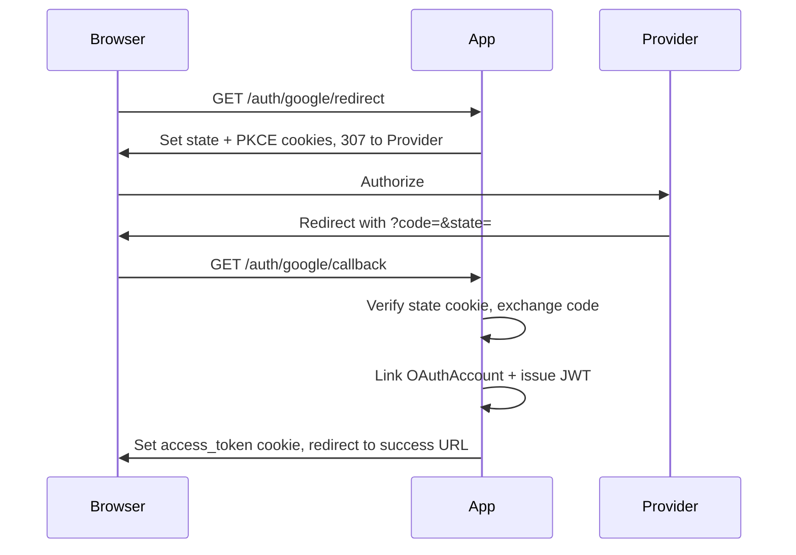

# arvel-oauth

<a name="introduction"></a>
## Introduction

`arvel-oauth` provides OAuth2/OIDC social login for Arvel. It handles the authorization-code flow (with PKCE and state cookies), links the external identity to a local user, and issues a JWT session via `AuthService`.

OAuth (Open Authorization) lets users log in with an external identity provider. OIDC (OpenID Connect) is an identity layer on top of OAuth2.

<a name="a-quick-tour"></a>
## A Quick Tour

The whole flow in four steps — install, configure, mount routes, and send users to the redirect URL:

```bash
uv add "arvel[oauth]"
arvel oauth:install
arvel migrate
```

```ini
# .env — Google example
OAUTH_GOOGLE_CLIENT_ID=your-client-id
OAUTH_GOOGLE_CLIENT_SECRET=your-client-secret
OAUTH_GOOGLE_REDIRECT_URI=https://app.example.com/auth/google/callback
OAUTH_SUCCESS_REDIRECT_URL=/dashboard
OAUTH_ERROR_REDIRECT_URL=/login?error=oauth
```

```python
# bootstrap/providers.py
from arvel_oauth import OAuthServiceProvider

providers = [OAuthServiceProvider, ...]
```

```python
# routes — wire once at app startup
from fastapi import APIRouter
from arvel_oauth.http import OAuthController, register_oauth_routes

router = APIRouter()
register_oauth_routes(router, controller=controller, prefix="/auth")
app.include_router(router)
```

Send the browser to `/auth/google/redirect`. On success the callback sets an `HttpOnly` session cookie and redirects to `OAUTH_SUCCESS_REDIRECT_URL`.

<a name="installation"></a>
## Installation

```bash
uv add "arvel[oauth]"
```

Register the provider and publish the migration:

```python
# bootstrap/providers.py
from arvel_oauth import OAuthServiceProvider

providers = [OAuthServiceProvider]
```

```bash
arvel vendor:publish --tag=arvel-oauth   # or: arvel oauth:install
arvel migrate
```

`OAuthServiceProvider` binds `OAuthConfig` and `OAuthManager` as singletons and publishes the `oauth_accounts` table migration.

<a name="the-oauth-flow"></a>
## The OAuth Flow



State and the PKCE `code_verifier` live in `HttpOnly`, `SameSite=Lax` cookies — they're never trusted from the query string alone. Cookies expire after 10 minutes, which is plenty for a round trip.

<a name="supported-providers"></a>
## Supported Providers

| Name | Class | Notes |
|---|---|---|
| `google` | `GoogleProvider` | OIDC userinfo; requests offline access |
| `github` | `GitHubProvider` | Not OIDC; PKCE follows `OAUTH_USE_PKCE` (default on) |
| `microsoft` | `MicrosoftProvider` | Entra ID; tenant from `OAUTH_MICROSOFT_TENANT` |
| `apple` | `AppleProvider` | Uses a JWT client secret; identity from the verified `id_token` |
| `oidc` | `OIDCProvider` | Generic; discovers config from the issuer's `.well-known` endpoint |

<a name="configuration"></a>
## Configuration

`OAuthConfig` reads `OAUTH_*` environment variables. A provider counts as "configured" once its credentials are set — client id + secret for Google/GitHub/Microsoft, client id + private key for Apple, and issuer URL + client id for OIDC.

| Env var | Default |
|---|---|
| `OAUTH_USE_PKCE` | `true` |
| `OAUTH_SUCCESS_REDIRECT_URL` | `/` |
| `OAUTH_ERROR_REDIRECT_URL` | `/login` |
| `OAUTH_ALLOW_HTTP_ISSUER` | `false` |
| `OAUTH_GOOGLE_CLIENT_ID` / `_SECRET` / `_REDIRECT_URI` | `""` |
| `OAUTH_GITHUB_CLIENT_ID` / `_SECRET` / `_REDIRECT_URI` | `""` |
| `OAUTH_MICROSOFT_CLIENT_ID` / `_SECRET` / `_REDIRECT_URI` / `_TENANT` | `""` / `common` |
| `OAUTH_APPLE_CLIENT_ID` / `_TEAM_ID` / `_KEY_ID` / `_PRIVATE_KEY` / `_REDIRECT_URI` | `""` |
| `OAUTH_OIDC_ISSUER_URL` / `_CLIENT_ID` / `_CLIENT_SECRET` / `_REDIRECT_URI` | `""` |

The redirect URI you register at the provider must match the env var exactly — including scheme, host, and path.

<a name="mounting-the-routes"></a>
## Mounting the Routes

The package does **not** auto-mount routes. Resolve the controller from the container (or construct it) and register the two endpoints yourself:

```python
from fastapi import APIRouter
from arvel_oauth.http import OAuthController, register_oauth_routes

# Typical wiring — pull singletons from the container at boot
controller = OAuthController(
    manager=container.resolve(OAuthManager),
    config=container.resolve(OAuthConfig),
    auth=container.resolve(AuthService),
    cookie_secure=True,   # set False only for local HTTP dev
)

router = APIRouter()
register_oauth_routes(router, controller=controller, prefix="/auth")
app.include_router(router)
```

This registers:

- `GET /auth/{provider}/redirect` — start the flow (sets state/PKCE cookies, redirects to the provider).
- `GET /auth/{provider}/callback` — exchange the code, link the account, issue a session, redirect to the success URL.

`{provider}` must be one of `google`, `github`, `microsoft`, `apple`, `oidc`.

On success the callback sets an `access_token` cookie (`HttpOnly`, `SameSite=Lax`) and redirects to `OAUTH_SUCCESS_REDIRECT_URL`. Provider-side errors (`?error=access_denied`) redirect to `OAUTH_ERROR_REDIRECT_URL` without raising.

<a name="linking-accounts-directly"></a>
## Linking Accounts Directly

To handle the exchange yourself — a mobile app, a custom UI, or a test — use the linker. It finds or creates the local user and the `oauth_accounts` row inside your session:

```python
from arvel_oauth import OAuthAccountLinker

async with DB.transaction() as session:
    account = await OAuthAccountLinker(session).link(oauth_user, token)
    user_id = account.user_id
```

Pass a custom user model if yours isn't the default `User`:

```python
account = await OAuthAccountLinker(session, user_model=AppUser).link(oauth_user, token)
```

The linker only attaches a new provider identity to an *existing* local user when the provider reports the email as verified (`OAuthUser.email_verified`). Otherwise it creates a fresh user with a synthetic `{provider_id}@{provider}.local` email. This guards against account takeover via an unproven email.

Built-in providers set `email_verified` conservatively — only when the upstream claim is explicitly true (Apple proves it by verifying the `id_token` signature). Microsoft Entra in particular omits the claim, so its logins default to unverified and won't auto-link by email.

Returning users refresh their stored tokens on each login — the linker updates the encrypted token column on an existing `(provider, provider_id)` match.

<a name="data-model"></a>
## Data Model

`OAuthAccount` (table `oauth_accounts`) stores the link: `user_id` (FK to `users.id`), a unique `(provider, provider_id)`, and the OAuth tokens encrypted via the `Crypt` facade.

```python
from arvel_oauth import OAuthAccount

accounts = await OAuthAccount.where(user_id=user.id).get()
# each row: provider, provider_id, encrypted tokens
```

> [!WARNING]
> Token encryption needs `APP_KEY` set when the column is read or written. Run `arvel key:generate` first.

<a name="errors"></a>
## Errors

| Exception | When |
|---|---|
| `ProviderNotFound` | Unknown provider name passed to `OAuthManager.provider()` |
| `OAuthExchangeError` | Token exchange failed at the provider |
| `DuplicateOAuthAccount` | Race on `(provider, provider_id)` unique constraint |
| `OIDCDiscoveryError` | Generic OIDC issuer discovery failed |
| `ValidationException` | Bad/missing OAuth state on callback (framework HTTP 422) |

<a name="gotchas"></a>
## Gotchas

- `InvalidOAuthState` is exported but isn't raised by the controller — a bad/missing state surfaces as a `ValidationException`.
- The Apple "configured" check looks at `client_id` + `private_key` only; set `team_id` and `key_id` too for the flow to work.
- The generic OIDC provider is resolved through `manager.oidc()` (it performs discovery), not the synchronous `manager.provider("oidc")`.
- Set `cookie_secure=False` on `OAuthController` only for local HTTP development — production should always use secure cookies.
