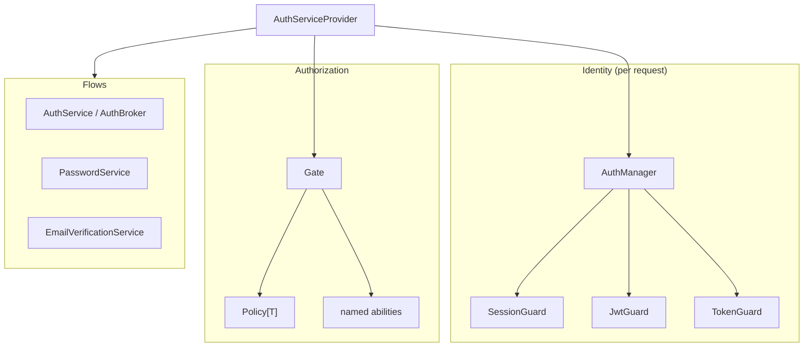
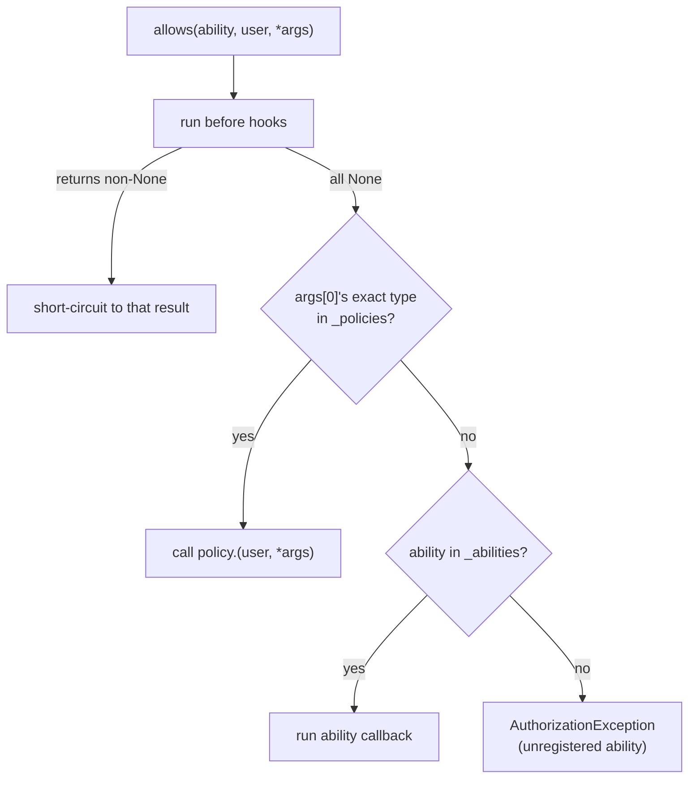

# Authentication & authorization

Auth splits into three concerns wired by one provider: **guards** (who is the current user), the **Gate** (is this user allowed), and **flow services** (register, login, password reset, email verification).

**Source**: `packages/arvel/src/arvel/auth/` (`manager.py`, `gate.py`, `policy.py`, `guard.py`, `guards/`, `config.py`, `provider.py`, `password_service.py`, `email_verification_service.py`), `facades/hash.py`.

## The three surfaces



`AuthServiceProvider.register()` loads `AuthConfig`, builds the guard map, binds `AuthManager` (and the `Auth` facade), binds `Gate` and the flow services, and mounts auth routes if enabled. `boot()` attaches default listeners and wires the email-verification service.

## Guards

`AuthManager` is a registry: `guard(name)` returns a named `Guard`, defaulting to `config.default`.

```python
class AuthManager:
    def __init__(self, *, guards: dict[str, Guard], default: str): ...
    def guard(self, name: str | None = None) -> Guard:
        return self._guards[name or self._default]
```

A `Guard` resolves the current user from a request:

```python
class Guard(ABC):
    @abstractmethod
    async def user(self, request) -> Any | None: ...
    async def login(self, user, request) -> None: ...
    async def logout(self, request) -> None: ...
```

| Guard | Identity source | Stateful |
|---|---|---|
| `SessionGuard` | session key `_auth_id` → resolver | yes — `attempt` checks `Hash.check`, `login` regenerates the session |
| `JwtGuard` | `Authorization: Bearer` JWT → `sub` claim → resolver | no |
| `TokenGuard` | bearer personal access token → SHA-256 → DB | no — attaches the token to the resolved user; check scopes via `user.token_can(ability)` |

Guards look users up through a `UserResolver` (`by_id`, `by_credentials`); the built-in `ArventUserProvider` (driver `"database"`) resolves against an Arvent model. The HTTP `Authenticate` middleware drives a guard and sets `request.state.user` — see [middleware](../http/middleware.md).

> **Note**: `TokenGuard` doesn't inherit the `Guard` ABC (no `login`/`logout`) but is still stored in the manager's guard map.

## The Gate

`Gate` holds abilities, policies, and before/after hooks:

```python
class Gate:
    def define(self, ability, callback): ...
    def policy(self, model_class, policy_instance): ...
    def before(self, callback): ...           # can short-circuit
    async def allows(self, ability, user, *args) -> bool: ...
    async def authorize(self, ability, user, *args) -> None:  # raises on deny
```

Resolution is fail-closed:



`Gate` calls `getattr(policy, ability)` directly — it does not call `Policy.check()`. `Policy.check` is a standalone helper for apps that want method-name dispatch themselves. Authorization at the HTTP edge goes through `CanMiddleware`, which resolves `Gate` and calls `allows`.

## Hashing

Runtime hashing is entirely via the `Hash` facade — argon2id by default, opt-in bcrypt:

```python
class Hash:
    @classmethod
    def make(cls, password, **kwargs) -> str: ...        # argon2id
    @classmethod
    def check(cls, password, hashed) -> bool: ...
    @classmethod
    def make_bcrypt(cls, password, rounds=12) -> str: ... # needs arvel[bcrypt]
```

Consumers: `AuthService.register`, `PasswordService.reset`, `SessionGuard.attempt`. The model `"hashed"` cast passes `$argon2`/`$2` prefixes through unchanged.

There's no hashing config to set — `Hash.make` always uses argon2id, and bcrypt is an explicit opt-in via `Hash.make_bcrypt`. (Laravel keeps hashing config separate from `config/auth.py`; Arvel just hard-defaults the secure choice.)

## Password reset

```mermaid
sequenceDiagram
    participant U as User
    participant PS as PasswordService
    participant DB
    participant EV as Event/Listener

    U->>PS: forgot(email)
    PS->>DB: lookup user (silent if unknown/throttled)
    PS->>PS: plain = token_urlsafe(32); digest = sha256(plain)
    PS->>DB: upsert PasswordReset(email, token_hash=digest)
    PS->>EV: dispatch PasswordResetRequested(reset_token=plain)
    Note over EV: SendPasswordResetEmail listener (inline)

    U->>PS: reset(token, password)
    PS->>DB: find reset row by sha256(token)
    PS->>DB: user.password = Hash.make(password); delete reset + all refresh tokens
    PS->>EV: dispatch PasswordResetCompleted
```

`forgot` is anti-enumeration: unknown or throttled emails return silently. Tokens are stored hashed; expiry deletes the row and raises `PasswordResetTokenInvalidError`.

The `SendPasswordResetEmail` listener builds a real reset link: it takes the base from `auth.reset_page_url` (falling back to `{app.url}/reset-password`) and appends `?token=…&email=…`. Point `auth.reset_page_url` at your front-end reset page; that page POSTs the `token` to `/api/auth/reset-password`.

## Email verification

`EmailVerificationService` signs a payload with an `itsdangerous` `URLSafeTimedSerializer` (secret from `config.jwt.secret`):

- `issue(user_id, email)` → signed token embedding `{id, sha256(email)[:16]}`.
- `consume(signed)` → verify signature + TTL, match the email hash, set `email_verified_at`, dispatch `EmailVerified`.

Registration dispatches `Registered`, whose `SendVerificationEmail` listener issues the link.

## Auth events

Domain events (`Registered`, `PasswordResetRequested`, `PasswordResetCompleted`, `EmailVerified`) extend the framework `Event` (frozen Pydantic, auto-registered). The default auth listeners are **inline** (they don't mix in `ShouldQueue`). See [events](events.md).

## See also

- [Middleware](../http/middleware.md) — `Authenticate`, `CanMiddleware`.
- [HTTP guards surface](../http/requests-validation.md) — `request.state.user`.
- [Encryption](encryption.md) · [Events](events.md)
