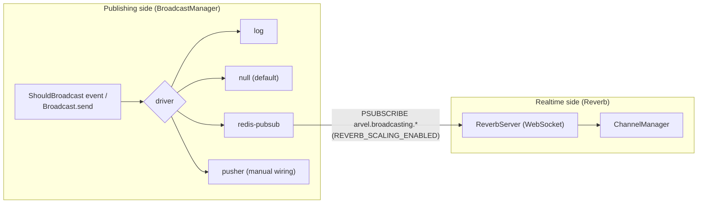
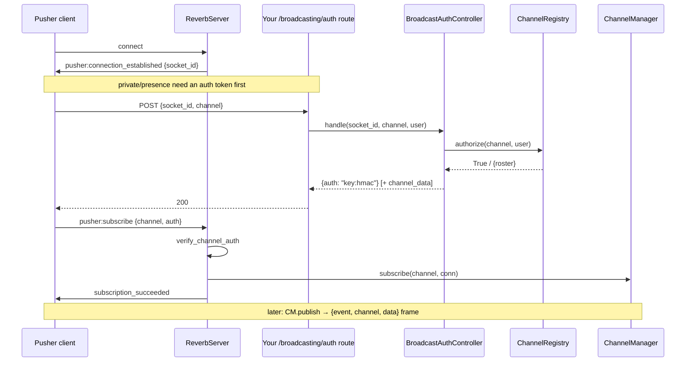
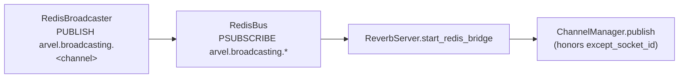

# Broadcasting & Reverb

Broadcasting publishes events to realtime channels through a driver (`log`, `null`, `redis-pubsub`, `pusher`). **Reverb** is a separate in-process WebSocket server that speaks the Pusher protocol — it is *not* a broadcast driver.

**Source**: `packages/arvel/src/arvel/broadcasting/` (`manager.py`, `protocol.py`, `channels.py`, `should_broadcast.py`, `drivers/`, `config.py`), `packages/arvel/src/arvel/reverb/` (`server.py`, `channel_manager.py`, `auth.py`, `auth_controller.py`, `protocol.py`, `redis_bus.py`), `providers/broadcast_provider.py`.

## Two halves



## The driver contract

```python
@runtime_checkable
class Broadcaster(Protocol):
    async def broadcast(self, channels, event, payload, *, except_socket_id=None) -> None: ...
```

`BroadcastManager.driver(name)` lazily builds and caches a driver from `BroadcastConfig.default`:

```python
class BroadcastDriver(StrEnum):
    LOG = "log"; NULL = "null"; REDIS_PUBSUB = "redis-pubsub"; PUSHER = "pusher"
```

| Driver | Auto-built | Behavior |
|---|---|---|
| `log` | yes | logs event + payload **keys only** |
| `null` | yes | no-op (default) |
| `redis-pubsub` | yes (`arvel[redis]`) | `PUBLISH arvel.broadcasting.<channel>` |
| `pusher` | **no** | HMAC-signed POST to Pusher REST; must be wired manually |

> **Warning**: There's no `reverb` driver. And `pusher` is intentionally not auto-constructed — `_make_pusher` raises, telling you to wire `PusherBroadcaster` with `app_id`/`key`/`secret` in your own provider.

## Channels and authorization

Channel behavior follows Pusher naming, not channel classes:

| Prefix | Auth on subscribe |
|---|---|
| (none) | public |
| `private-` | HMAC `auth` token required |
| `presence-` | HMAC `auth` + `channel_data` JSON (roster) |

Authorization callbacks register against a module-level `ChannelRegistry` via the facade decorator:

```python
@Broadcast.channel("private-user.{id}")
async def authorize_user_channel(user, id: str) -> bool:
    return str(user.id) == id
```

`ChannelRegistry.authorize(channel, user=...)` runs the first matching pattern; `False`/`None` rejects, a dict authorizes a presence channel with that roster data.

## ShouldBroadcast

```python
class ShouldBroadcast:
    def broadcast_on(self) -> Sequence[str]: ...
    def broadcast_as(self) -> str: return type(self).__name__
    def broadcast_with(self) -> Mapping[str, object]: ...   # defaults to model_dump()
```

When an `Event` mixes this in, `EventDispatcher._maybe_broadcast` calls `Broadcast.event(event)` after listeners — provided a manager is bound. See [events](events.md).

## Reverb: the WebSocket server

`arvel reverb:start` runs `ReverbServer.serve(host, port)`. It speaks the Pusher protocol in-process.



Inbound frames handled: `pusher:ping` (→ `pong`), `pusher:subscribe`, `pusher:unsubscribe`. Client events (`pusher:client-*`) are **not** implemented. Subscribe enforces a per-socket rate limit and validates the channel name; private/presence channels verify the HMAC `auth` token (signed by `sign_channel_auth`).

`ChannelManager` tracks `channel → set[connection]` and fans out event frames, skipping the originating `socket_id` when asked.

## Cross-process fan-out



`RedisBroadcaster` PUBLISHes one message per channel under `arvel.broadcasting.<channel>` with `{event, data, except_socket_id}`. When `REVERB_SCALING_ENABLED=true`, `reverb:start` wires a `RedisBus` that PSUBSCRIBEs to `arvel.broadcasting.*`, decodes the channel from the Redis channel name, and fans each message out to its local sockets — skipping the originating `socket_id`. This is the ADR-013 §4 contract. Scaling is **off by default**, so single-process dev needs no Redis; enable it (and install `arvel[redis]`) when running multiple Reverb processes.

Still wire-it-yourself:

- `BroadcastAuthController` is **not** auto-mounted. `BroadcastConfig.auth_endpoint` (default `/broadcasting/auth`) is config-only — you mount the route yourself with session/auth middleware.
- `BroadcastServiceProvider` is not a baseline provider — add it to `bootstrap/providers.py`. It binds the manager and facade and ships the `reverb:start` command.

## See also

- [Events](events.md) — `ShouldBroadcast` hook.
- [Notifications](notifications.md) — the broadcast notification channel.
