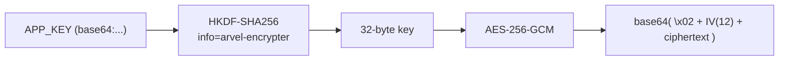

# Encryption

`Encrypter` does authenticated symmetric encryption with a key derived from `APP_KEY`. It's reached through the `Crypt` facade — there's no encryption service provider.

**Source**: `packages/arvel/src/arvel/encryption/encrypter.py`, `facades/crypt.py`, and `database/casts.py` (`EncryptedType`).

## Encrypter

```python
class Encrypter:
    def __init__(self, key: bytes): ...
    @classmethod
    def from_app_key(cls, app_key: str) -> Encrypter: ...
    def encrypt_string(self, plaintext: str) -> str: ...
    def decrypt_string(self, payload: str) -> str: ...
    def encrypt(self, value: Any) -> str: ...
    def decrypt(self, payload: str) -> Any: ...
```

- **Cipher**: AES-256-GCM (`cryptography`'s `AESGCM`).
- **Key derivation**: `APP_KEY` (optional `base64:` prefix) → base64 decode → HKDF-SHA256 with `info=b"arvel-encrypter"` → 32-byte key.
- **Wire format**: version byte `\x02` + 12-byte IV + ciphertext, base64-encoded.



## Crypt facade

```python
class Crypt:
    @classmethod
    def encrypter(cls) -> Encrypter: ...        # reads os.environ['APP_KEY'], caches per key
    @classmethod
    def set_encrypter(cls, enc) -> None: ...     # tests
    @classmethod
    def encrypt_string(cls, plaintext) -> str: ...
    @classmethod
    def decrypt_string(cls, payload) -> str: ...
```

`Crypt` bypasses the container: it reads `APP_KEY` from the environment, caches one `Encrypter` per key string, and raises `MissingAppKeyError` if `APP_KEY` is unset (run `arvel key:generate`).

> **Note**: The DB column cast `EncryptedType` (in `database/casts.py`) uses a **v1** wire format (distinct from the `Encrypter`'s v2). They're separate code paths — column encryption vs. application-level `Crypt`.

## See also

- [Casts](../orm/casts.md) — `EncryptedType` / `encrypted:` column casts.
- [Storage](storage.md) — also derives keys from `APP_KEY` via HKDF.
- [Facades](../architecture/ARCH-005-facades.md) — `Crypt` is env-resolved, not container-resolved.
