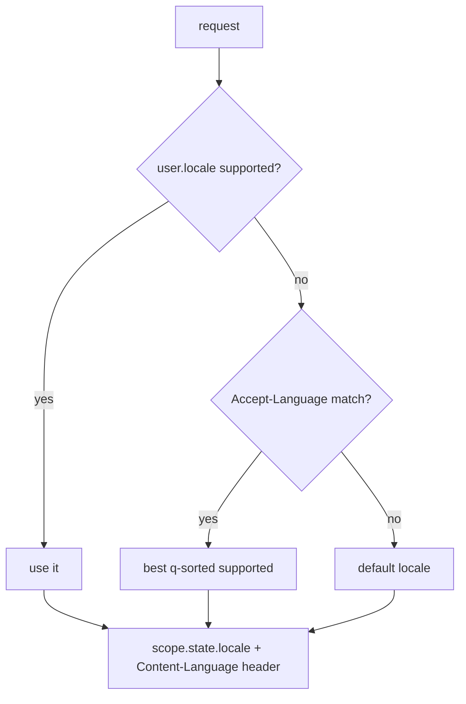

# Localization (i18n)

A `Translator` resolves dotted keys against per-locale catalogs loaded from files. `SetLocaleMiddleware` picks the request locale; helpers read it.

**Source**: `packages/arvel/src/arvel/i18n/` — `translator.py`, `loader.py`, `middleware.py`, `helpers.py`, `providers/lang_provider.py` (registered as the baseline `LangServiceProvider`).

## Translator

```python
class Translator:
    def __init__(self, loader, *, default_locale="en", fallback_locale=None): ...
    def set_locale(self, locale): ...
    def get(self, key, replace=None, locale=None) -> str: ...
    def choice(self, key, count, replace=None, locale=None) -> str: ...
```

`get("namespace.rest.of.key")` resolves the namespace through the loader, traverses the dotted path, and substitutes `:placeholder` / `{placeholder}` values. A missing key returns the key verbatim. `choice` handles pluralization by count.

## Loaders

```python
class TranslationLoader(Protocol):
    def load(self, locale, namespace) -> dict[str, TranslationValue]: ...
```

- `PythonFileLoader` — `resources/lang/{locale}/{namespace}.py` exporting a `translations` dict.
- `JsonFileLoader` — nested `{locale}/{namespace}.json`, or a single-file `{locale}.json` keyed by namespace.

## Locale resolution



`SetLocaleMiddleware` resolves per request: `request.state.user.locale` (if supported) → `Accept-Language` (RFC 9110, q-sorted) → default. It sets `scope["state"]["locale"]` and the `Content-Language` header but does **not** mutate the global `Translator`. The request helper `t(request, key, **replace)` reads `request.state.locale`; module-level `__()` / `__choice()` use the bound translator with an optional `locale=` override.

## Provider

`LangServiceProvider` is a **baseline** provider. `register()` picks `JsonFileLoader` if JSON catalogs exist, else `PythonFileLoader`, builds the `Translator` (default locale from `config("app.locale", "en")`), binds it into the container, and binds the module-level translator. `boot()` is a no-op.

## See also

- [Bootstrap & lifecycle](../architecture/ARCH-002-bootstrap-lifecycle.md) — `LangServiceProvider` runs early so later error messages can localize.
