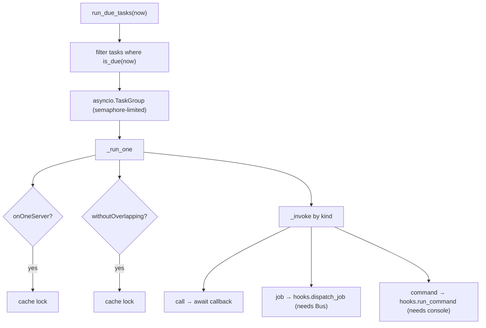

# Scheduling

A fluent `Schedule` builder defines cron-like tasks; `SchedulerKernel` evaluates which are due and runs them, with optional overlap and single-server locks via the cache.

**Source**: `packages/arvel/src/arvel/scheduling/` — `schedule.py`, `scheduled_task.py`, `expressions.py`, `kernel.py`, `providers/scheduler_provider.py`.

## Defining tasks

```python
class Schedule:
    def call(self, callback) -> ScheduledTaskBuilder: ...
    def command(self, name) -> ScheduledTaskBuilder: ...
    def job(self, job_class) -> ScheduledTaskBuilder: ...
    def tasks(self) -> tuple[ScheduledTask, ...]: ...
```

`ScheduledTaskBuilder` exposes frequency helpers (`everyMinute`, `everyFiveMinutes`, … `daily`, `yearly`) that all compile to a `cron(expression)`, plus `withoutOverlapping`, `onOneServer`, `inMaintenanceMode`, `outputTo`. `tasks()` snapshots pending builders into frozen `ScheduledTask` Pydantic models.

## Running



`is_due` uses `croniter` with a one-minute Laravel-style tolerance window. `serve_forever` loops on a sleep interval, honoring interrupt/pause markers (via `SchedulerSignal` in the cache). The CLI `schedule:work` runs `serve_forever` (or `--once`).

`inMaintenanceMode()` and `outputTo()` are honored by the kernel. When the app is down (`MaintenanceModeManager.is_down()`), `_invoke` skips tasks that didn't opt in (`reason="in_maintenance_mode"`) and runs the ones that did — Laravel's `evenInMaintenanceMode` semantics. `outputTo` tees the task's stdout/stderr to the target file via a `_Tee` redirect; a failed redirect logs a warning and the task still runs. The provider wires the `MaintenanceModeManager` into the kernel factory.

## Provider

`SchedulerServiceProvider.register()` binds a singleton `Schedule` and a factory-built `SchedulerKernel` (wired with the `CacheManager`, a `Bus.dispatch` hook, and a console-run hook). `boot()` auto-imports `app/console/kernel.py` and calls its `Kernel.schedule(schedule)`. It's a **baseline** provider. Commands: `schedule:work`, `schedule:list`, plus interrupt/pause/continue.

## See also

- [Cache](cache.md) — overlap/one-server locks. [Queues](queues.md) — scheduled jobs. [CLI architecture](../console/cli-architecture.md)
